# Labs 0: Create an agent for testing and monitoring

## Objectives

- Exercise: Create an agent in Copilot Studio  
    - Task 1: Navigate to Copilot Studio and create an agent.  
    - Task 2: Add Knowledge – Power Platform licensing file.  
    - Task 3: Test your copilot.

## Contents

In this lab, you will perform the actions necessary for building an agent with Copilot Studio for using in the rest of labs.

## Prerequisites

- Ensure you are using the "incognito" or "InPrivate" browsing session of your modern browser. Additionally, use the latest version of Microsoft Edge for the best performance.
- A valid Copilot Studio license or if enabled in your tenant you could use a trial license
- An Power Platform environment suitable (DLPs not blocking Copilot Studio actions) to create agents with Copilot Studio. ‘Sandbox’ environment type recommended.
- If you are experiencing any problems with this prerequisites, please notify your instructor as soon as possible.

## Estimated Completion Time

- 30 minutes

## Exercise 1: Create an agent in Copilot Studio**

### Task 1: Navigate to Copilot Studio and create an agent.

1. Navigate to Copilot Studio maker's page: **[https://copilotstudio.microsoft.com](https://copilotstudio.microsoft.com/)**

2. In the upper right-hand corner select an environment that you have access to and where we will create the Copilot Studio agent.

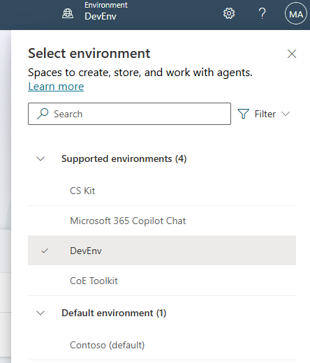

3. Select **Create** and Select **New agent**.

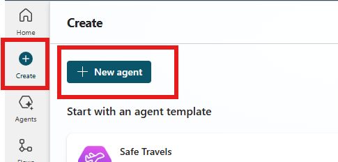

**Note:** *Generative AI may not always ask the exact same questions to create the agent.*

4. In the prompt add **"This agent helps users with question related to Power Platform licensing "** then press Enter.

5. When asked " Great! Now let's determine a name for this agent. How about "Power Platform Licensing Assistant"? Please confirm or suggest another name." answer **"Yes."**

6. When asked ‘Now, let's refine the instructions for the Power Platform Licensing Assistant. First, let's define what the agent should do. For example, "Provide detailed information about Power Platform licensing options and answer user queries related to licensing." What specific actions or behaviours should the agent perform?’ answer **"This agent provides users with information and answers questions related to Power Platform licensing, including pricing, features, and subscription options."**

7. When asked "The Power Platform Licensing Assistant is now set up to assist users with questions related to Power Platform licensing, including pricing, features, and subscription options. Would you like to add any publicly accessible data sources for this agent? This step is optional." Answer **"No"**

8. Now you can select **Create**. 

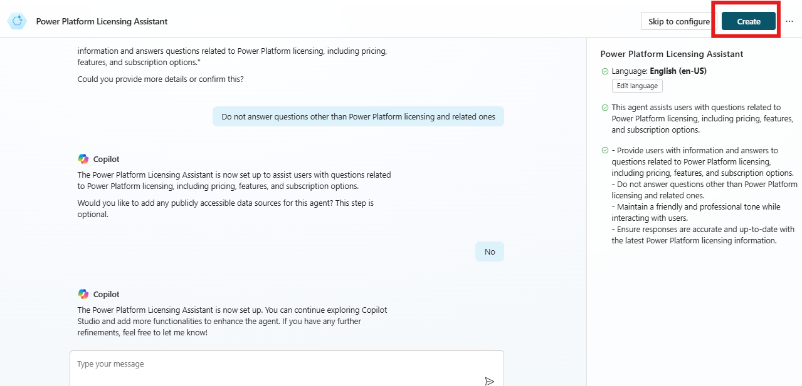

**Note:** *Wait for setup to complete.*

9. In "**Details**" section, take a look to "**Name**", "**Description**" and "**General instructions**". You can edit the description and general instruction to refine the behaviour the agent. Enable the use of generative AI to determine how to best respond.

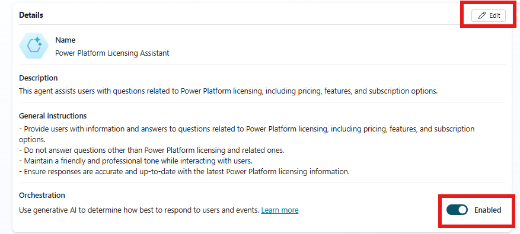

### Task 2: Add Knowledge – Power Platform licensing file.

1. Now will add a knowledge source to look for Power Platform licensing information. Download Power Platform licensing guide for the following link: https://go.microsoft.com/fwlink/?LinkId=2085130

2. In "Knowledge" section, click on "+ Add knowledge"

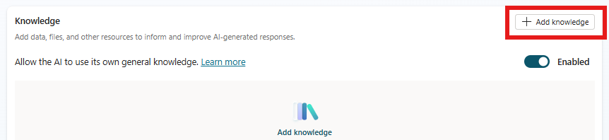

3. Upload the licensing guide on "Upload files"

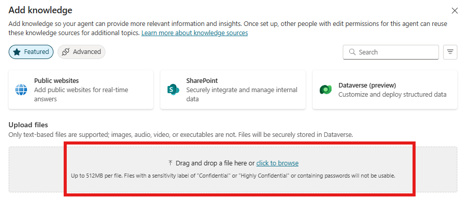

4. Fill out "Description" with the following *"This knowledge source searches for Power Platform licensing information"*. Click "Add"

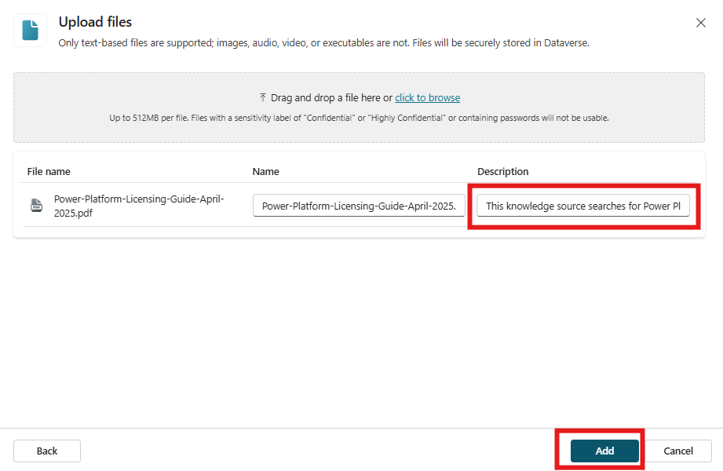

5. Disable "Allow the AI to use its own general knowledge" to only use information included in the licensing guide.

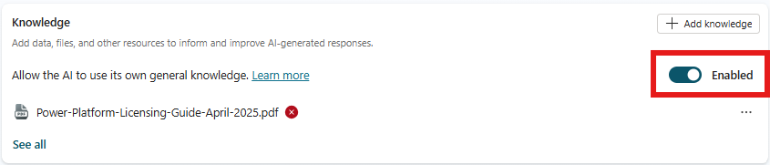

6. Click "Continue"

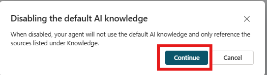

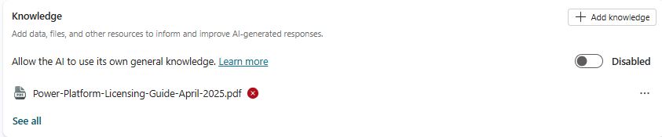

### Task 3: Test your copilot.

1. If the **Test copilot** pane is hidden by default, open it by selecting the **Test** icon.

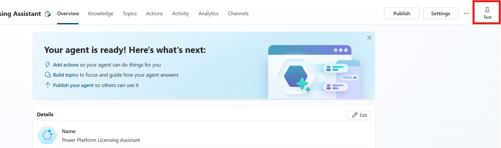

2. Select `...` next to the Copilot reset button and enable "**Track between topics**"

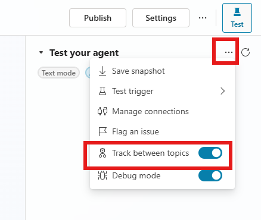

3. At the box **'Ask a question or describe what you need'** prompt in the Test copilot pane, type ‘What are the different licensing options available for Power Platform?’.

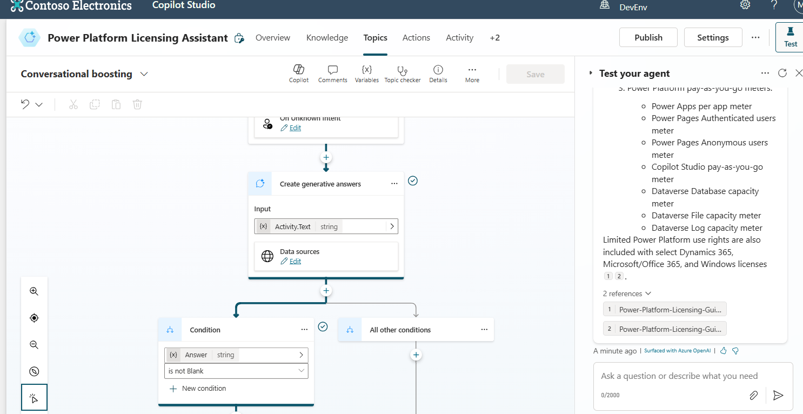

Notice that the topic **‘Conversational boosting’** is displaying along with the answer in Test Pane. Licensing guide knowledge source has been used.

