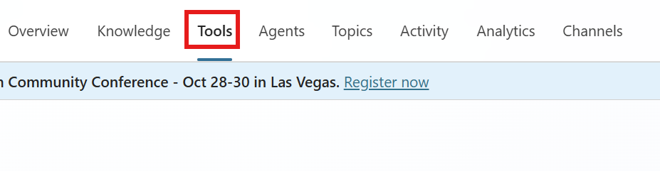
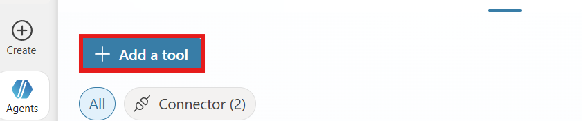
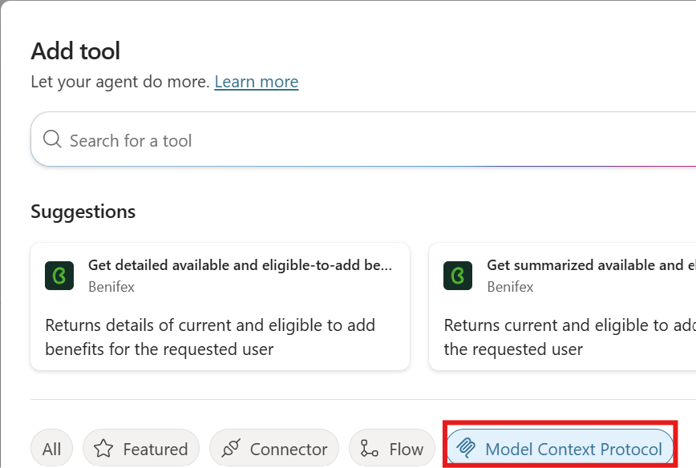
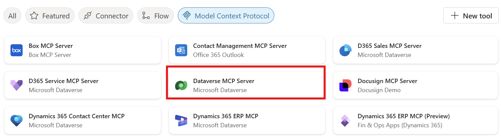
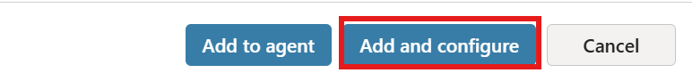
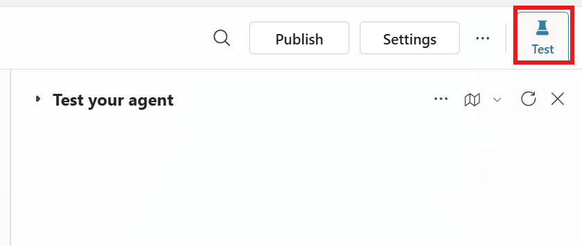

# Lab 4: Integrate Model Context Protocol (MCP) in Copilot Studio

## Objectives
- Add and configure the Model Context Protocol (MCP) tool
- Connect to Microsoft Dataverse using OpenAPI
- Test and validate your agent’s real-time data access

---

## Task 0: Prerequisites

- It's required to have completed **[Lab 0 - Create an agent](./00-create-an-agent.md)** to follow this part.

## Task 1: Add the MCP Tool

1. Open your agent in Copilot Studio.
2. Go to the **Tools** section.

3. Select **+ Add a tool**.

4. Search for **Model Context Protocol**.

5. Choose **Dataverse MCP Server** from the list.

6. Click **Add and configure**.

---
Note: You can add [your own Model Context Protocol server] (https://learn.microsoft.com/en-us/microsoft-copilot-studio/mcp-add-existing-server-to-agent) 

## Task 3: Test Your Agent

1. Open the **Test your agent** pane.

2. Try the following queries:
   - “Show me my contacts”
   - “Create a new lead with name John Doe”
3. Confirm that the agent retrieves or writes data in real time.

---

## Tips for Success

### Metadata Matters
- Use clear table names and descriptions in Dataverse.
- Add synonyms and definitions to improve natural language understanding.

### Centralised MCP Server
- Reuse a single MCP server across multiple agents.
- Only duplicate if isolation is required.

## Training Resources
- [Connect to Dataverse with MCP](https://learn.microsoft.com/en-us/power-apps/maker/data-platform/data-platform-mcp)
- [MCP in Copilot Studio Explained](https://www.youtube.com/watch?v=EYQqgLoYSNM)
- [Copilot Studio MCP Catalog](https://learn.microsoft.com/en-us/microsoft-copilot-studio/agent-extend-action-mcp)

