# Lab 5: Use Azure AI Search in Copilot Studio

## Objectives

## Contents

In this lab, you will perform the actions necessary to connect Azure AI Search to your Copilot Studio agent and use it to generate responses.

## Prerequisites

- It's required to have completed **[Lab 0 - Create an agent](./00-create-an-agent.md)** to follow this part.

## Estimated Completion Time

30 minutes

## Exercise 1: Create an agent in Copilot Studio

### Task 1: Navigate to Copilot Studio and create an agent.

1.	Navigate to Copilot Studio maker's page: https://copilotstudio.microsoft.com
2.	In the upper right-hand corner select an environment that you have access to and where we will create the Copilot Studio agent. 

    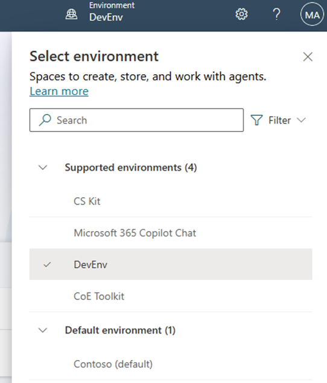

     
    
3.	Select **Create** and select **New agent**.

    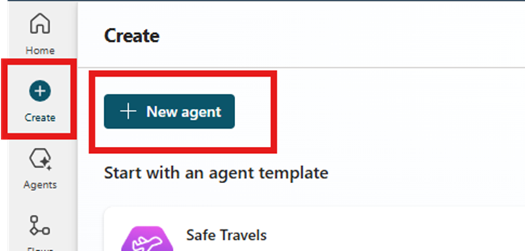
    
     

    > Note: Generative AI may not always ask the exact same questions to create the agent.

     

4.	In the prompt add **"This agent helps users with question related to Power Platform licensing"** then press Enter.
5.	When asked " Great! Now let's determine a name for this agent. How about "Power Platform Licensing Assistant"? Please confirm or suggest another name." answer **"Yes."** 
6.	 When asked ‘Now, let's refine the instructions for the Power Platform Licensing Assistant. First, let's define what the agent should do. For example, "Provide detailed information about Power Platform licensing options and answer user queries related to licensing." What specific actions or behaviours should the agent perform?’ answer **"This agent provides users with information and answers questions related to Power Platform licensing, including pricing, features, and subscription options."**
7.	When asked “The Power Platform Licensing Assistant is now set up to assist users with questions related to Power Platform licensing, including pricing, features, and subscription options. Would you like to add any publicly accessible data sources for this agent? This step is optional.” Answer **“No”**
8.	Now you can select Create. 

    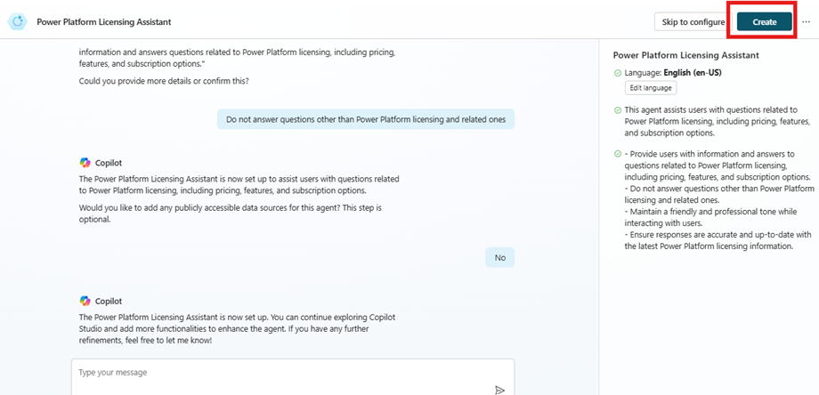

     

    > Note: Wait for setup to complete..

     

9.	In **“Details”** section, take a look to **“Name”**, **“Description”** and **“General instructions”**. You can edit the description and general instruction to refine the behaviour the agent. Enable the use of generative AI to determine how to best respond. 

    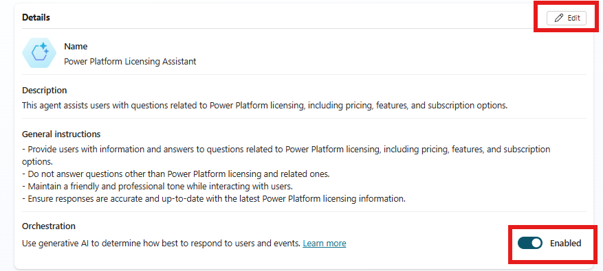

 ## Exercise 2: Use Azure AI Search as knowledge source

### Task 1: Review Azure AI Search configuration

1. In the Azure Subcription you should have an Azure Storage with a Container containing a licensing guide  "Power-Platform-Licensing-Guide-MMMM-YYYY.pdf" (https://go.microsoft.com/fwlink/?linkid=2085130)

    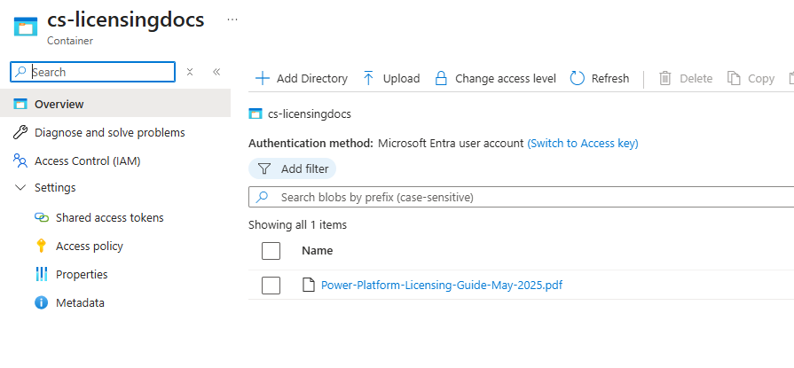

     

2. In Addition check for an Azure AI Search service

    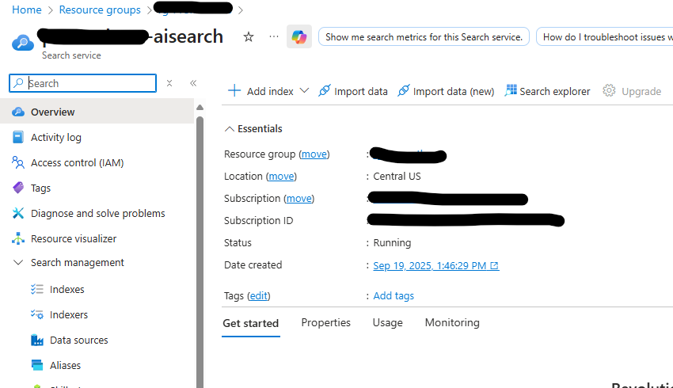

     

    and for an Azure Open AI service in your subscription

     

    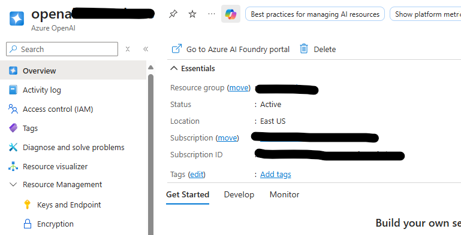

     

3. Review also you have deployed an embeddings model in Azure Open AI

    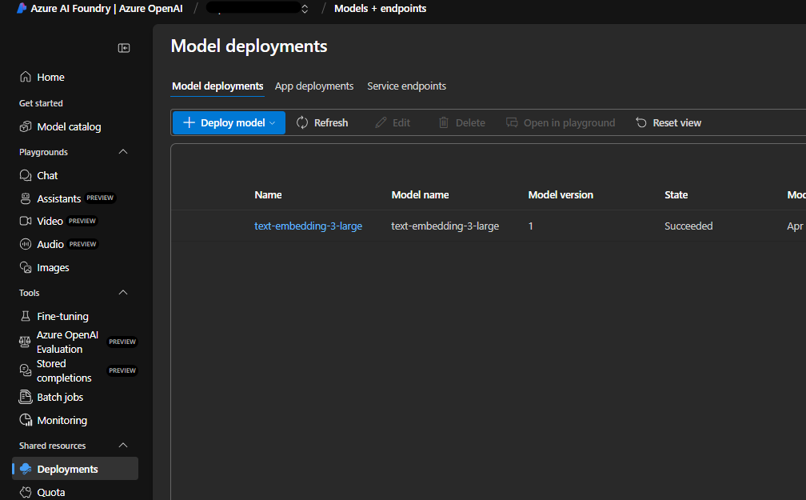

     

    and in Azure AI Search you have imported and vectorize the licensing guide

     

    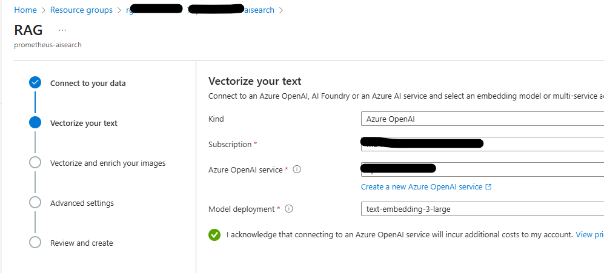

     

    

     

    You have are ready to connect Azure AI Search to your agent

### Task 2: Connect agent to Azure AI Search

1.	To connect our agent to Azure AI Search we will need its **endpoint url** and an **admin key**. For the **url** you can find and copy it at the **Overview** page in Azure AI Search Service

    

     
 
    and for **admin key**, you can find that in **Keys** page. You can copy one of two indifferently

     

    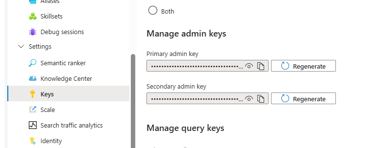 

     
 
2. Back to our **Licensing Assistant** agent in Copilot Studio, go to the agent's **Knowledge tab**, click **"Add Knowlege"** button and select **Azure AI Search** in the dialog that appears.

   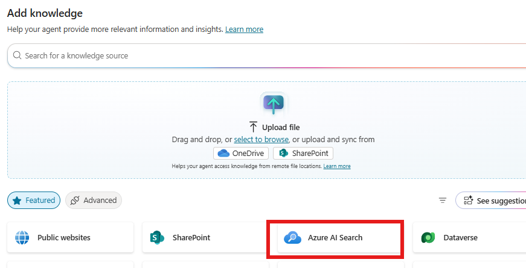

    

3. You will have to **create a new connection** and **Add to agent**
   
   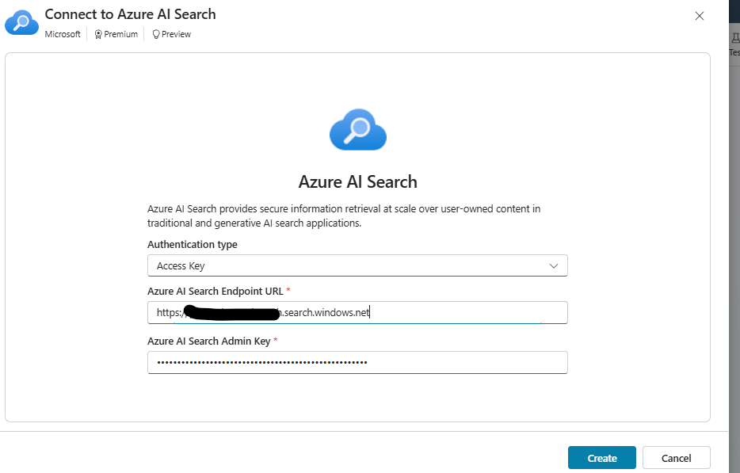

    

You are now ready to test your agent using Azure AI Search as Knowledge source

### Task 3: Use Azure AI Search in you agent

1. If the **Test copilot** pane is hidden by default, open it by selecting the Test icon.
 
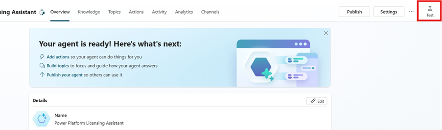

 

2.	Select ... next to the Copilot reset button

 
  
3.	At the box **'Ask a question or describe what you need'** prompt in the Test copilot pane, type ‘What are the different licensing options available for Power Platform?’.
 
    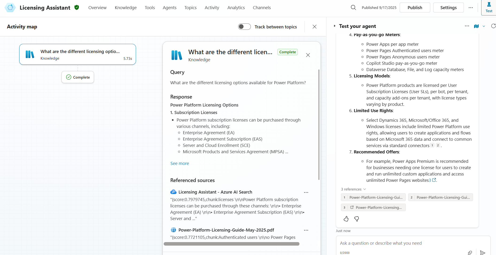

 

Notice that 'Activity map’ is displaying along with the answer in Test Pane. Azure AI Search as knowledge source has been used.

Lab is now completed, well done!!!. You can move to the next lab
