# Lab 6: Use use custom models in Copilot Studio

## Objectives

In this lab, you will perform the actions necessary to use custom models from Azure AI foundry in your Copilot Studio agent and generate responses.

## Prerequisites

- It's required to have completed **[Lab 5 - Use Azure AI Search in Copilot Studio](05-%20AI%20Search.md)** to follow this part.

## Estimated Completion Time

30 minutes

## Exercise 1: Make custom model available in Power Platform

### Task 1: Deploy custom model in AI Foundry

1.	Open AI Foundry portal https://ai.azure.com and select project you used in Azure AI Search Lab. You can open also Azure portal https://portal.azure.com , look for your Azure OpenAI resource, open it and click on **Go to Azure AI Foundry Portal**. 

2. Click **Deployments** in left-hand menu.

    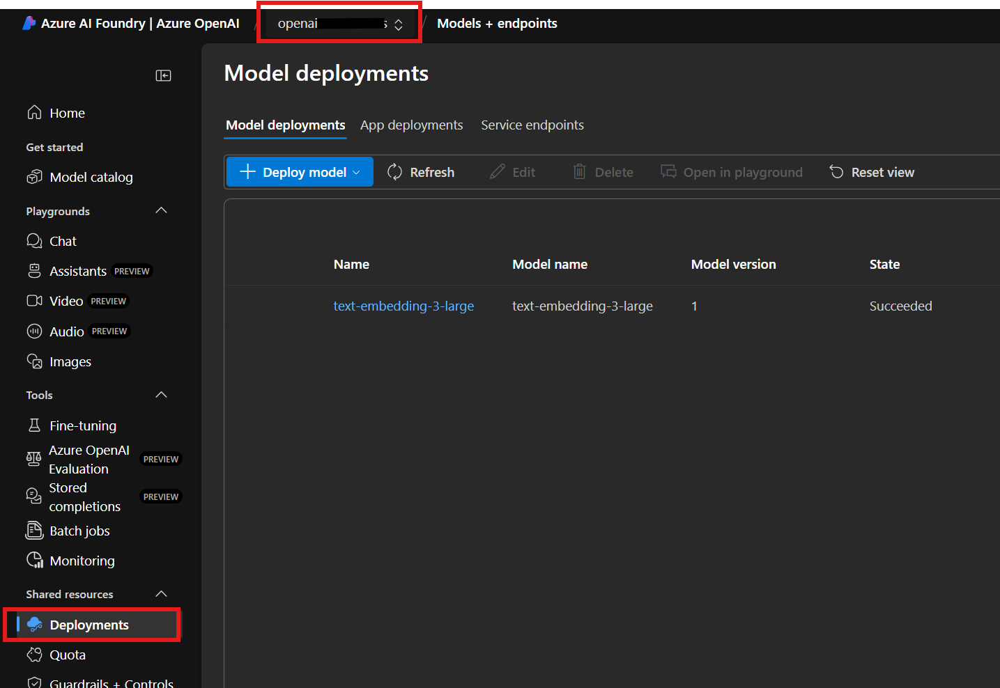

    <br>
    
3.	In **Model deployments** click in **Deploy model**, select **Deploy base model** and look for **o4** model. Select the **o4-mini** model and click **Confirm** in lower button.

    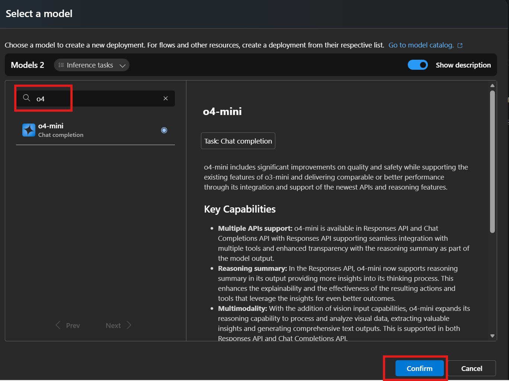

    <br>
    
4.	Let config values as is. Click **Deploy** lower button.

    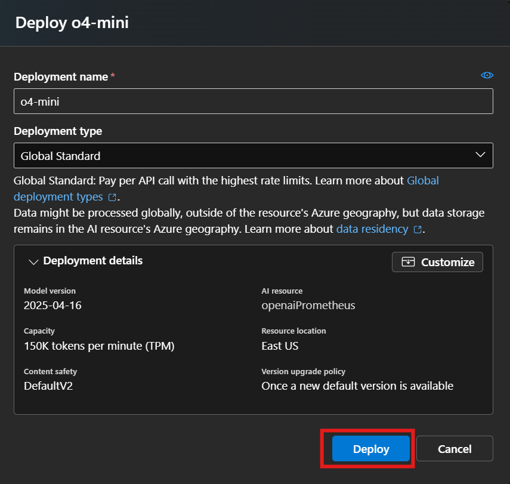

    <br>
    
5.	Take note of **Target URI** and **Key** and copy those in a safe place. You will use bot afterwards in Copilot Studio.

    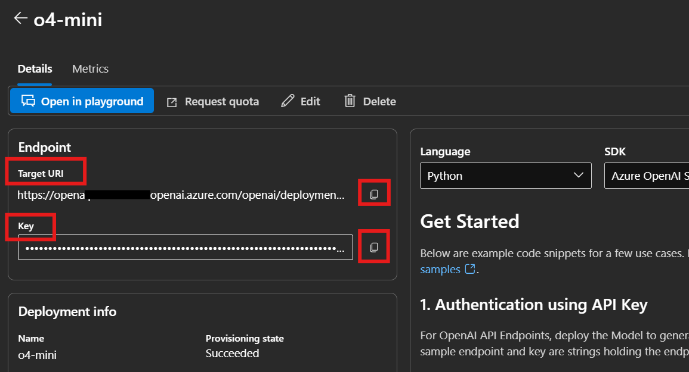

    <br>

### Task 2: Create a Power Platform prompt connected to your model

1. Open Power Apps Maker portal **https://make.powerapps.com** and click **Prompts** in the left-hand menu. If you cannnot find the **Prompts** in the menu, open **... More** item in the botton, click **Discover all**, find **AI** group and pin **Prompts**.
   
    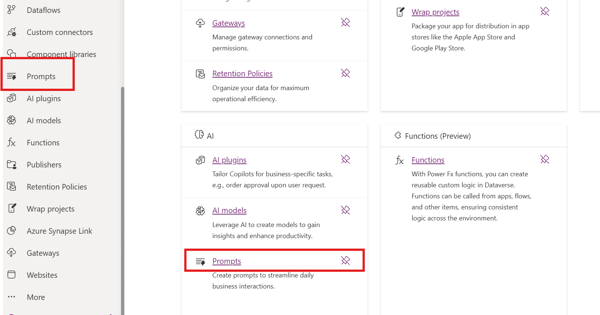

    <br>

2. With ** Prompts** opened, click on **Build your own prompt**. When Prompt editor opens, change the name of the Prompt to something as **RAG on Azure AI Search** and copy in the **Instructions** text area the following: **Make a summary of <insert text parameter named 'input'>, don't do any reference to the input or document.**. (You can adapt the instructions with other prompt afterwards if you want).
  
    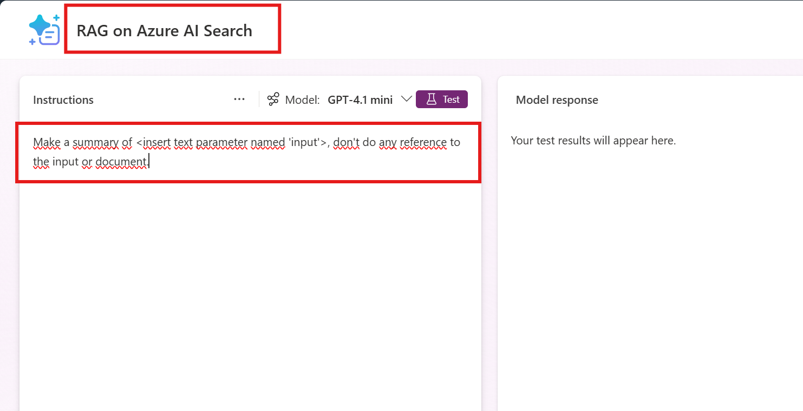

    <br>

3. Select text **<insert text parameter named 'input'>**, press slash **/ key (shift + 7)** and select **Text**. Change the name of parameter to **input**. You can add some text in **Sample Data** for testing.
 
  
    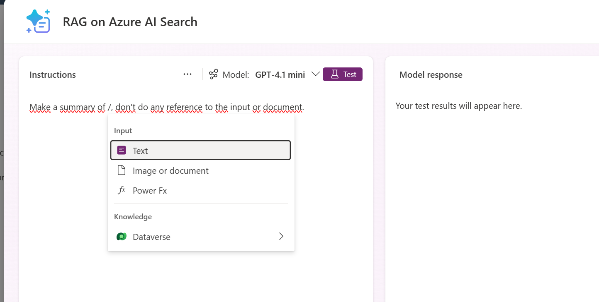

    <br>

     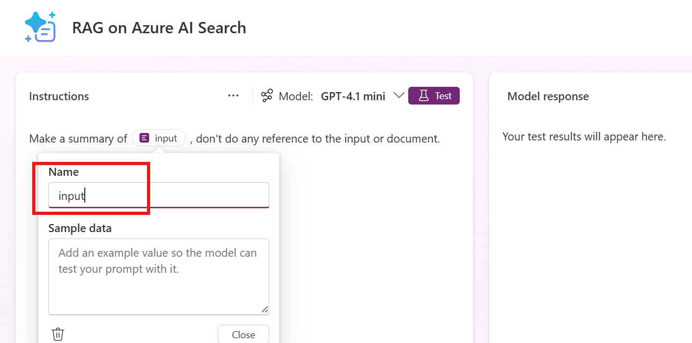

    <br>

4. Expand the List Box **Model** to review different models you can use with your prompt. Select the **Cros icon** in the bottom to add a model form Azure AI Foundry and click **Connect a new model** in the dialog shown.

     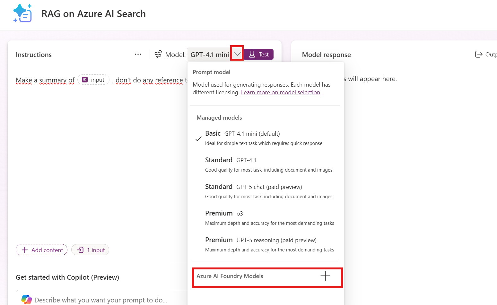

    <br>

5. Recover the **Target URI** and **Key** you wrote down proviously and fill out the connection fields **Azure model endpoint URL** and **API Key** respectively. For instance put **o4-mini** for both fields **Model deployment name** and **Base model name**.

     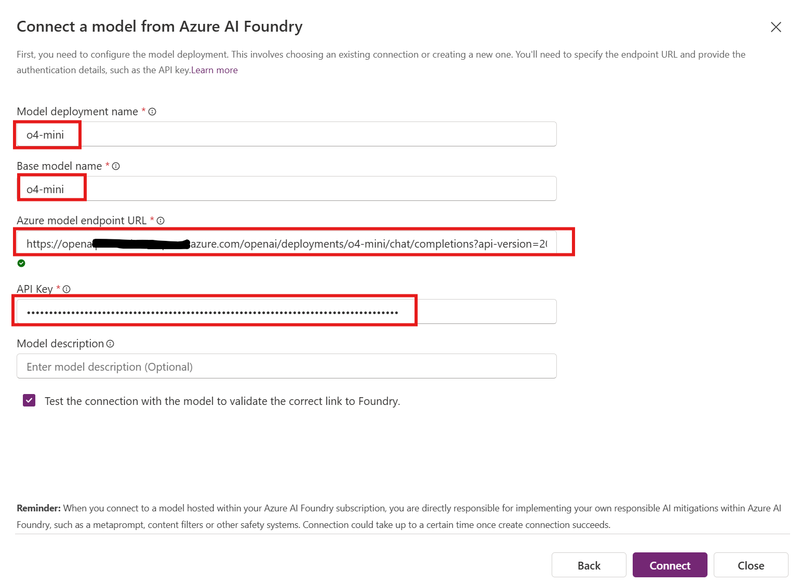

    <br>
   
6. Click **Connect**. You will have your AI Foundry custom model connected to your prompt. Now you can **Save** your prompt (lower right button).
 
     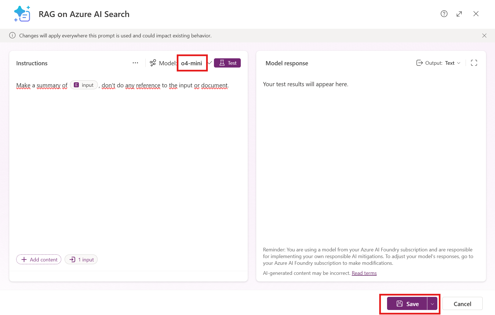

    <br>
    
 ## Exercise 2: Use the model in Copilot Studio

### Task 1: Modify Conversational boosting system topic 

1. Open your agent in Copilot Studio (you can use the agent created in previous lab for AI Search)
2. Go to **Knowledge** tab, select your Azure AI search knowledge source and take note of the name of the index **Selected**. You will use it in next steps. Go back and remove this knowledge source.
  
     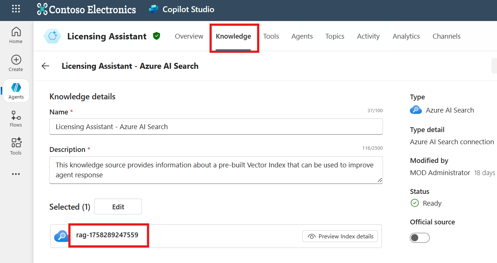

    <br>

3. Select **Topics** tab and filter for **System (9)**. Click on **Converstaional boosting** to edit the topic.

     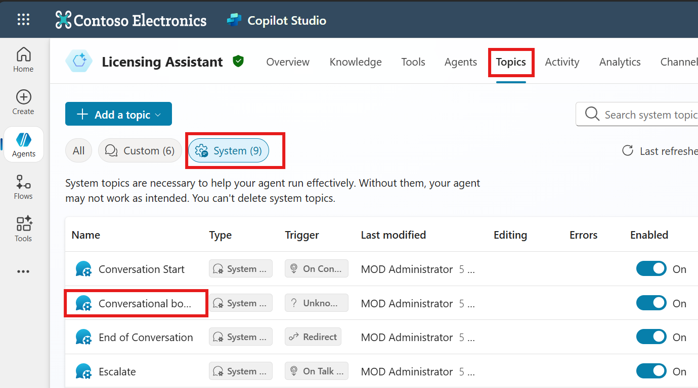

    <br>
  
4. On the screen editing the prompt, click in the cross icon just below the trigger **On Unknow Intent**, select **Add a tool** and serch in **Connector** tab for **Azure AI Search**. Select **Search vectors with natural language**.

     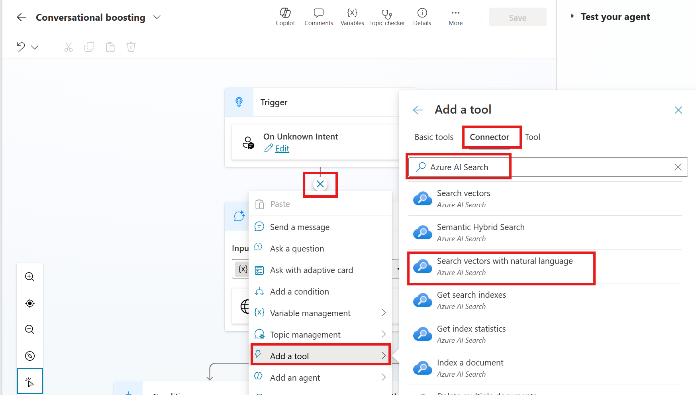

    <br>
  
5. In the **Create or pick a connection** dialog you can use the connection created in previous lab. Click on **Submit**
6. Click **Inputs** in **Search vectors with natural language** action. Fill out the following fields:
   -  **Index Name**: name of the index previously saved
   -  **Search Text**: click on three dots on the right of the field and select **System** variable named **Activity.Text**
   -  **Select fields**: click on three dots on the right of the field and write formula **["chunk","title"]**
   -  **Top Searches**: You can put a number, i.e. **5**
  
     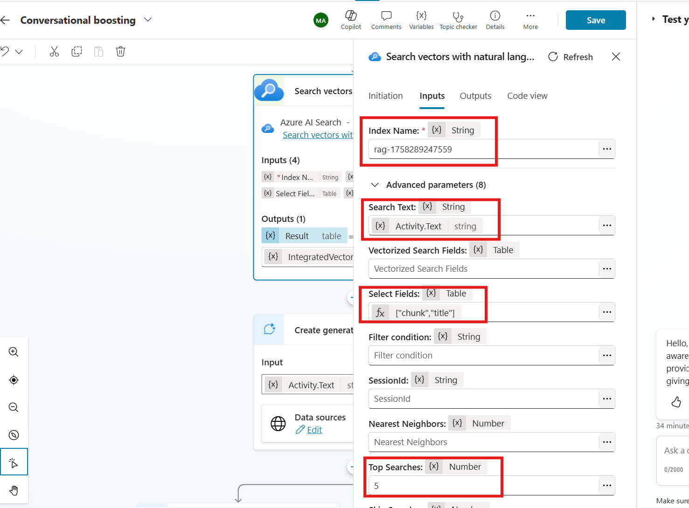

    <br>
  
7. Below **Search vectors with natural language** action, click again in the cross icon just below, select **Variable management** and **Parse value** option.
8. On **Parse value** action, fill the **Parse value** (click on three dots in the right) with **Custom** variable **IntegratedVectorSearch**
 
     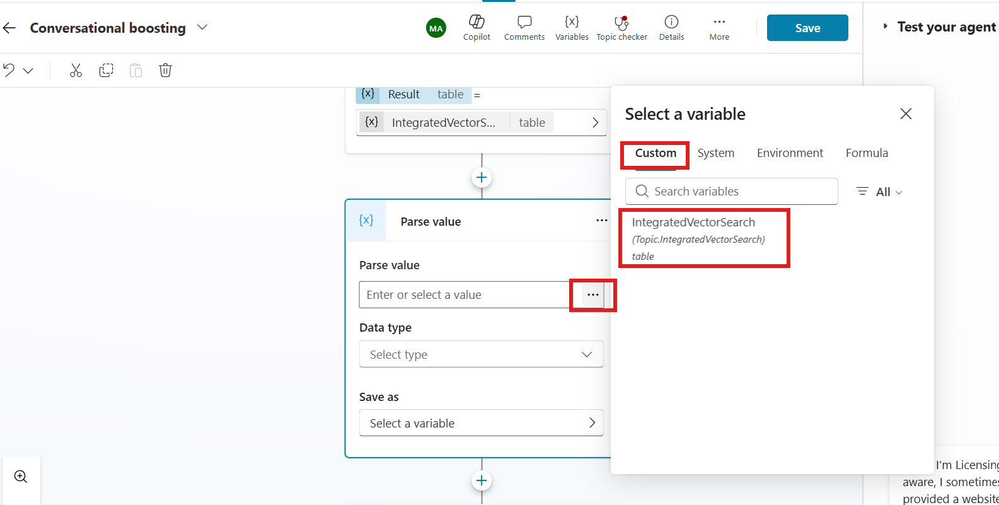

    <br>

9. For **Data type** field select **From Sample data** and click on **Get schema from sample JSON**.  Copy the following sample schema and click **Confirm**
    ```
    [
        {
            "chunk": "xxxxxx",
            "score": 0.7754992,
            "title": "yyyyy"
        },
        {
            "chunk": " zzzzzzzzzzz",
            "score": 0.76120704,
            "title": "rrrrrrrrrrr"
        }
    ]
    ```
 
     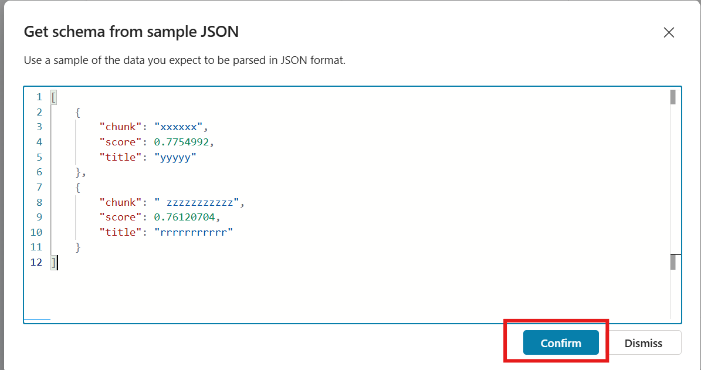

    <br>

10. On **Save as** click right arrow and **Create a new variable** with some name, for instance, **varSearchParsed** (click on created name similar to **Var1** and change the **Variable name** in the dialog that pops up)

     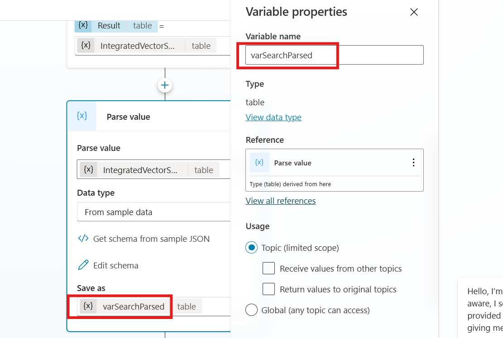

    <br>

11. Below **Parse value** action, again **Add a tool** but in this case in **Basic tools** look for **RAG on AZure AI Search** (prompt) that we created previously.

     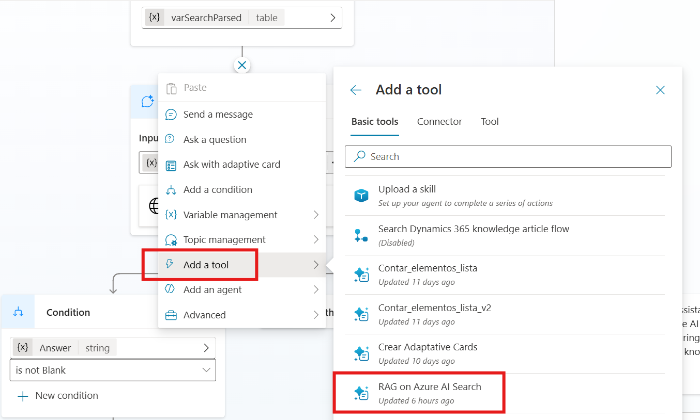

    <br>

12. Fill **input (String)** field value with the Formula below and click **Insert**.

    ```

    Concat(Topic.varSearchParsed,chunk,",")

    ```
       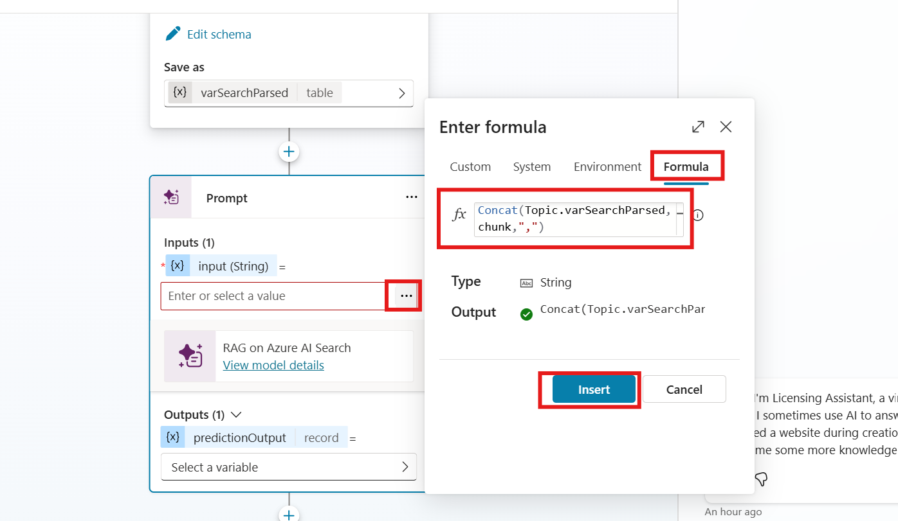

    <br>
  
13. We will **Create a new variable** clicking in the **Outputs** right arrow. As in a previous step rename the variable to something like **varRAGResponse**

14. Next step is to show finally the response from our Custom model. For that, below **Prompt** action we have to add a **Send a message** action, and select **varRAGResponse.text** variable for the **message**

       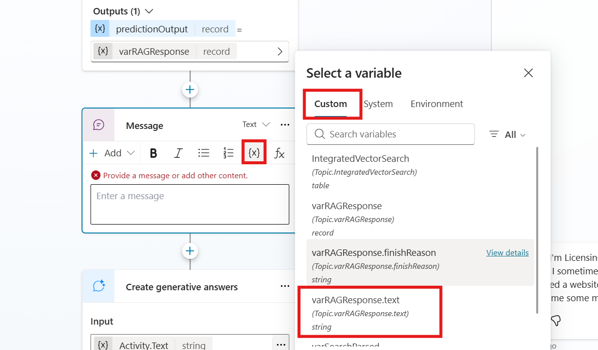

    <br>
 
15. Finally we will add a **End current topic** action to end the flow in **Boosting conversation** topic. Click **Save** top button in topic editor to save our customized topic.

       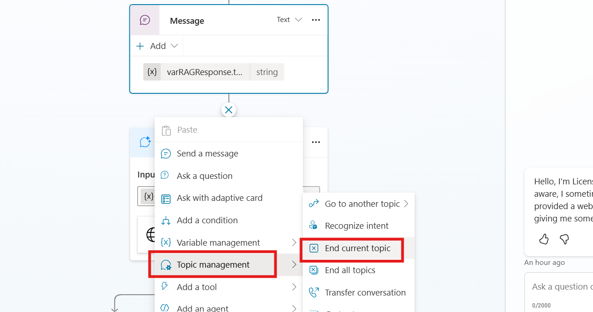

    <br>
 
### Task 2: Final agent configuration and testing

1.	On Copilot Studio go to **Settings** (upper right button) and check in **Generative AI** settings, **Knowledge** group that **Use general knowledge** and **Use information from the Web** are **Off**. Click **Save** on the bottom if you changed the values to **Off**. Close **Settings**

       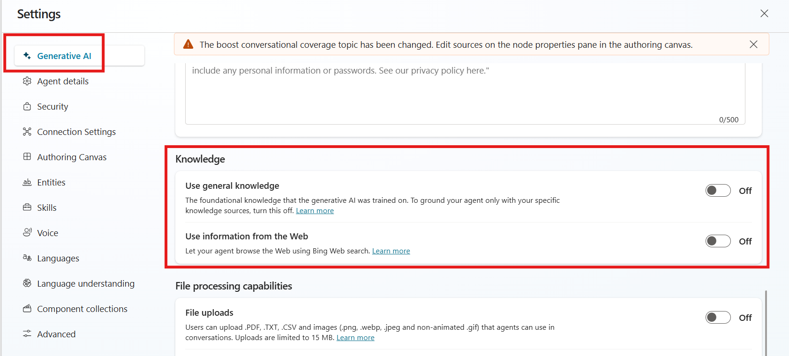

    <br>
 
2. Open **Test your agent** window and write the following prompt:
   
    ```
    What types of POwer Apps licenses are there?
    ```

     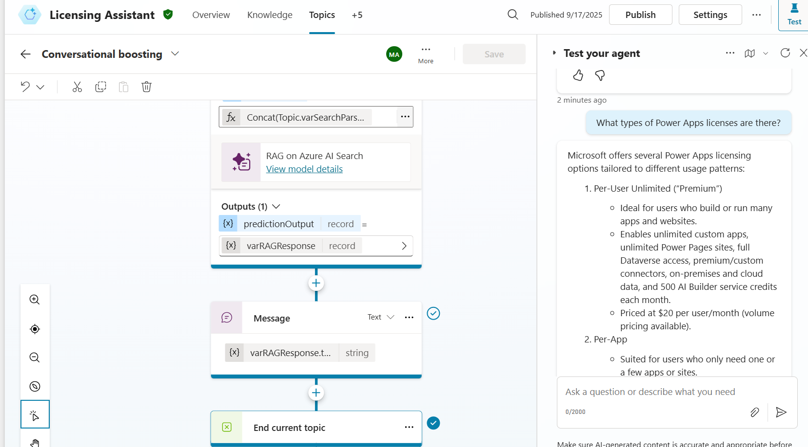

    <br>
 

Lab is now completed, well done!!!.
