#  Azure AI Search Flow Accelerator
## Objectives
Copilot Studio is a native tool that can be extended with various Azure AI capabilities. Thanks to Microsoft’s accelerators, we can enhance its functionality and significantly improve performance. In this document, we’ll explore how each accelerator can support and complement Copilot Studio to achieve this goal.

On this case importing the [Azure AI Search Flow] we were able to connect Copilot Studio with Azure AI Search in a more efficient way, enabling advanced search capabilities and improving the overall user experience.

***

# 1) Prerequisites & What you’ll import

*   **Power Platform environments** (Dev → Test/Prod) with **Dataverse**.
*   A **solution (.zip)** that contains:
    *   Your **cloud flow** (solution‑aware).
    *   Your **custom connector** (solution‑aware).
    *   **Connection references** used by the flow/connector.
*   Permissions to **import solutions** and activate flows/connectors. [\[learn.microsoft.com\]](https://learn.microsoft.com/en-us/power-apps/maker/data-platform/import-update-export-solutions)

> **Why solutions?** Solutions package apps, flows, connectors, env‑vars and make **ALM** (export/import, managed vs unmanaged) consistent across environments. [\[learn.microsoft.com\]](https://learn.microsoft.com/en-us/power-apps/maker/data-platform/import-update-export-solutions)

***

# 2) Import the solution into your target environment

1.  Go to **Power Apps** → **Solutions** → **Import solution**.
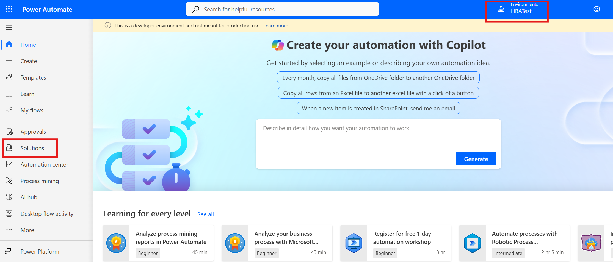
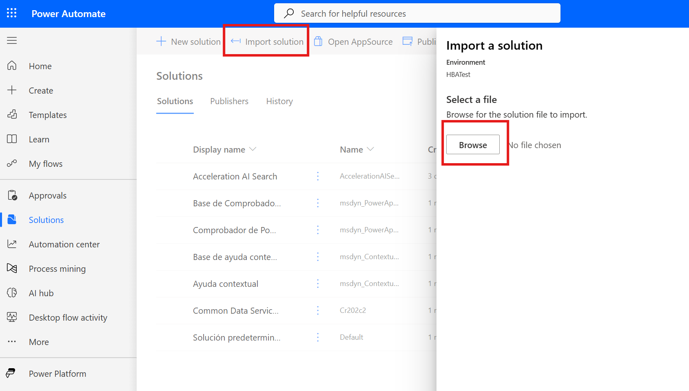
2.  Upload the **solution file** and select **Next**.
3.  In **Advanced settings**, keep the option to enable **plugin steps and flows**.
4.  Proceed with **Import**, then **Publish all customizations** once done. [\[learn.microsoft.com\]](https://learn.microsoft.com/en-us/power-apps/maker/data-platform/import-update-export-solutions)

***

# 3) Configure connection references & authenticate

After import:

1.  Open the **solution** → review **3ActionAISearch connector** click on it to edit the connections to your Azure AI Search service.
2.  On the connector page, click **Edit** to modify its connections and AI Search endpoint.
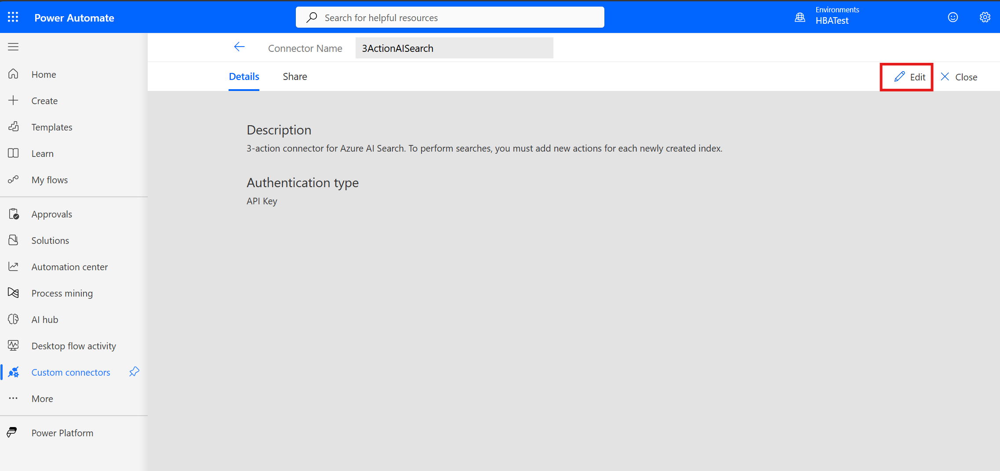
3.  On General change host name to yor AI Search endpoint. Such us <your_ai_search_name>.search.windows.net. Do not type https://
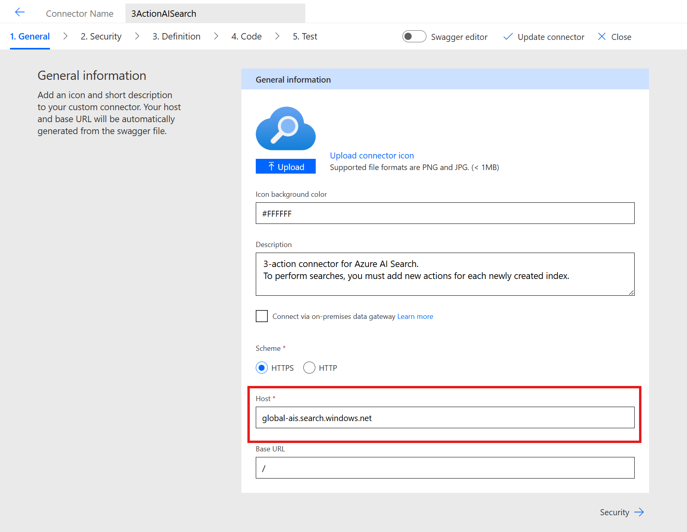
4.  Leave steps 2, 3 and 4 as is.
5.  On Test tab, create a new connection using your **api-key** from Azure AI Search.
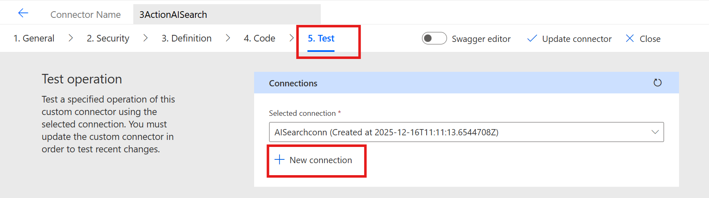
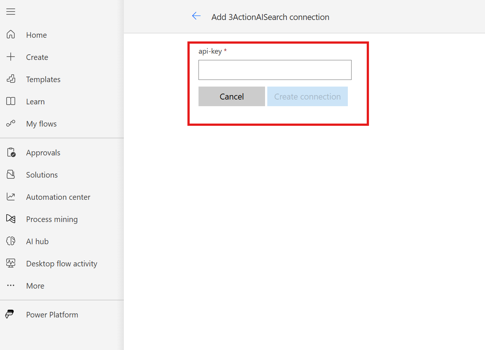
6.  Save the connector clicking in **update connector**. Now your connector is ready to be used in the flow.
***

# 4) Finish Review at copilot Studio

Go to [Copilot Studio](https://copilotstudio.microsoft.com/). Check you are in the right environment. In tools section you will be hable to see, the connector and the flow.

Then click on the flow to open it and test it.
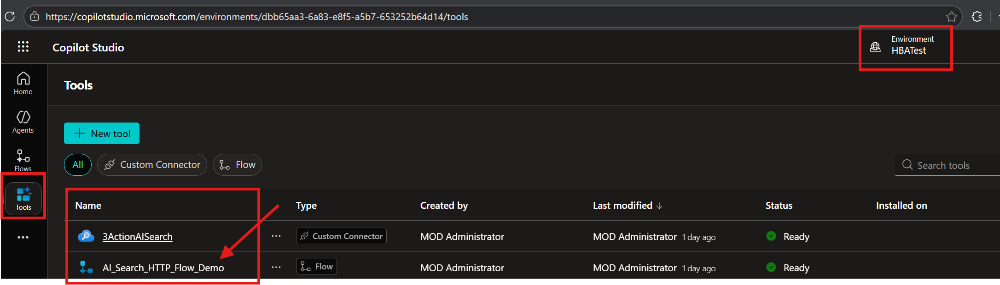

Now you can check the flow steps and familiarize yourself with its logic.

## Step-by-Step: What This Flow Does 
1.  **Manual Trigger** The flow starts when you manually trigger it using a button. 

2.  **Initialize Variables** Several variables are initialized: - `select` (default: `*`) - `search` (default: `""`) - `filter` (default: `""`) - `facets` (array) - `top` (default: `10`) - `api-version` (default: `2025-09-01`) 

3.  **Set Variables Based on Inputs** The flow checks if you provided values for `select`, `search`, `filter`, `facets`, `top`, and `api-version` in the trigger. If so, it updates those variables. 

4.  **Switch Action** Based on the `Action` input (`CreateIndex`, `UploadDocuments`, or `Search`), the flow runs one of three cases: - **CreateIndex:** Creates a new index. - **UploadDocuments:** Uploads documents to a specified index. - **Search:** Runs a search query using the provided parameters. 
5.  **End** The flow completes after executing the selected action. --- 

**Summary:** This flow lets you choose between creating an index, uploading documents, or searching, with flexible parameters for each operation.

***

# 5) How to use it

1.  In the design view of copilot studio. Cliclk on **Test** button on the top right corner.
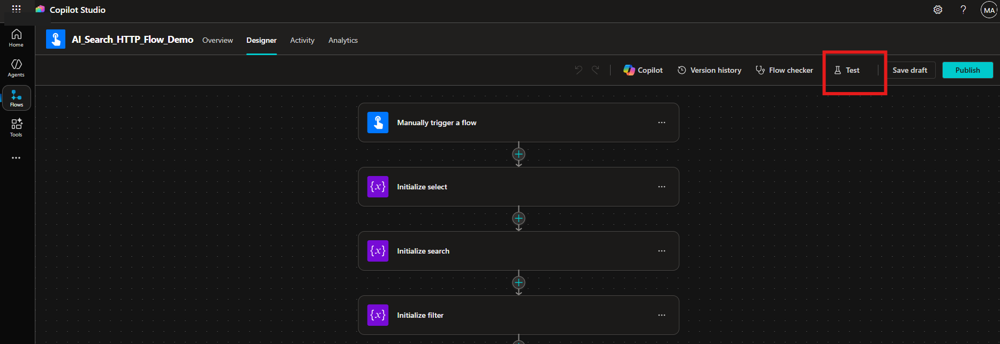
2.  A panel will open on the right side where you can set the parameters for the flow.
*       Select Manually to insert the parameters.
*       Select Automatically if you want to use a previous parameters configuration. (This option will be only available after you have run the flow at least once)
*       Click test.
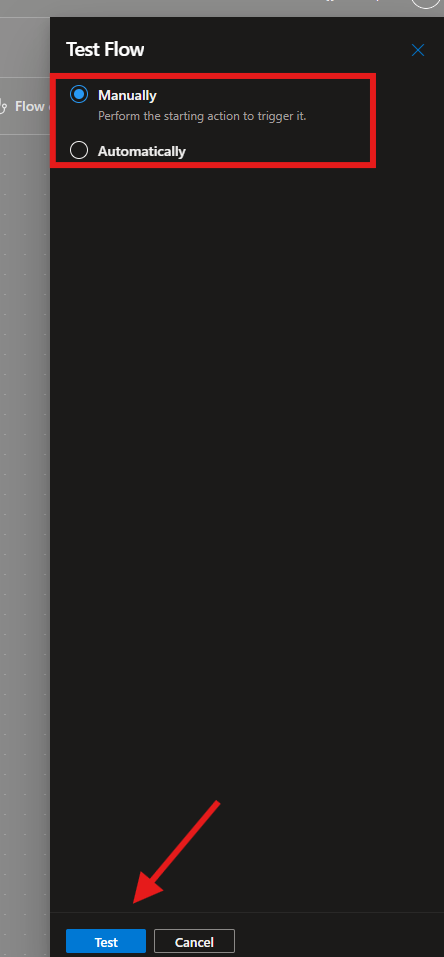

3.  Set the **Action** you want to perform: `CreateIndex`, `UploadDocuments`, or `Search`.
4.  Fill in the other parameters as needed based on the action you selected.

*   For `CreateIndex`, provide the body json and your api-key. You can find an example of the body in the [test-sample](test-sample/ai-search-createIndex-demo.http) file.
    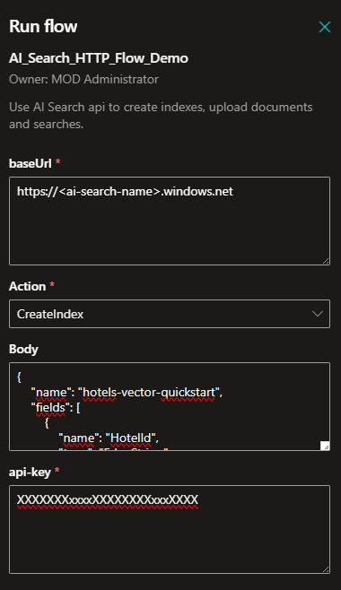

*   For `UploadDocuments`, provide the index name, body json and your api-key. You can find an example of the body in the [test-sample](test-sample/ai-search-createIndex-demo.http) file.
    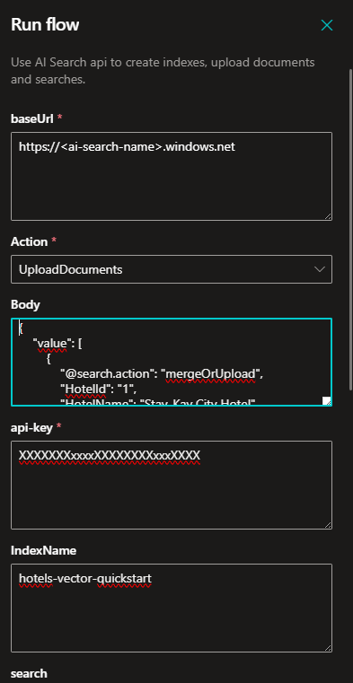

*   For `Search`, provide the index name, body json and your api-key. You can find an example of the body in the [test-sample](test-sample/ai-search-createIndex-demo.http) file.
    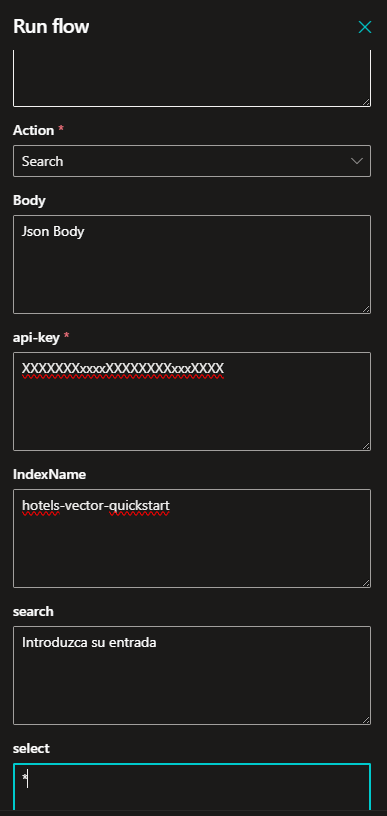

5.  Click on **Run flow** to execute it.

***

## Appendix — Useful references

*   **Use connectors in Copilot Studio agents** (overview, prebuilt & custom). [\[learn.microsoft.com\]](https://learn.microsoft.com/en-us/microsoft-copilot-studio/advanced-connectors)
*   **Call an agent flow from an agent / topic** (tools vs topic invocation patterns). [\[learn.microsoft.com\]](https://learn.microsoft.com/en-us/microsoft-copilot-studio/advanced-use-flow)
*   **Import solutions** (managed vs unmanaged, publishing, troubleshooting). [\[learn.microsoft.com\]](https://learn.microsoft.com/en-us/power-apps/maker/data-platform/import-update-export-solutions)
*   **Use environment variables in solution custom connectors** (syntax, Key Vault support). [\[learn.microsoft.com\]](https://learn.microsoft.com/en-us/connectors/custom-connectors/environment-variables)
*   **Azure AI Search connector reference** (auth types, actions, limits). [\[learn.microsoft.com\]](https://learn.microsoft.com/en-in/connectors/azureaisearch/)

***