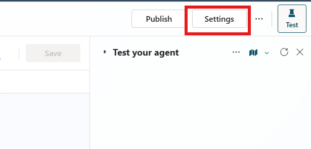
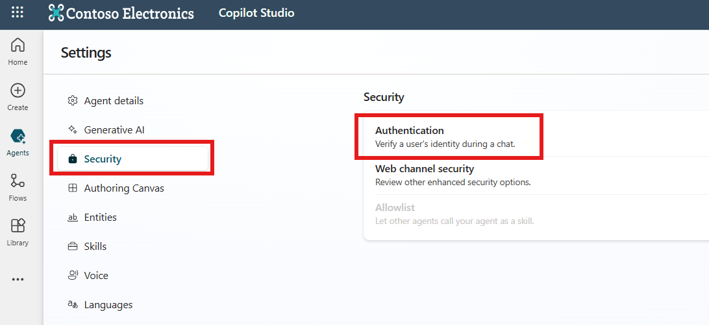
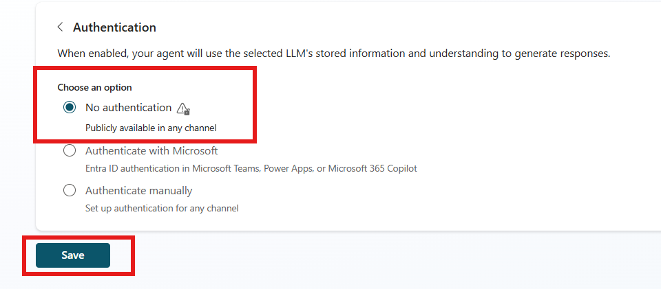
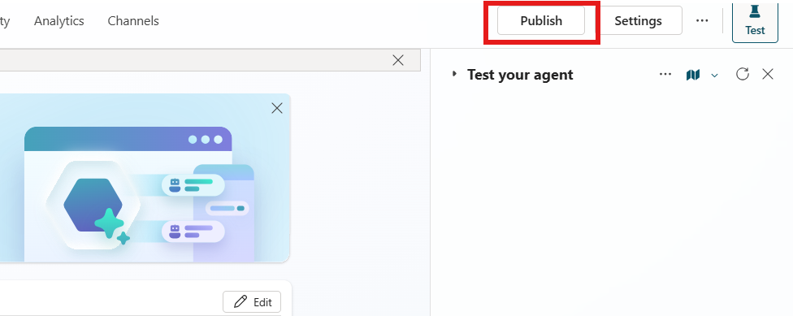

# Lab 1.1: Authentication

## Objectives

- Exercise: Agent authentication  
   - Task 1: Configure agent authentication

## Contents

In this lab, you will perform the actions necessary for building an agent with Copilot Studio for using in the rest of labs.

## Prerequisites

- It's required to have completed **[Lab 0 - Create an agent](./00-create-an-agent.md)** to follow this part.

## Estimated Completion Time

- 30 minutes

## Exercise 1: Create an agent in Copilot Studio**

## Exercise 3: Agent authentication

### Task 1: Configure agent authentication

1. Select the **‘Settings’** button in the upper right corner of the designer

2. Select **‘Security’** in the left menu and click on **‘Authentication’**

3. For simplicity, we will start with our agent being publicly available. Choose **‘No authentication’** and click **‘Save’**.

4. Close ‘Settings’ clicking cross icon in the upper right corner and select button ‘Publish’ button close to ‘Settings’ one.

