# Lab 1.1: Create Topics

## Objectives

- Exercise: Add specific topics of conversation  
    - Task 1: Enable Orchestration based on generative AI  
    - Task 2: Create a single-turn topic  
    - Task 3: Test single-turn copilot  
    - Task 4: Add multi-turn topic  
    - Task 5: Test multi-turn topic.

## Contents

In this lab, you will perform the actions necessary for building an agent with Copilot Studio for using in the rest of labs.

## Prerequisites

It's required to have completed **[Lab 0.0 - Create an agent](./0.0-create-an-agent.md)** to follow this part.

## Estimated Completion Time

- 30 minutes

## Exercise 1: Add specific topics of conversation

### Task 1: Enable Orchestration based on generative AI

1. Enable generative orchestration means Copilot Studio understands the intent of the user processing the prompt provided by the user in natural language and determines the best item to trigger, in the **Overview** tab enable (if you didn’t it previously) the toggle with name **Orchestration**

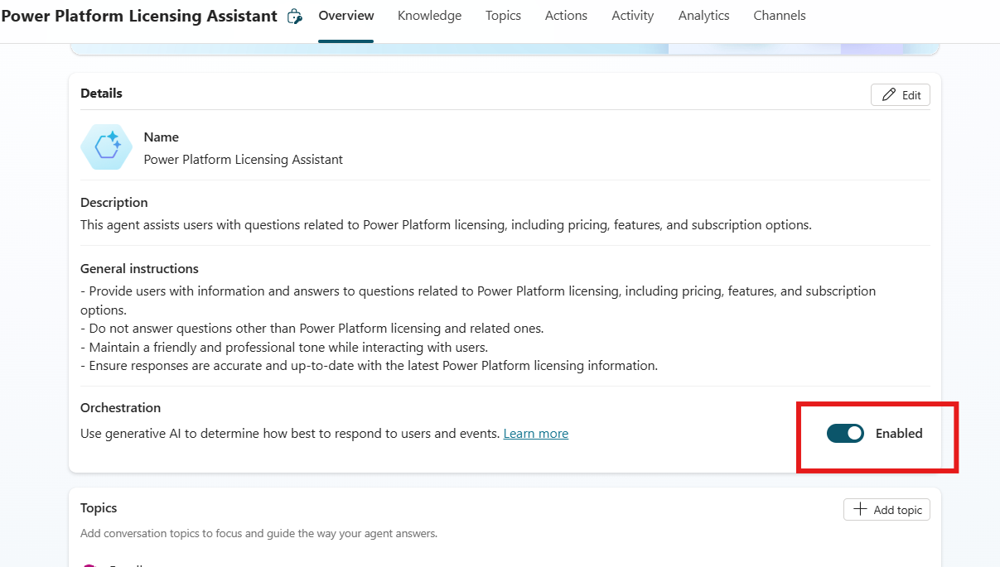

### Task 2: Create a single-turn topic

2. To create a new topic, in the upper side of the screen select **‘Topics’** tab, then select **'Add a topic’** and then **‘From blank’** to start creating a new custom topic.

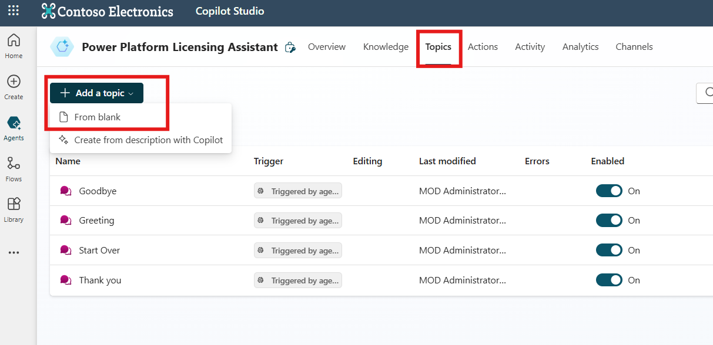

3. In the very first building block of the topic **‘Trigger’** (which is used to describe what the topic does), write the following: ‘This topic answers exclusively questions where price is requested: Can you provide the pricing details for Power Platform licenses?, what is the price for Power Automate premium licenses?, Give the price for a Copilot message in pay as you go?’

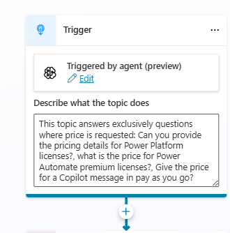

4. Select the **‘+’ button** in the middle of the screen to add ‘Send a message’ action

5. Write in the box the following sentence ‘To answer questions related to prices ask a MS commercial representative’

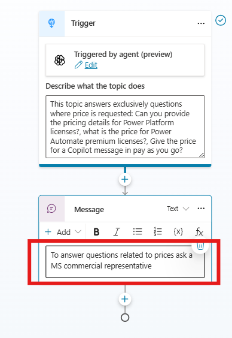

6. Select again the **‘+’ button** to add a ‘End current topic’ action.

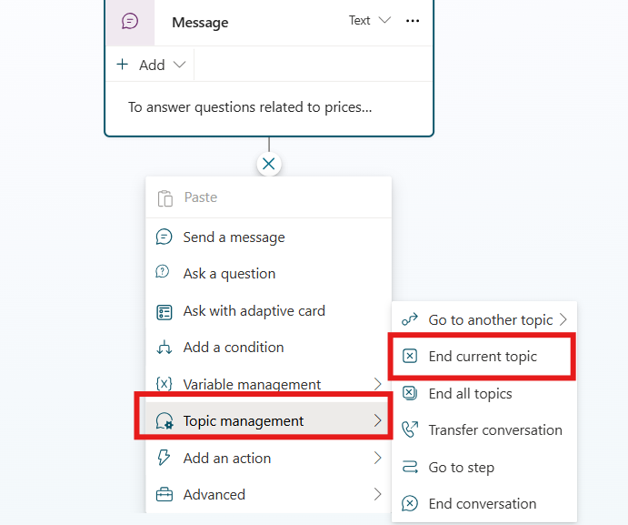

7. Select the **‘Save’** button in the upper right corner of the designer, provide a name for the topic and click **‘Save’** button in the dialog.

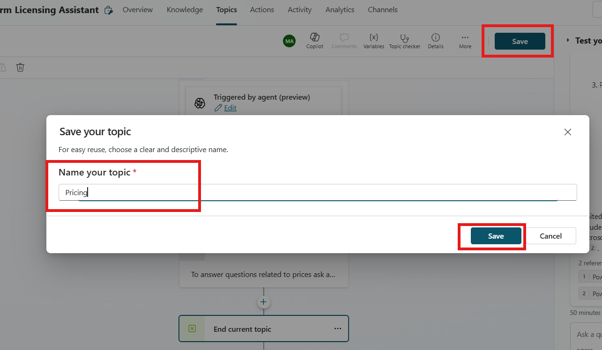

### Task 3: Test single-turn topic

1. At the box '**Ask a question or describe what you need'** prompt in **Test copilot** pane, type ‘Tell me the price for Power Apps per app licenses’.

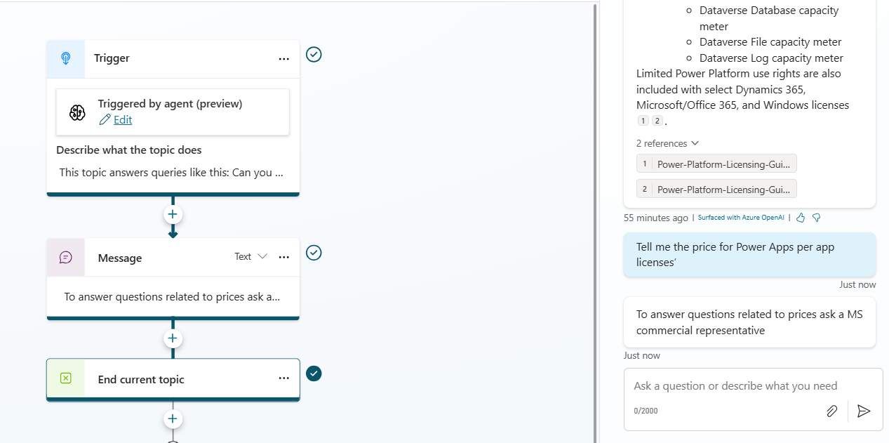

Generative orchestration detected a question for ‘Pricing’ topic and played that.

### Task 4: Add a multi-turn topic

2. In the upper side of the screen select **‘Topics’** tab, then select **'Add a topic’** and then **‘From blank’** to start creating again a new custom topic.

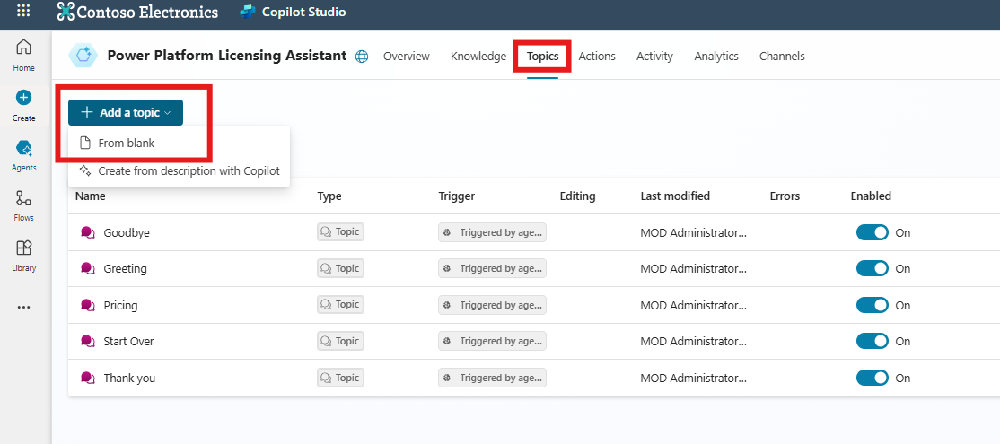

3. In the block **‘Trigger’** write the following: ‘This topic answer exclusively questions where contact is requested: I want to contact with a commercial representative, how to contact?’

4. Select the **‘+’ button** in the middle of the screen to add ‘Ask a question’ action

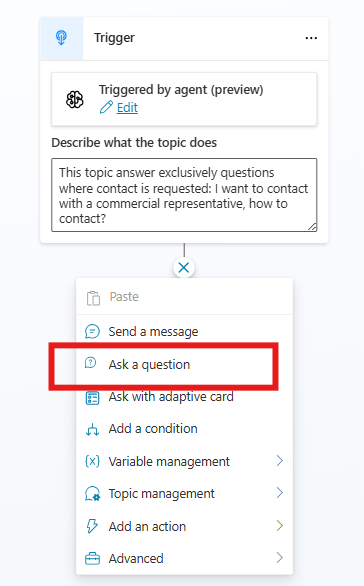

5. Provide the following message in text box: "Please, enter your email address"

6. Click arrow below in **‘Identify’** to choose information to be identified in the answer. Search for email and select it.

7. Click in the three dots upper right corner of the Question action and select **‘Properties’**

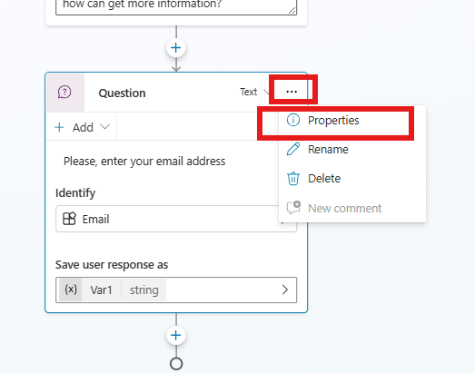

8. Click in the box ‘Interruptions’

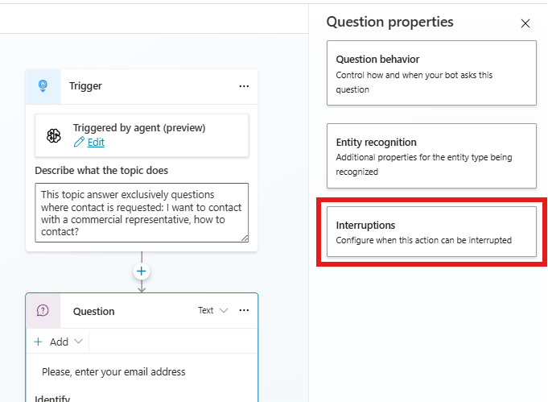

9. Uncheck **‘Allow switching to another topic’** to avoid jump to another topic if the answer is not an email.

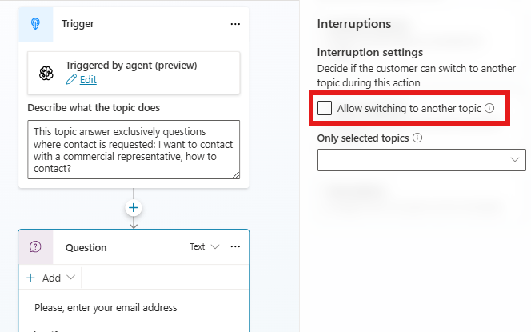

10. Select the **‘+’ button** again in the middle of the screen below ‘Question’ action box to add **‘Send message’** action

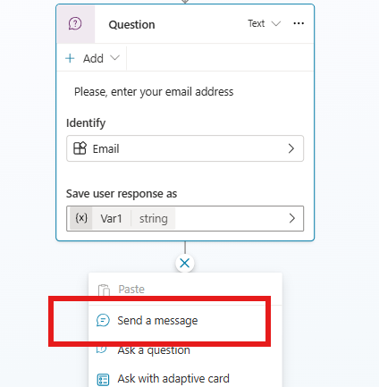

11. Write the following in text box: ‘Thanks, a commercial representative will contact to you soon’

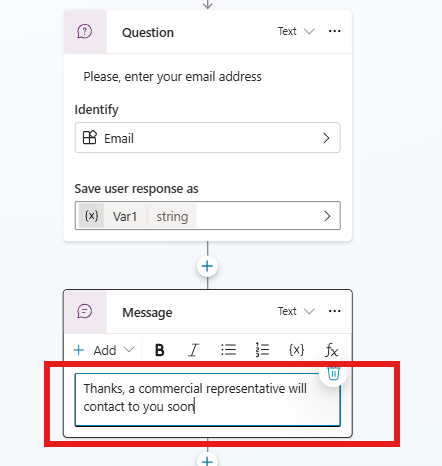

12. Finally, as in former single-turn topic, add an **‘End current topic’** action, and **‘Save’** the topic with a name (i.e. **‘Contact’**)

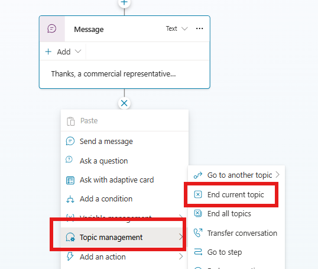

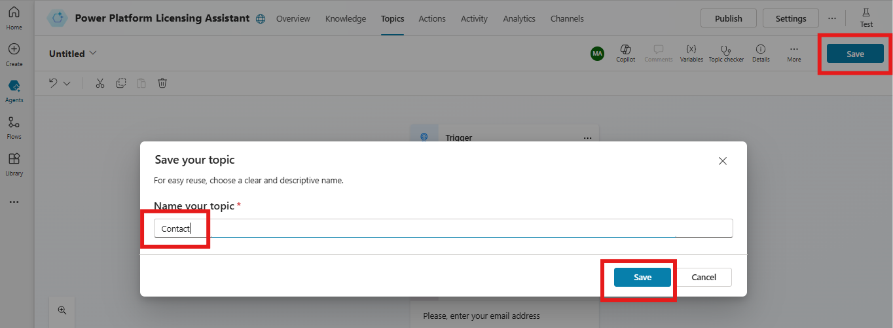

### Task 5: Test multi-turn topic

1. At the box '**Ask a question or describe what you need'** prompt in **Test copilot** pane, type ‘Need to contact’.

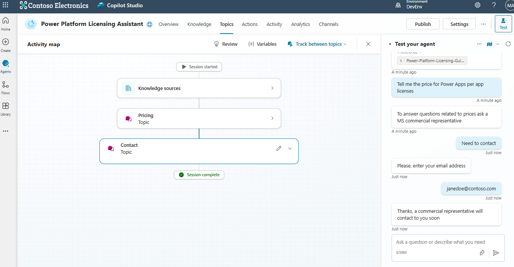

Generative orchestration detected now a question to ‘Contact’ topic and played that.

