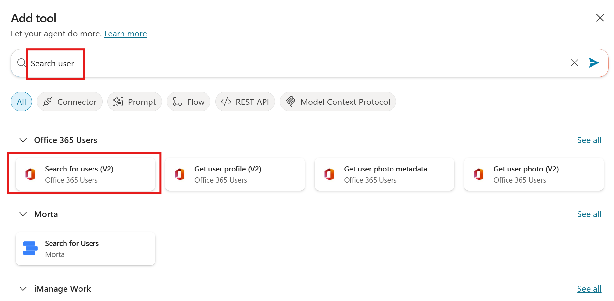
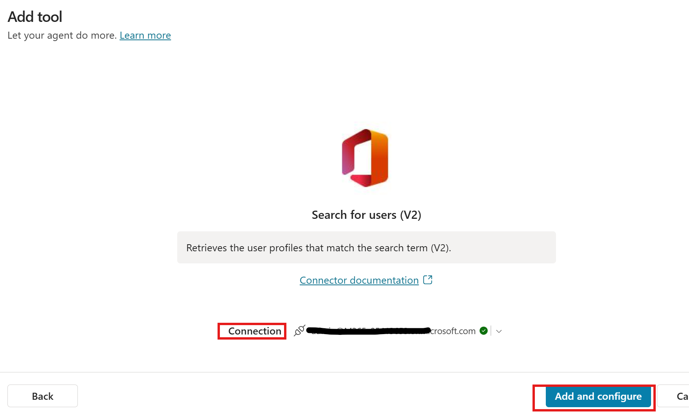
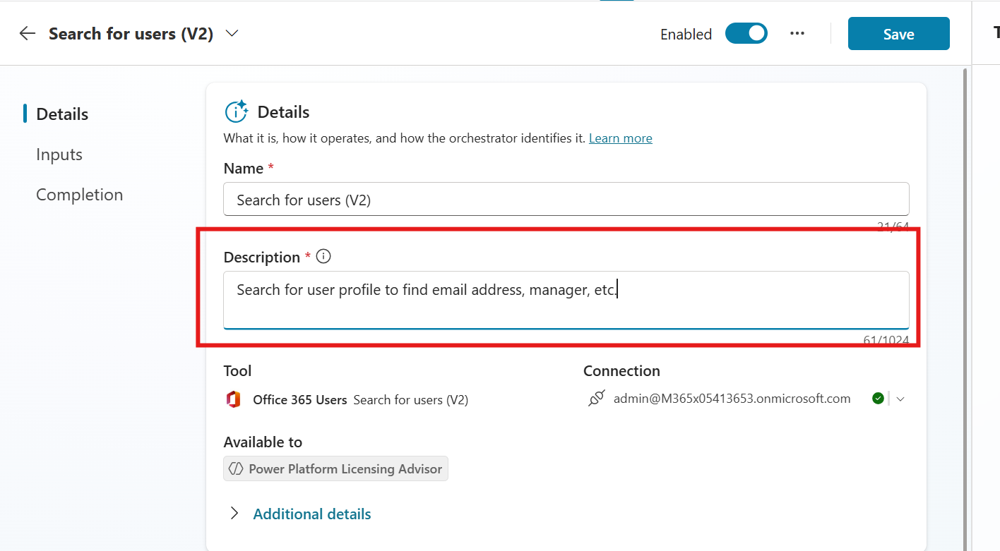
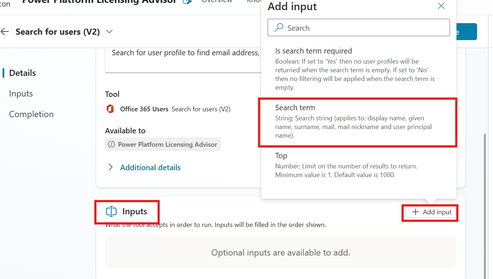
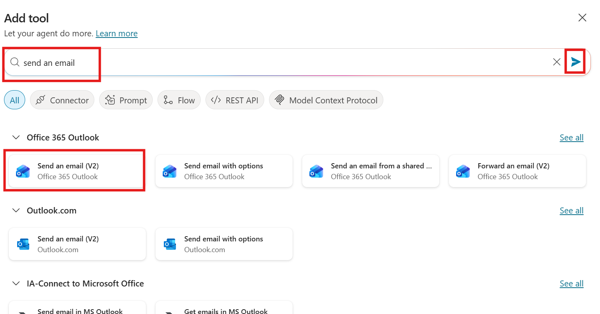
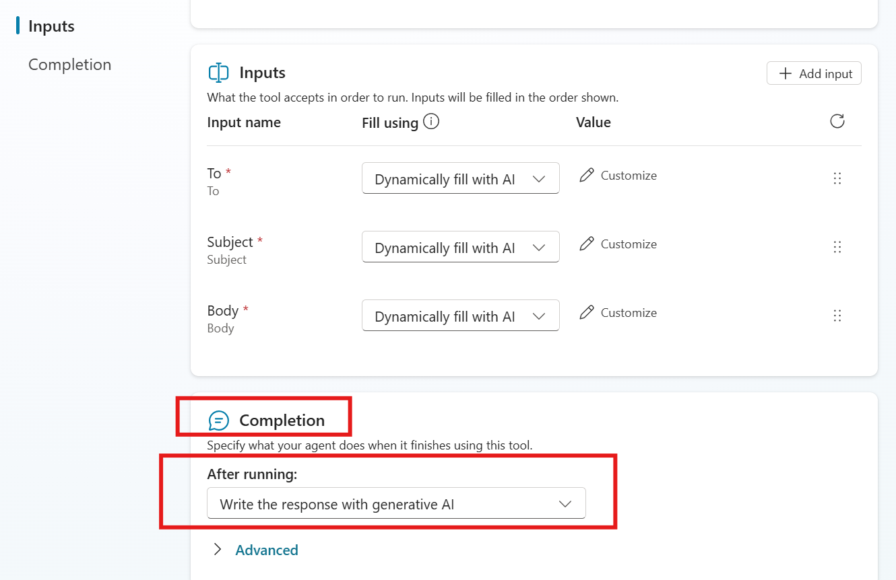
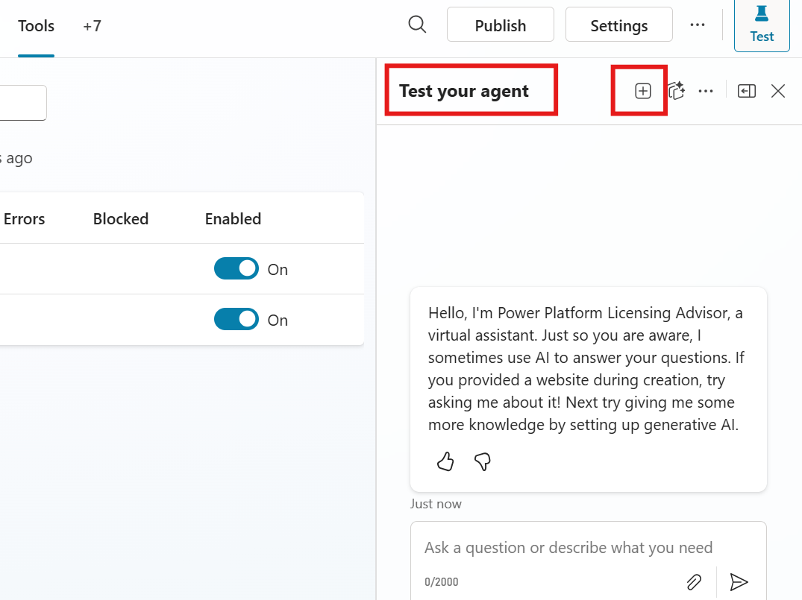
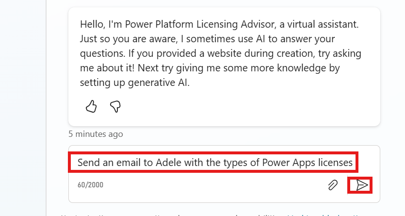
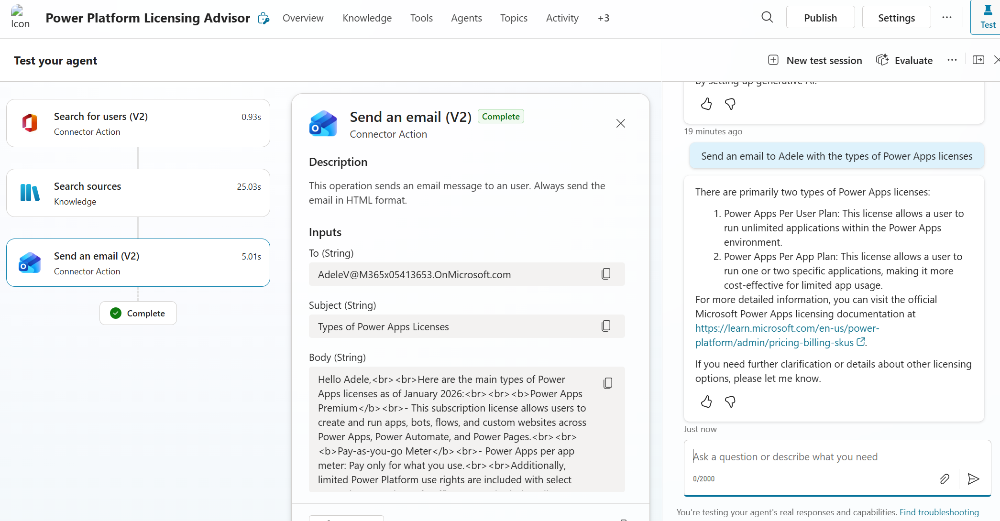
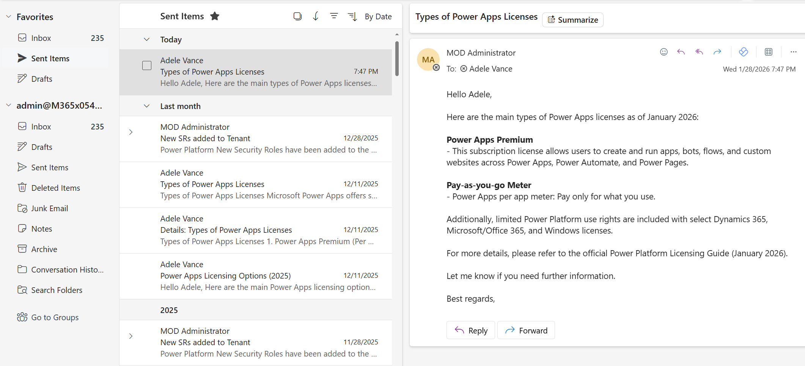

# Lab 1.2: Tools

### Objectives:
- Create a Tool.
- Use a Tool.
  

## Prerequisites

- It's required to have completed **[Lab 0.0 - Create an agent](../0.0-create-an-agent/0.0-create-an-agent.md)** to follow this part.

## Contents

In this lab, you will learn how to create a tool and understand its purpose and benefits.

## Estimated Completion Time

- 30 minutes

## Exercise 1: Tools in Copilot Studio

Tools are the building blocks that enable your agent to interact with external systems. Tools expand the functionality of your agent, allowing it to perform various actions in response to user requests or autonomous triggers. Each tool represents a specific capability that your agent can perform.

### Task 1: Add tools to an agent

1. Select **Tools** tab in the agent and after click on **+ Add a tool**  

    

2. Search for **Search user** and select **Search for users (V2)**.
   
    

3. if needed create a new **Connection** and after select **Add and configure**.

    

4. Under **Description** copy the following: *Search for user profile to find email address, manager, etc.* 
 
    

5. On **Inputs** area, click **+ Add input** and select **Search term**

    

6. Click on **Save** to finish the configuration of this tool

7. Go again to **Tools** tab, select **+ Add a tool** and search for **send an email** . 

    

8. Create if needed a new connection and select **Add and configure**.

9. In **Description** copy the following: *This operation sends an email message to an user. Always send the email in HTML format.*. Let **Inputs** as are, but in **Completion**, change **After running:** with **Write the response with generative AI**. 

    

## Exercise 2: Use the tools

### Task 1: Causes the agent to use the tools

1. On **Test your agent** pane, restart agent for a new conversation clicking **+** icon. You will see how the pane is cleaned up and a new welcome message appears.

    

2. At the '**Type your message**' prompt in the **Test your agent** pane, type *Send an email to Adele with the types of Power Apps licenses* (i.e. You can choose whoever user you want in your tenant). Send the message.

    

3. When dialogs for approving connections will appear, consent those clicking **Connect**. Wait the agent finish the answer and look for final response and activity.

   

4. Also review your **Sent items** folder to find email sent to Adele.

   

Good Job: You have finished this lab.

