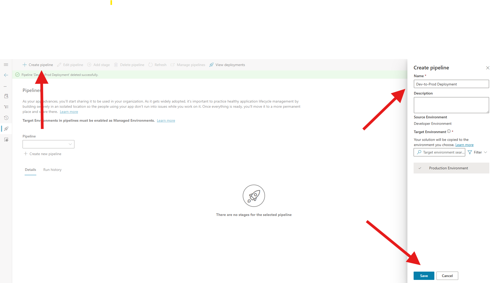
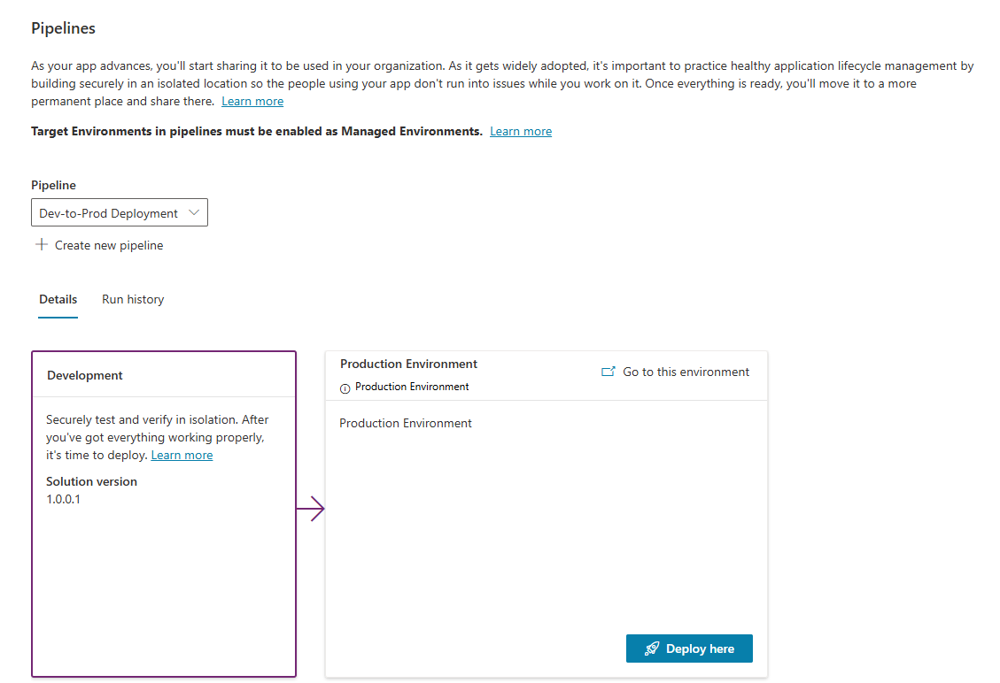
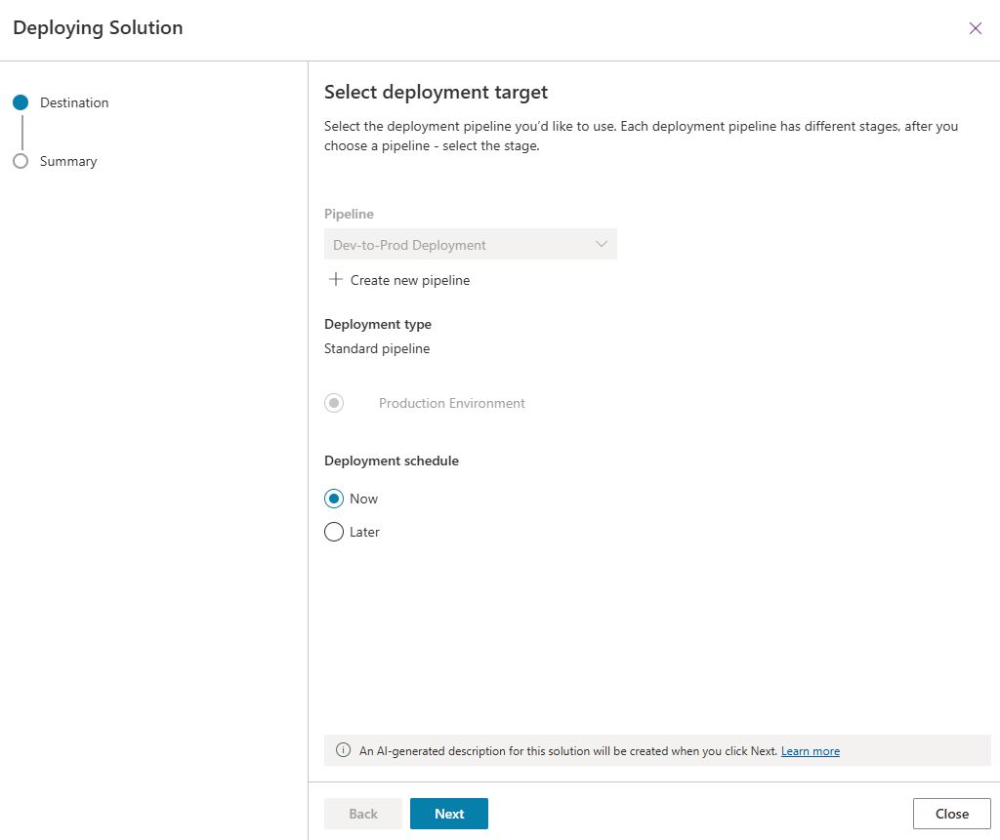
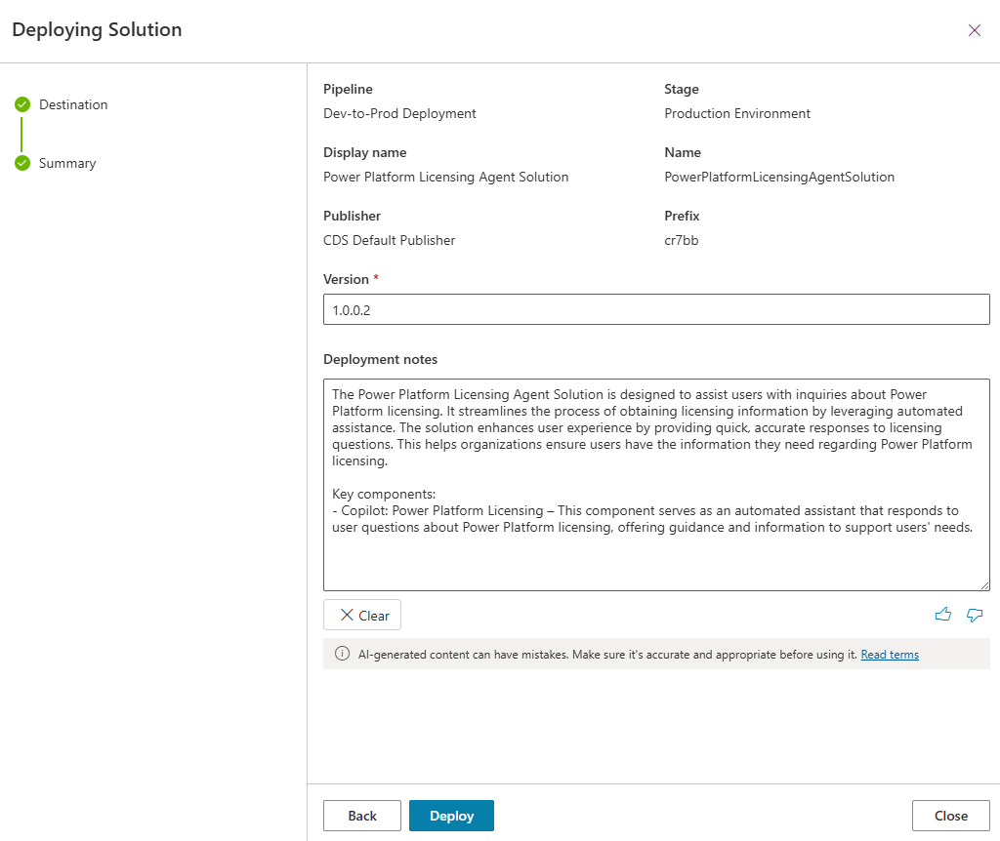
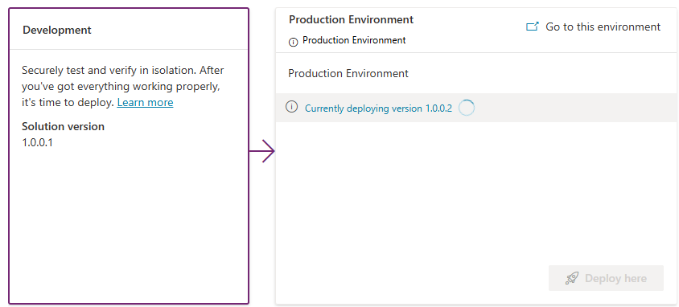
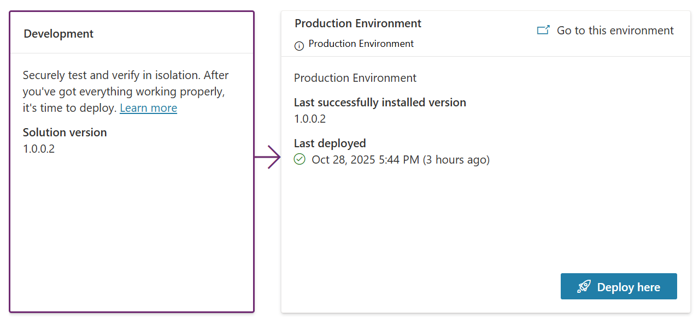

#### Export and Import a Solution via Personal Power Platform Pipelines

## Overview
This guide walks you through:
- Exporting a solution from one environment using **Personal Power Platform Pipelines**.
- Adding the previously created agent **“Power Platform Licensing”** to the solution.
- Importing the solution into a new environment through pipelines.

---

## Prerequisites
Before starting:
- Ensure you have **System Administrator** or **Environment Maker** role in both environments.
- Access to **Power Platform Pipelines**.
- The agent **“Power Platform Licensing”** is available in your development environment.
- Pipelines are configured and you have permissions to run them.

---

## Step 1: Navigate to Power Platform Pipelines
1. Go to https://admin.powerplatform.microsoft.com.
2. In the **Environment selector** (top-right corner), choose the environment where the solution currently resides.


---

## Step 2: Locate the Solution
1. In the left navigation pane, select **Solutions**.
2. Create a new solution to add the agent and its components.
3. Name the solution **"Power Platform Licensing Agent Solution"**.
4. Select an existing publisher or create one (if needed).
5. Click **Create**.


---

## Step 3: Add the Agent to the Solution
1. Open the solution by clicking its name.
2. Click **Add existing** → **Copilot Agent**.
3. Search for **“Power Platform Licensing”**.
4. Select the agent and click **Add**.
5. Confirm the agent is now listed in the solution components.
6. If there are dependent components (e.g., environment variables, connection references), add them as well.


---

## Step 4: Create a New Pipeline
1. Navigate to **Pipelines** (the rocket icon) in the left navigation pane.
2. Click **Create Pipeline**.
3. Provide:
   - **Name**: e.g., 'Dev-to-Prod Deployment'.
   - **Description**: Briefly describe the purpose.
4. Define **Target Environment**:
   - Production Environment (Target).
6. Save the pipeline.



---

## Step 5: Use Personal Pipelines to Deploy
1. Select the pipeline configured for your deployment (e.g., **Dev → Prod**).
2. Choose the **source environment** and select the solution you prepared.
3. Click **Run Pipeline**.
4. Monitor the pipeline execution steps:
   - **Export from source environment**
   - **Validate solution**
   - **Import into target environment**











---

## Step 6: Configure During Import
- If prompted for **connection references** or **environment variables**, configure them during the pipeline run.
- Ensure all dependencies are resolved before completing the import.

---

## Step 7: Verify Deployment
1. After the pipeline completes, open the solution in the target environment.
2. Confirm that:
   - All components are present.
   - The agent **“Power Platform Licensing”** is included.


---

## Process Flow Diagram
```mermaid
flowchart LR
    A[Source Environment] --> B[Add Agent to Solution];
    B --> C[Run Personal Pipeline];
    C --> D[Export & Validate Solution];
    D --> E[Import into Target Environment];
    E --> F[Verify Components];