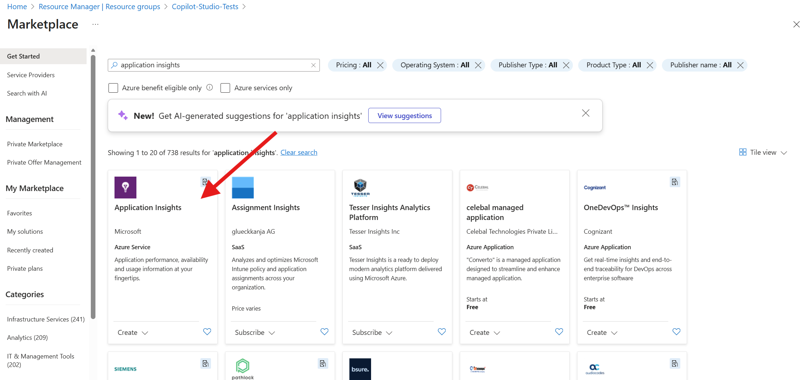
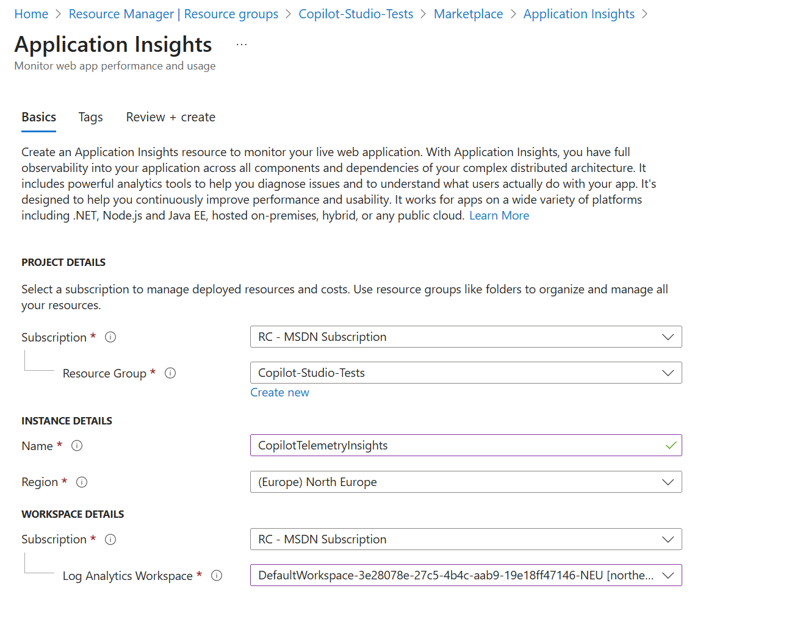
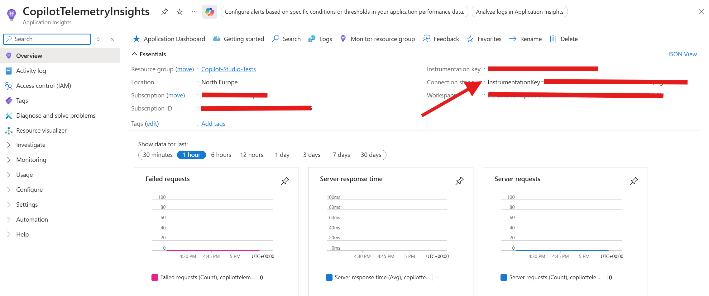
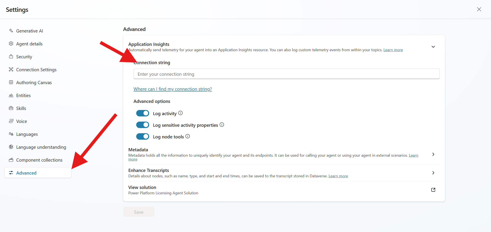
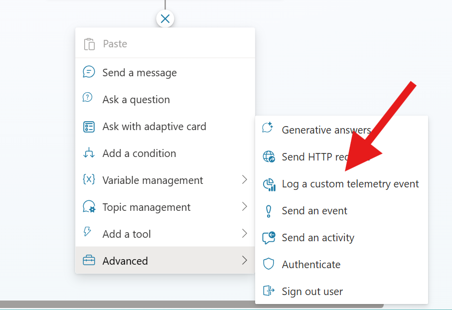
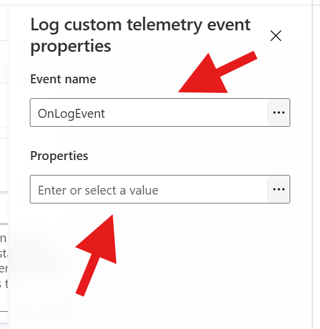
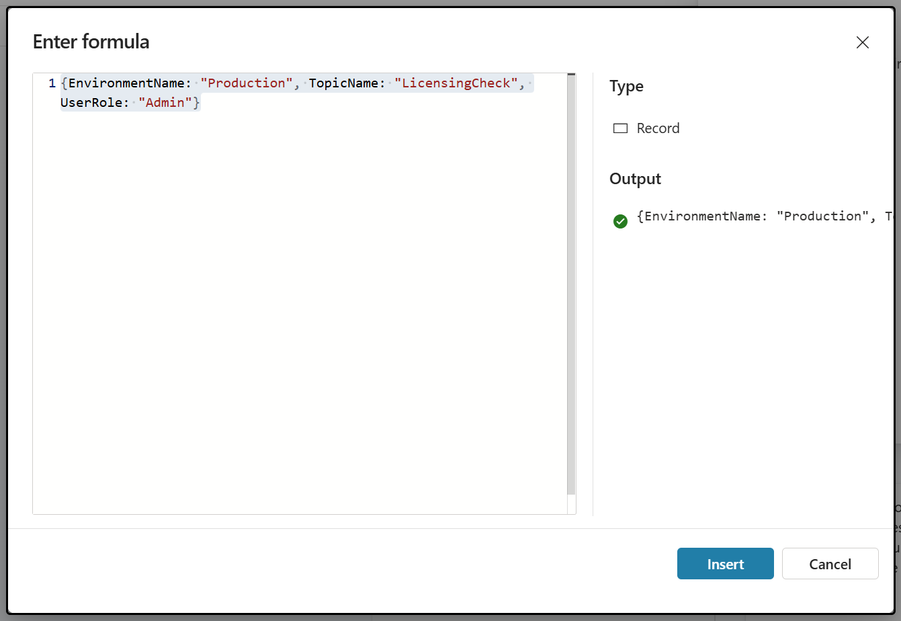
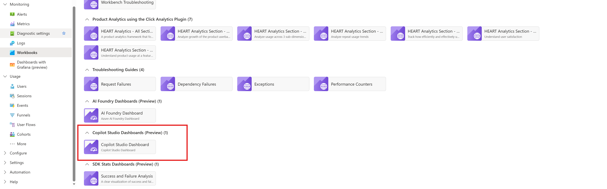
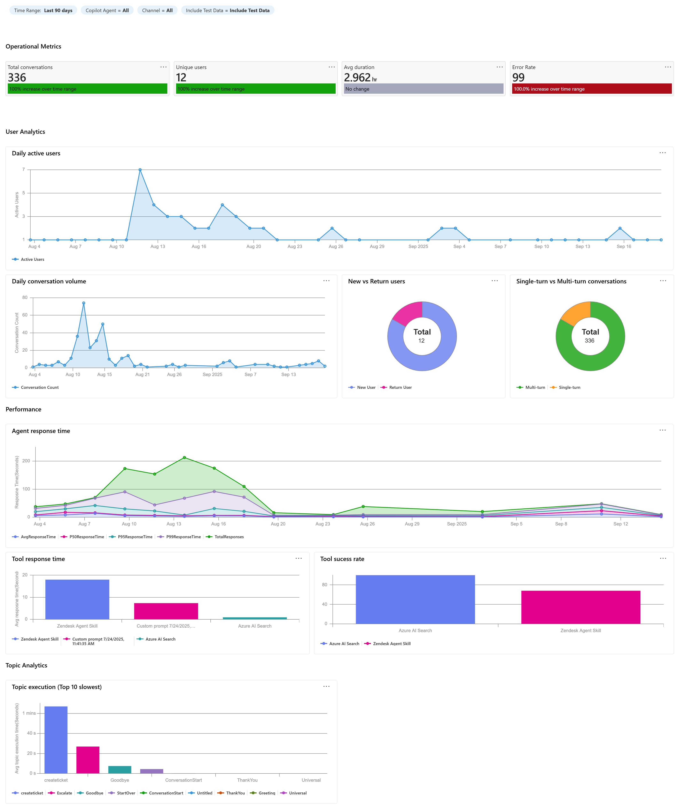
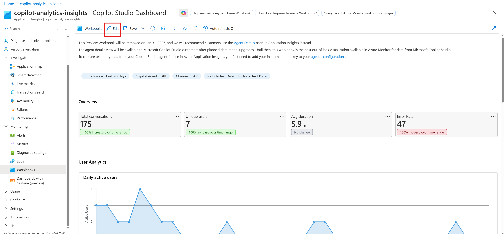

# Monitor Copilot Studio Events with Azure Application Insights

## Overview
This guide walks you through:
- Connecting **Copilot Studio** to **Azure Application Insights**.
- Configuring telemetry for your Copilot agents.
- Using **custom dimensions** via the **Log custom event** action.
- Viewing monitoring results in Copilot Studio (Preview).
- Monitoring and analyzing events using Application Insights.


---

## Why Application Insights?
Application Insights is part of **Azure Monitor**, providing:
- **Real-time telemetry** for Copilot agents.
- Insights into **user interactions**, **topics triggered**, and **performance metrics**.
- Advanced filtering and segmentation using **custom dimensions**.

---

## Prerequisites
Before starting:
- Access to **Copilot Studio** and an active agent.
- An **Azure subscription** with permissions to create resources.
- An **Application Insights** resource created in Azure.
- Basic understanding of telemetry and analytics.

---

## Step 1: Create an Application Insights Resource
1. Sign in to the https://portal.azure.com.
2. Click **Create a resource** → Search for **Application Insights**.
3. Select **Application Insights** and click **Create**.
4. Provide:
   - **Name**: e.g., `CopilotTelemetryInsights`.
   - **Region**: Same as your Copilot environment for best performance.
   - **Resource Group**: Choose or create one.
5. Click **Review + Create**, then **Create**.





---

## Step 2: Get the Instrumentation Key
1. After deployment, open the **Application Insights** resource.
2. Navigate to **Overview** → Copy the **Instrumentation Key** or **Connection String**.



---

## Step 3: Configure Telemetry in Copilot Studio
1. Go to https://copilotstudio.microsoft.com.
2. Select your **Environment** and open the **“Power Platform Licensing” Agent** that you want to monitor.
3. Navigate to **Settings** → **Advanced**.
4. Select **Application Insights**.
5. Paste the **Instrumentation Key** or **Connection String** from Application Insights.
6. Save changes.



---

## Step 4: Define Events to Track
- Common events include:
  - **Log Activity** - If enabled, details of incoming/outgoing messages and events are logged.
  - **Log sensitive activity properties** - If enabled, the values of certain properties that could be considered sensitive on incoming/outgoing messages and events are included in logs. The properties that are considered potentially sensitive are userid, name, text and speak (text and speak properties only apply to messages).
  - **Log node tools** - Log an event each time a node within a topic is executed.
- Configure event logging in your agent's code or settings using **Power Fx** or custom plugins.


---

## Step 5 (optional): Add Custom Dimensions Using Log Custom Event
Custom dimensions provide richer context for analytics. Examples:
- **EnvironmentName**: Dev, Test, Prod.
- **TopicName**: Which topic triggered the event.
- **UserRole**: Admin, Maker, End-user.

### Why Custom Dimensions Matter
- They **transform raw telemetry into actionable insights**.
- Enable **segmentation** (e.g., filter by environment or user role).
- Improve **alerting and dashboards** by adding business context.

### How to Add in Copilot Studio:
1. Open the topic where you want to log telemetry.
2. Add the **Log custom event** action.
3. Configure:
   - **Event name**: `OnLogEvent`
   - **Properties**:
     - `EnvironmentName` = "Production"
     - `TopicName` = "LicensingCheck"
     - `UserRole` = "Admin"

These properties will appear as `customDimensions` in Application Insights.








---

## Step 6: Verify Data Flow in Application Insights
1. Interact with your Copilot agent.
2. In **Application Insights**, telemetry data is logged when users interact with the bot, including during testing within Copilot Studio. To see the logged telemetry data, navigate to the Logs section of your Application Insights resource in Azure.
   - **Live Metrics** for real-time data.
   - **Logs** for custom dimensions using **KQL**.
   - **Failures** and **Performance** tabs for issues and latency.
3. Set **Alerts** for critical events (e.g., high error rate, latency spikes).
4. From here, you can also use Kusto queries to query and analyze your data. See example queries.

//Line Chart that shows how many distinct users communicated with your bot per day for the past 14 days
let queryStartDate = ago(14d);
let queryEndDate = now();
let groupByInterval = 1d;
customEvents
| where timestamp > queryStartDate
| where timestamp < queryEndDate
| summarize uc=dcount(user_Id) by bin(timestamp, groupByInterval)
| render timechart

// Count intents by environment
customEvents
| where name == "IntentTriggered"
| summarize count() by tostring(customDimensions.EnvironmentName), tostring(customDimensions.TopicName)

// Errors grouped by topic
exceptions
| summarize count() by tostring(customDimensions.TopicName), type

// Performance by user role
requests
| summarize avg(duration) by tostring(customDimensions.UserRole)

---


## Step 7: Viewing Monitoring Results (Preview)
Application Insights now offers a new built-in Copilot Studio dashboard — giving you a unified view of key metrics that can be customized and shared with your team:
- Navigate to **Application Insights → Monitoring -> Workbooks** and open Copilot Studio Dashboard from the workbooks gallery.
- View:
  - **Operational Metrics**  
  - **User Analytics**
  - **Performance**
  - **Topic Analytics**






> The dashboard opens as an editable workbook where you can customize the workbook and save according to your needs.



---

## Process Flow Diagram
```mermaid
flowchart LR
    A[Copilot Studio Agent] --> B[Enable Telemetry];
    B --> C[Send Events to Application Insights];
    C --> D[Monitor with Live Metrics & Logs];
    D --> E[Create Dashboards & Alerts];