# Lab 2.1: Use Advanced Querying with Azure AI Search in Copilot Studio

## Objectives
1. Design and build an Azure AI Search index optimized for RAG.
2. Implement ingestion, chunking, vectorization, semantic ranking, and scoring profiles.
3. Explore hybrid and semantic queries, filters, and evaluation metrics.
4. Integrate the index with a Copilot Studio agent using:
   - Knowledge Source (quick setup)
   - HTTP connector (full control)
   - Real-time knowledge connectors
5. Orchestrate a controlled RAG pipeline in Copilot Studio with tools and prompts.

## Contents

In this lab, you will perform the actions necessary to connect Azure AI Search to your Copilot Studio agent and use it to generate responses.

## Prerequisites

Before starting this lab, ensure you have completed the following prerequisites:

- **[Lab 0.0 - Create an agent](../0.0-create-an-agent/0.0-create-an-agent.md)** 
- **[Scripts 1.4 - Deploy Resources for AI Search](../../scripts/lab-1.4/terraform/readme.md)**
- **[Lab 1.4 - Using AI Search](../1.4-aisearch/1.4-aisearch.md)**

## Estimated Completion Time

45 minutes

# Exercise 1: Create a Index in Azure AI Search

### Task 1: Create a Container and Upload Document

1.	Navigate to the storage account created in the prerequisites and select **Containers** under Data storage. 

2. Click on **+ Container** to create a new container. 

3. In the **New container** pane, enter a name for the container (e.g., `documents2index`), set the **Public access level** to `Private (no anonymous access)`, and click **Create**.

4. When the container is created, click on its name to open it.

5. Click on **Upload** to upload the document(s). In the **Upload blob** pane, click on the folder icon to select the file(s) from your local machine. Select a document or multiple documents and click **Upload**.

    > **Warning**: If you cannot upload a document, ensure that you have the necessary permissions (Storage Blob Data Contributor role).

### Task 2: Create an Data Source in Azure AI Search

1. Navigate to the Azure AI Search service created in the prerequisites.

2. In the left-hand menu, select **Data sources** and then click on **+ Add data source**.

3. In the **New data source** pane, enter a name for the data source (e.g., `documents2index`).

4. For the **Data source type**, select `Azure Blob Storage`.

5. For the **Storage account**, select the storage account you created in the prerequisites.

6. For the **Container**, select the container you created in Task 1.

### Task 3: Create an Index in Azure AI Search

1. In the Azure AI Search service, select **Indexes** from the left-hand menu and click on **+ Add index** and then select **Add index (JSON)**.

2. copy and paste the following JSON schema into the editor, replacing any existing content. This schema defines the fields and settings for your index.

```json
{
  "name": "rag-knowledge-index",
  "fields": [
    {
      "name": "chunk_id",
      "type": "Edm.String",
      "searchable": true,
      "filterable": false,
      "retrievable": true,
      "stored": true,
      "sortable": true,
      "facetable": false,
      "key": true,
      "analyzer": "keyword",
      "synonymMaps": []
    },
    {
      "name": "parent_id",
      "type": "Edm.String",
      "searchable": false,
      "filterable": true,
      "retrievable": true,
      "stored": true,
      "sortable": false,
      "facetable": false,
      "key": false,
      "synonymMaps": []
    },
    {
      "name": "chunk",
      "type": "Edm.String",
      "searchable": true,
      "filterable": false,
      "retrievable": true,
      "stored": true,
      "sortable": false,
      "facetable": false,
      "key": false,
      "synonymMaps": []
    },
    {
      "name": "title",
      "type": "Edm.String",
      "searchable": true,
      "filterable": false,
      "retrievable": true,
      "stored": true,
      "sortable": false,
      "facetable": false,
      "key": false,
      "synonymMaps": []
    },
    {
      "name": "text_vector",
      "type": "Collection(Edm.Single)",
      "searchable": true,
      "filterable": false,
      "retrievable": true,
      "stored": true,
      "sortable": false,
      "facetable": false,
      "key": false,
      "dimensions": 1536,
      "vectorSearchProfile": "rag-vector-profile-1",
      "synonymMaps": []
    }
  ],
  "scoringProfiles": [],
  "suggesters": [],
  "analyzers": [],
  "normalizers": [],
  "tokenizers": [],
  "tokenFilters": [],
  "charFilters": [],
  "similarity": {
    "@odata.type": "#Microsoft.Azure.Search.BM25Similarity"
  },
  "semantic": {
    "defaultConfiguration": "rag-semantic-configuration",
    "configurations": [
      {
        "name": "rag-semantic-configuration",
        "flightingOptIn": false,
        "rankingOrder": "BoostedRerankerScore",
        "prioritizedFields": {
          "titleField": {
            "fieldName": "title"
          },
          "prioritizedContentFields": [
            {
              "fieldName": "chunk"
            }
          ],
          "prioritizedKeywordsFields": []
        }
      }
    ]
  },
  "vectorSearch": {
    "algorithms": [
      {
        "name": "rag-hnsw-algorithm-1",
        "kind": "hnsw",
        "hnswParameters": {
          "metric": "cosine",
          "m": 4,
          "efConstruction": 400,
          "efSearch": 500
        }
      }
    ],
    "profiles": [
      {
        "name": "rag-vector-profile-1",
        "algorithm": "rag-hnsw-algorithm-1",
        "vectorizer": "rag-openai-vectorizer-1"
      }
    ],
    "vectorizers": [
      {
        "name": "rag-openai-vectorizer-1",
        "kind": "azureOpenAI",
        "azureOpenAIParameters": {
          "resourceUri": "https://YOUR-OPENAI-RESOURCE.openai.azure.com",
          "deploymentId": "text-embedding-ada-002",
          "modelName": "text-embedding-ada-002",
          "apiKey": "YOUR-OPENAI-API-KEY"
        }
      }
    ],
    "compressions": []
  }
}
```

3. Click **Create** to save the index. 

    > **Warning**: Before creating the index, make sure to replace `YOUR-OPENAI-RESOURCE` with your actual Azure OpenAI resource endpoint and `YOUR-OPENAI-API-KEY` with your actual API key in the JSON schema above.

4. The index will be created and will appear in the **Indexes** list.

### Task 4: Create a Skillset in Azure AI Search

1. In the Azure AI Search service, select **Skillsets** from the left-hand menu and click on **+ Add skillset**.

2. In the **New skillset** pane, copy and paste the following JSON schema into the editor, replacing any existing content. This schema defines the skills for processing documents, including chunking and embedding.

```json
{
    "name": "rag-knowledge-skillset",
    "description": "Skillset for processing documents with chunking and embedding",
    "skills": [
        {
            "@odata.type": "#Microsoft.Skills.Text.SplitSkill",
            "name": "text-split",
            "description": "Split text into chunks",
            "context": "/document",
            "defaultLanguageCode": "en",
            "textSplitMode": "pages",
            "maximumPageLength": 1000,
            "pageOverlapLength": 200,
            "maximumPagesToTake": 0,
            "unit": "characters",
            "inputs": [
              {
                "name": "text",
                "source": "/document/content",
                "inputs": []
              }
            ],
            "outputs": [
                {
                    "name": "textItems",
                    "targetName": "pages"
                }
            ]
        },
        {
            "@odata.type": "#Microsoft.Skills.Text.AzureOpenAIEmbeddingSkill",
            "name": "openai-embedding",
            "description": "Generate embeddings using Azure OpenAI",
            "context": "/document/pages/*",
            "resourceUri": "https://YOUR-OPENAI-RESOURCE.openai.azure.com",
            "apiKey": "YOUR-OPENAI-API-KEY",
            "deploymentId": "text-embedding-ada-002",
            "modelName": "text-embedding-ada-002",
            "dimensions": 1536,
            "inputs": [
                {
                    "name": "text",
                    "source": "/document/pages/*",
                    "inputs": []
                }
            ],
            "outputs": [
                {
                    "name": "embedding",
                    "targetName": "text_vector"
                }
            ]
        }
    ],
    "indexProjections": {
    "selectors": [
      {
        "targetIndexName": "rag-knowledge-index",
        "parentKeyFieldName": "parent_id",
        "sourceContext": "/document/pages/*",
        "mappings": [
          {
            "name": "text_vector",
            "source": "/document/pages/*/text_vector",
            "inputs": []
          },
          {
            "name": "chunk",
            "source": "/document/pages/*",
            "inputs": []
          },
          {
            "name": "title",
            "source": "/document/title",
            "inputs": []
          }
        ]
      }
    ],
    "parameters": {
      "projectionMode": "skipIndexingParentDocuments"
    }
  }
}
```

   > **Warning**: Before creating the skillset, make sure to replace `YOUR-OPENAI-RESOURCE` with your actual Azure OpenAI resource endpoint and `YOUR-OPENAI-API-KEY` with your actual API key in the JSON schema above.

### Task 5: Create an Indexer in Azure AI Search

1. In the Azure AI Search service, select **Indexers** from the left-hand menu and click on **+ Add indexer**.

2. In the **New indexer** pane, enter a name for the indexer (e.g., `documents2index-indexer`).

3. For the **Data source**, select the data source you created in Task 2.

4. For the **Target index**, select the index you created in Task 3.

5. For the **Skillset**, select the skillset you created in Task 4.

6. Configure the **Schedule** to run **Once** for testing purposes, or **Hourly** for production scenarios.

7. Click **Save** to save the indexer and start the indexing process.

### Task 6: Check Indexing Status and Validate

1. Go to **"Search explorer"** in your index

2. Click on **View** and select **JSON View**.

3. Copy and paste the following query and run it:
```json
{
    "search": "*",
    "top": 5
}
```

### Task 7: Test Query Patterns (BM25)

1. In **Search explorer**, run:
```json
{
    "search": "YOUR-SEARCH-TERM",
    "searchMode": "all",
    "top": 5,
    "select": "chunk_id, chunk"
}
```
  > **Warning**: remember to change `YOUR-SEARCH-TERM"` with the actual search term.

2. Observe the results and search score

---

# Exercise 2: Use Copilot Studio with Azure AI Search

There are three options to connect Azure AI Search to your Copilot Studio agent. In this lab, we will explore both options, the first one is the simplest and quickest to set up, while the second one provides more control and customization.

## OPTION 1: Connect Azure AI Search as Knowledge Source
### Task 1: Connect agent to Azure AI Search

1. Open **Copilot Studio** and navigate to your **Agent** created in **Lab 0.0 - Create an agent**.

   

   <br>

### Task 2: Set the Agent instructions and Connect Azure AI Search
1. Set the system prompt for the agent in the instructions section as below:

   

   <br>

    here is an example of a system prompt you can use:

   ```
   You are a Hotel assistant. Use the knowledge provided to answer user questions about Hotel information, amenities and features. Provide clear and concise information to help users make informed decisions about their stay.

   ```

   

   <br>

2. In the **Knowledge** tab, click on **+ Add knowledge** button to connect Azure AI Search as knowledge source.

   

   <br>

3. In the dialog that appears, select **Azure AI Search**.

   

   <br>

4. Select the index you created in Exercise 1 - Task 3 from the options available, and clink **Add to agent**.

   

   <br>

### Task 3: Test your agent with Azure AI Search
1. Go to the **Test your agent** pane to test your agent. You can ask questions related to the documents you uploaded to Azure AI Search in Exercise 1 - Task 1. (eg. What can I do at the hotel?)

   

   <br>

2. You will see the executed queries and the answers provided by the agent.

   

   <br>

---

## OPTION 2: Connect Azure AI Search using a custom HTTP flow

### Task 1: Create an Agent flow with HTTP flow

1. In **Copilot Studio**, navigate to **Flows** and click on **+ New agent flow**.

   

   <br>

2. In the **Designer** tab, you will see a default **Add a trigger** block. Select **When an agent calls the flow**.

   

   <br>

3. Next, click on the **+** icon below the trigger block to add a new action. 

   

   <br>

4. In the **Choose an action** pane, search for **HTTP** and select the **HTTP** action.

    
  
    <br>

5. Configure the HTTP action to query Azure AI Search. Set the following parameters:

   - **Method**: POST
   - **URL**: your Azure AI Search query endpoint, which follows the format:
     ```
     https://<your-search-service-name>.search.windows.net/indexes/<your-index-name>/docs/search?api-version=2025-09-01
     ```

    - **Headers**:
      - `Content-Type`: `application/json`
      - `api-key`: Your Azure AI Search admin API key

    - **Body**: Use the following JSON template, replacing `YOUR-SEARCH-TERM` with the query from the agent:
    ```json
    {
        "search": "@{triggerBody().query}",
        "searchMode": "all",
        "top": 5,
        "select": "chunk_id, chunk"
    }
    ```

6. Next, click on the **+** icon below the trigger block to add a new action. 

   

   <br>

7. In the **Choose an action** pane, search for **Respond** and select the **Respond to the agent** action.

    
  
    <br>

8. Click on **Add an output** and select **Text**. Set the values as below:

   

   <br>

   

   <br>

     

   <br>

9. **Publish** the flow by clicking on the **Publish** button at the top right corner.

   

   <br>

### Task 2: Connect the Agent to the Flow

1. Open **Copilot Studio** and navigate to your **Agent** created in **Lab 0.0 - Create an agent**.

   

   <br>

### Task 2: Set the Agent instructions and Connect to the Flow
1. Set the system prompt for the agent in the instructions section as below:

   

   <br>

    here is an example of a system prompt you can use:

   ```
   You are a Hotel assistant. Use the flow provided to answer user questions about Hotel information, amenities and features. Provide clear and concise information to help users make informed decisions about their stay. Just use the info provided by the flow and don't use any other knowledge source.

   ```

   

   <br>

2. In the **Tools** tab, click on **+ Add a tool** button to connect Azure AI Search as knowledge source.

   

   <br>

3. In the dialog that appears, select **Flow** and choose the flow you created earlier. Next, click **Add to agent**.

   

   <br>

4. Edit the flow to assure you had selected **Write the response with generative AI** in the **Completion** section.

   

   <br>

### Task 3: Test your agent with a HTTP flow
1. Go to the **Test your agent** pane to test your agent. You can ask questions related to the documents you uploaded to Azure AI Search in Exercise 1 - Task 1. (eg. What can I do at the hotel?)

   

   <br>

2. You will see the executed queries and the answers provided by the agent.

   

   <br>

---

## OPTION 3: Connect Azure AI Search using a Custom Connector

### Task 1: Create Custom Connector

1. Go to Copilot Studio Portal and navigate to **Tools**.

   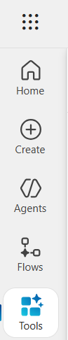

   <br>

2. Click on **+ New Tool** and select **Custom Connector**.

   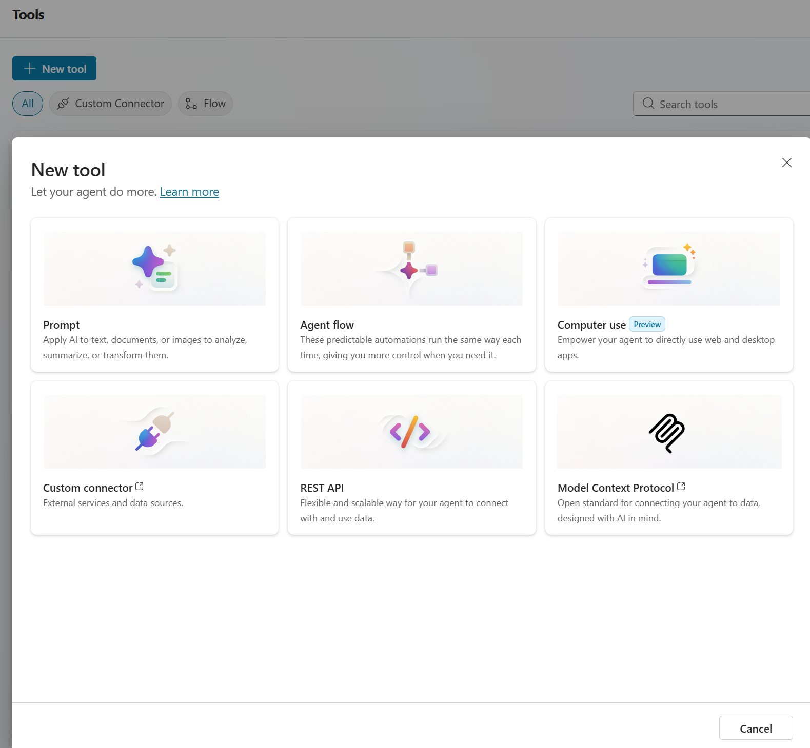

   <br>

3. Click on **+New custom connector** and select **Create from blank**. Follow the steps to create a custom connector that connects to your Azure AI Search instance using the HTTP API.

   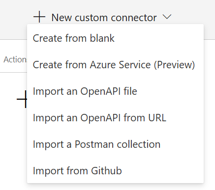

   <br>

4. Set the custom connector name and click on **Continue**.

   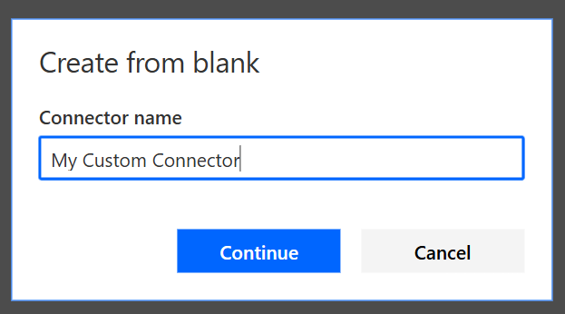

   <br>

5. In the **General** tab, set the **Host** to your Azure AI Search service endpoint (e.g., `your-search-service-name.search.windows.net`).

    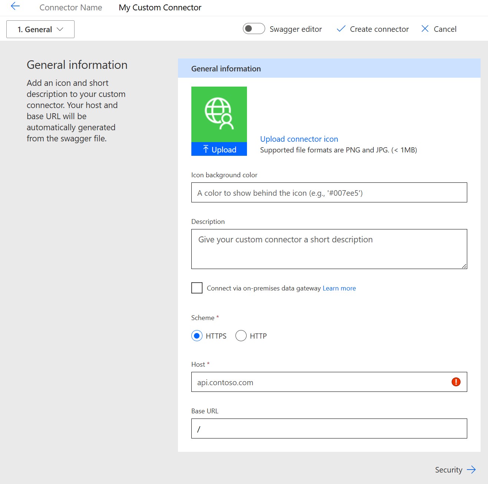
    <br>

6. In the **Security** tab, select **API Key** as the authentication type. Set the **Parameter label** to `Api-key` and the **Parameter name** to `Api-key`.

   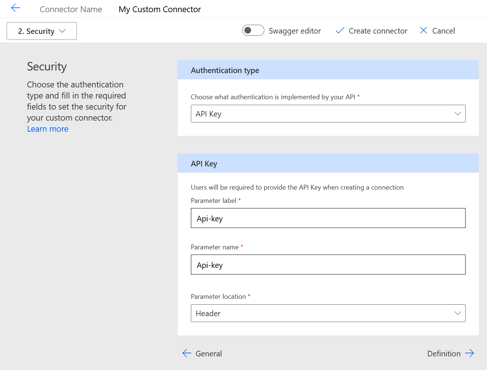

   <br> 

7. In the **Definition** tab, click on **+ New action** to define an action for querying the Azure AI Search index.
    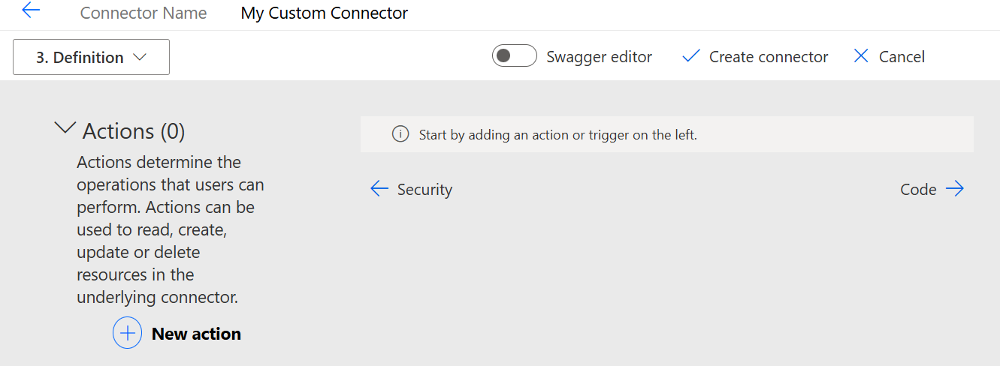
    <br>

8. For the new action, set the following parameters:
   - **Summary**: Query Azure AI Search
   - **Operation ID**: queryAzureAISearch
   - **Visibility**: Important

9. In the **Request** section, click on **+ Import from sample** and set the following:

    - **Method**: POST
    - **URL**:
      ```
      https://<your-search-service-name>.search.windows.net/indexes/<your-index-name>/docs/search?api-version=2025-09-01
      ```
    - **Headers**:
      - `Content-Type`
      - `api-key`

      
    <br>

  10. Keep the **Code** section and **Test** section as default and click on **Create connector**.  

  <!-- ### Task 2: Create an Agent flow with HTTP flow

1. In **Copilot Studio**, navigate to **Flows** and click on **+ New agent flow**.

   

   <br>

2. In the **Designer** tab, you will see a default **Add a trigger** block. Select **When an agent calls the flow**.

   

   <br>

3. Click on **+ Add an input** and select **Text**. Name the input `search_term`.

   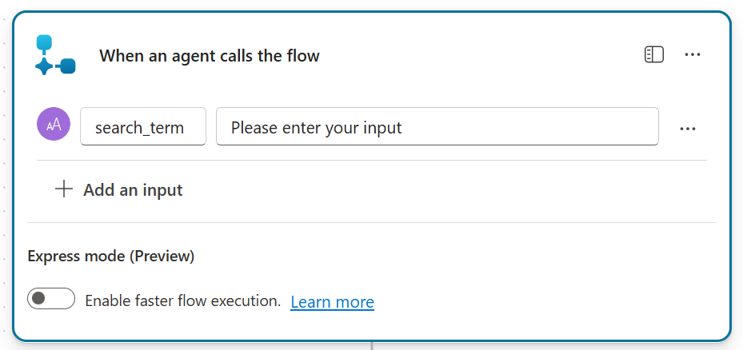

   <br>

4. Next, click on the **+** icon below the trigger block to add a new action. 

   

   <br>

5. In the **Choose an action** pane, set the **Custom** to filter custom connectors and search for the custom connector you created earlier.

    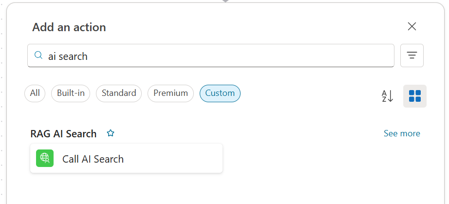
  
    <br>

6. Configure the custom connector action to query Azure AI Search. Set the following parameters:

   - **Api-version**: `2025-09-01`
   - **Content-Type**: `application/json`
   - **Api-key**: Your Azure AI Search API key
   - **Body/search**: `@{triggerBody().search_term}`
   - **Body/searchMode**: `all`
   - **Body/top**: `5`
   - **Body/select**: `chunk_id, chunk`

    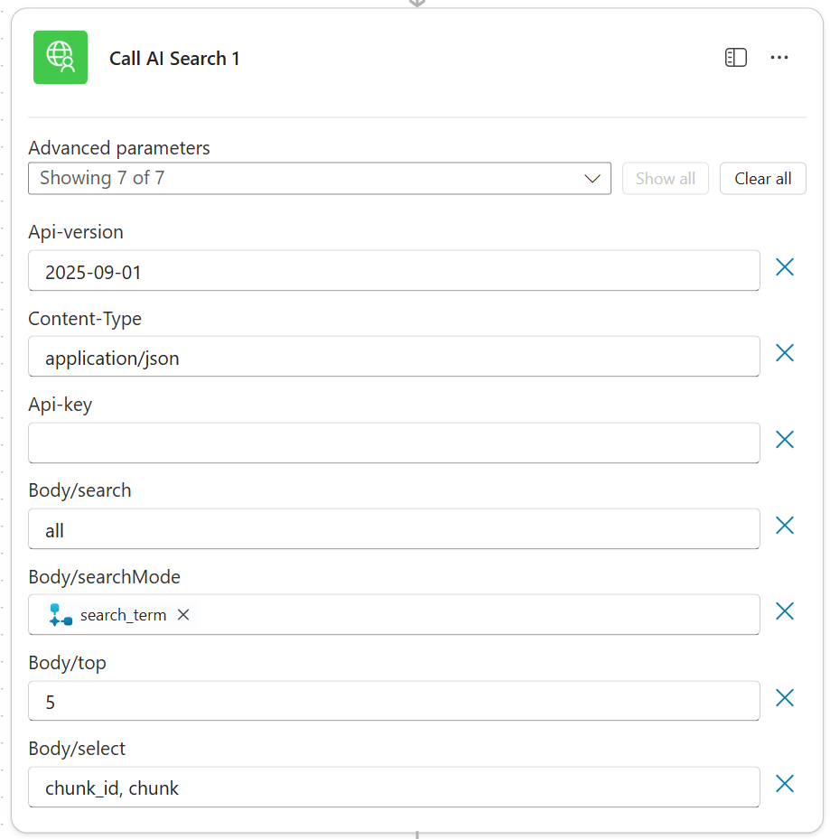
  
    <br>

7. Next, click on the **+** icon below the trigger block to add a new action. 

   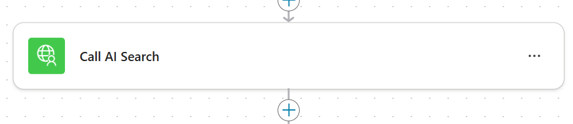

   <br>

8. In the **Choose an action** pane, search for **Respond** and select the **Respond to the agent** action.

9. Click on **Add an output** and select **Text**. Set the values as below:
   

   <br>

   

   <br>

     

   <br>

10. **Publish** the flow by clicking on the **Publish** button at the top right corner.

   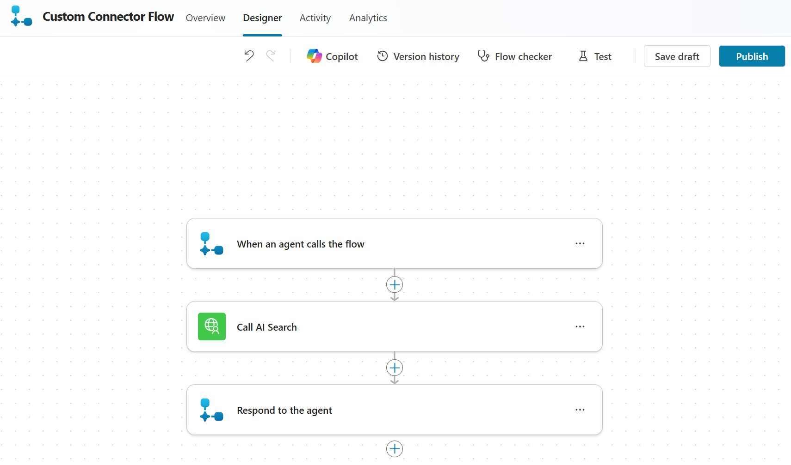

   <br> -->

### Task 3: Create An Agent and Connect to the Custom Connector

1. Open **Copilot Studio** and navigate to your **Agent** created in **Lab 0.0 - Create an agent**.

   

   <br>

2. Set the system prompt for the agent in the instructions section as below:

   

   <br>

    here is an example of a system prompt you can use:

   ```
   You are a Hotel assistant. Use the flow provided to answer user questions about Hotel information, amenities and features. Provide clear and concise information to help users make informed decisions about their stay. Just use the info provided by the flow and don't use any other knowledge source.

   ```

   

   <br>
    
3. In the **Tools** tab, click on **+ Add a tool** button to and search for the custom connector you created earlier, and click **Add and configure**.

   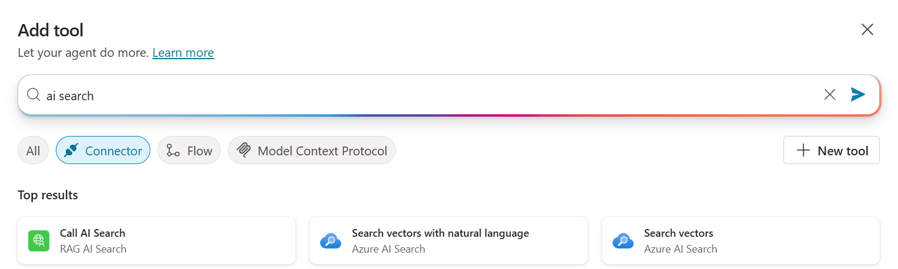

   <br>

4.


Lab is now completed, well done!!!. You can move to the next lab


