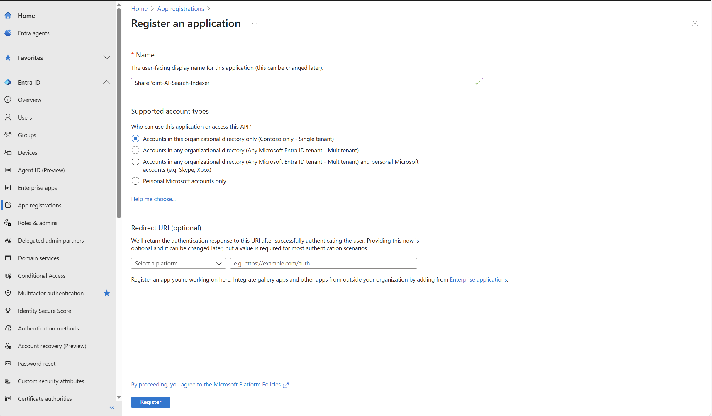
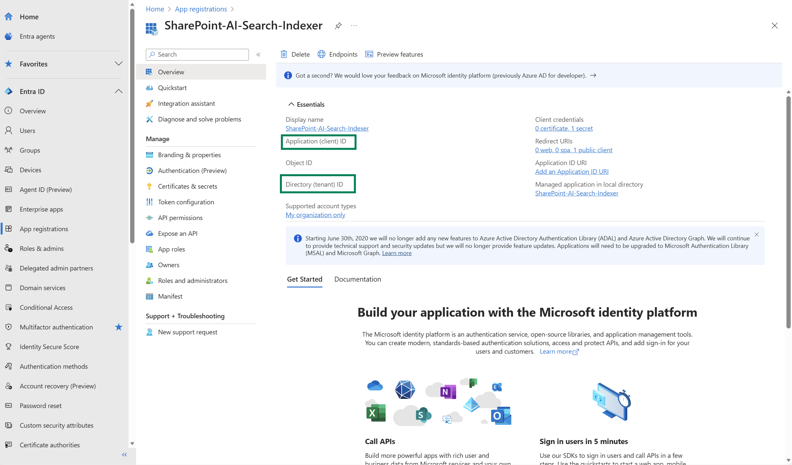
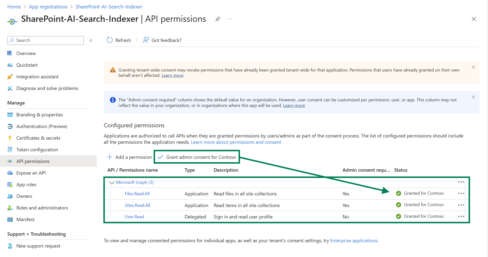
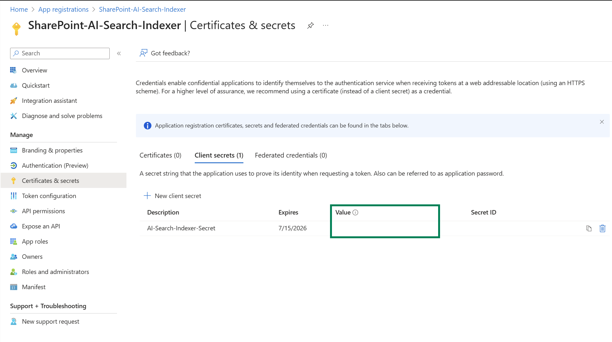
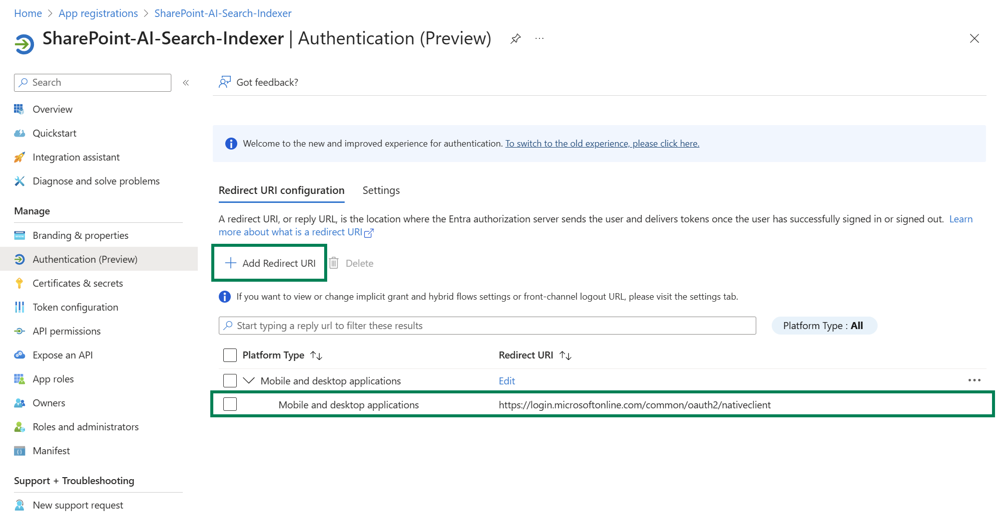
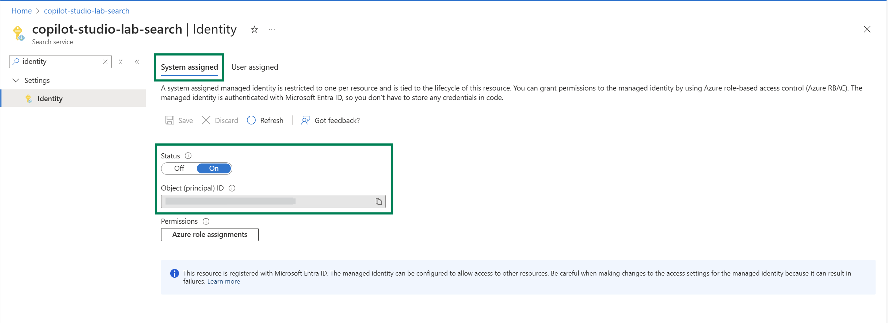
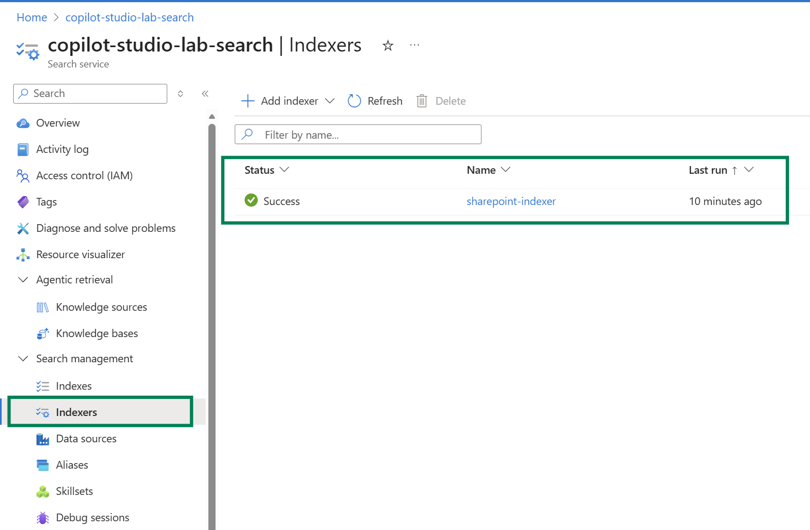
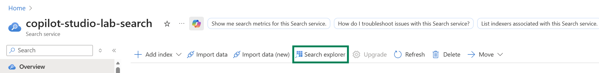
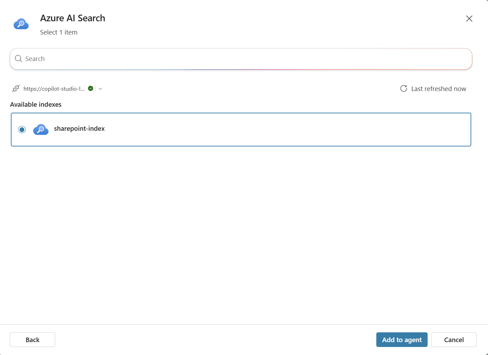
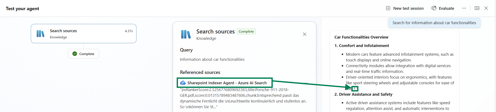

# Lab 2.3: Index SharePoint Document Libraries with Azure AI Search in Copilot Studio

## Objectives

1. Configure a SharePoint in Microsoft 365 indexer to index documents from SharePoint document libraries.
2. Set up Microsoft Entra application registration with appropriate permissions.
3. Create a search index optimized for SharePoint content with metadata extraction.
4. Integrate the SharePoint-indexed content with a Copilot Studio agent.
5. Test and validate the end-to-end RAG pipeline using SharePoint as the knowledge source.

## Contents

In this lab, you will configure Azure AI Search to index documents directly from SharePoint document libraries and use this indexed content as a knowledge source for your Copilot Studio agent.

## Prerequisites

Before starting this lab, ensure you have completed the following prerequisites:

- [Lab 0.0 - Create an agent](../0.0-create-an-agent/0.0-create-an-agent.md)
- [Lab 1.4 - Using AI Search](../1.4-ai-search/1.4-ai-search.md)
- Access to a SharePoint in Microsoft 365 site with documents in a document library
- Azure AI Search service (Basic tier or higher - **Free tier does not support SharePoint indexer**)
- Azure OpenAI resource with an embedding model deployed
- Microsoft Entra ID permissions to create app registrations (or access to a tenant admin)

## Estimated Completion Time

60 minutes

---

# Exercise 1: Configure Microsoft Entra Application Registration

The SharePoint in Microsoft 365 indexer requires a Microsoft Entra application for authentication. In this exercise, you'll create and configure the app registration.

### Task 1: Create Microsoft Entra Application Registration

1. Sign in to the [Azure portal](https://portal.azure.com/).

2. Search for or navigate to **Microsoft Entra ID**, then select **Add** > **App registrations**.

   

3. Select **+ New registration** and configure:
   - **Name**: `SharePoint-AI-Search-Indexer` (or a name of your choice)
   - **Supported account types**: Select **Single tenant**
   - **Redirect URI**: Leave empty (not required)

4. Click **Register**.

   

5. After registration, note down the following values from the **Overview** page (you'll need them later):
   - **Application (client) ID**
   - **Directory (tenant) ID**

### Task 2: Configure API Permissions

1. In your newly created app registration, select **API permissions** from the left menu.

2. Click **Add a permission**, then select **Microsoft Graph**.

3. Choose **Application permissions** (recommended for production scenarios).

4. Search for and select the following permissions:
   - `Files.Read.All` - Required for reading file content
   - `Sites.Read.All` - Required for accessing SharePoint sites

   

> **Note**: If you need to enable ACL (Access Control List) sync for document-level permissions, you'll need `Sites.FullControl.All` instead of `Sites.Read.All`. This is an advanced scenario covered in the documentation.

5. Click **Add permissions**.

6. Click **Grant admin consent for [Your Organization]**. This requires tenant admin privileges.

> **Warning**: If you don't have admin privileges, you'll need to contact your tenant administrator to grant consent for these permissions.

### Task 3: Create Client Secret

1. Select **Certificates & secrets** from the left menu.

2. Under **Client secrets**, click **+ New client secret**.

3. Configure the secret:
   - **Description**: `AI-Search-Indexer-Secret`
   - **Expires**: Select an appropriate expiration period (e.g., 6 months, 12 months)

   

4. Click **Add**.

5. **Important**: Copy the **Value** of the secret immediately. This value will not be shown again after you navigate away from this page. Store it securely.

### Task 4: Configure Authentication Settings

1. Select **Authentication** from the left menu.

2. Under **Settings**, set **Allow public client flows** to **Yes**.

3. Click **Save**.

4. Under **Redirect URI configuration***, click **+ Add Redirect URI**, select **Mobile and desktop applications**.

5. Check the box for `https://login.microsoftonline.com/common/oauth2/nativeclient`.

6. Click **Configure**.

   

---

# Exercise 2: Enable Managed Identity on Azure AI Search (Optional)

Enabling a system-assigned managed identity allows Azure AI Search to automatically detect the tenant. This step is optional but recommended if your SharePoint site is in the same tenant as your search service.

### Task 1: Enable System-Assigned Managed Identity

1. Navigate to your **Azure AI Search** service in the Azure portal.

2. In the left menu, select **Identity** under **Settings**.

3. On the **System assigned** tab, set **Status** to **On**.

   

4. Click **Save**.

5. Note the **Object ID** that appears after saving - this is your search service's managed identity.

---

# Exercise 3: Create SharePoint Data Source and Index

In this exercise, you'll create the data source connection, index, and indexer to pull content from SharePoint.

### Task 1: Prepare Your SharePoint Document Library

1. Navigate to your SharePoint site (e.g., `https://yourcompany.sharepoint.com/sites/YourSite`).

2. Go to your **Document Library** (usually called "Documents" or a custom library).

3. Upload some test documents. Supported formats include:
   - PDF, DOCX, DOC, XLSX, XLS, PPTX, PPT
   - HTML, TXT, RTF, XML, JSON
   - MSG (Outlook emails), EML

4. Copy the URL of your SharePoint site (e.g., `https://yourcompany.sharepoint.com/sites/YourSite`).

> **Warning**: The SharePoint indexer does not support SharePoint Lists, .ASPX site content, or OneNote notebook files. Only documents in document libraries are indexed.

### Task 2: Create the Search Index

1. Navigate to your **Azure AI Search** service in the Azure portal.

2. Select **Indexes** from the left menu and click **+ Add index** > **Add index (JSON)**.

3. Copy and paste the following JSON schema, which includes SharePoint-specific metadata fields:

```json
{
    "name": "sharepoint-index",
    "fields": [
        {
            "name": "chunk_id",
            "type": "Edm.String",
            "searchable": true,
            "filterable": false,
            "retrievable": true,
            "stored": true,
            "sortable": true,
            "facetable": false,
            "key": true,
            "analyzer": "keyword"
        },
        {
            "name": "parent_id",
            "type": "Edm.String",
            "searchable": false,
            "filterable": true,
            "retrievable": true,
            "stored": true,
            "sortable": false,
            "facetable": false,
            "key": false
        },
        {
            "name": "chunk",
            "type": "Edm.String",
            "searchable": true,
            "filterable": false,
            "retrievable": true,
            "stored": true,
            "sortable": false,
            "facetable": false,
            "key": false
        },
        {
            "name": "title",
            "type": "Edm.String",
            "searchable": true,
            "filterable": true,
            "retrievable": true,
            "stored": true,
            "sortable": true,
            "facetable": false,
            "key": false
        },
        {
            "name": "text_vector",
            "type": "Collection(Edm.Single)",
            "searchable": true,
            "filterable": false,
            "retrievable": true,
            "stored": true,
            "sortable": false,
            "facetable": false,
            "key": false,
            "dimensions": 1536,
            "vectorSearchProfile": "sharepoint-vector-profile"
        }
    ],
    "semantic": {
        "defaultConfiguration": "sharepoint-semantic-config",
        "configurations": [
            {
                "name": "sharepoint-semantic-config",
                "prioritizedFields": {
                    "titleField": { "fieldName": "title" },
                    "prioritizedContentFields": [
                        { "fieldName": "chunk" }
                    ]
                }
            }
        ]
    },
    "vectorSearch": {
        "algorithms": [
            {
                "name": "sharepoint-hnsw-algorithm",
                "kind": "hnsw",
                "hnswParameters": {
                    "metric": "cosine",
                    "m": 4,
                    "efConstruction": 400,
                    "efSearch": 500
                }
            }
        ],
        "profiles": [
            {
                "name": "sharepoint-vector-profile",
                "algorithm": "sharepoint-hnsw-algorithm",
                "vectorizer": "sharepoint-openai-vectorizer"
            }
        ],
        "vectorizers": [
            {
                "name": "sharepoint-openai-vectorizer",
                "kind": "azureOpenAI",
                "azureOpenAIParameters": {
                    "resourceUri": "https://YOUR-OPENAI-RESOURCE.openai.azure.com",
                    "deploymentId": "text-embedding-ada-002",
                    "modelName": "text-embedding-ada-002",
                    "apiKey": "YOUR-OPENAI-API-KEY"
                }
            }
        ]
    }
}
```

> **Warning**: Before creating the index, replace `YOUR-OPENAI-RESOURCE` with your actual Azure OpenAI resource endpoint and `YOUR-OPENAI-API-KEY` with your actual API key.

4. Click **Create** to save the index.

### Task 3: Create the Data Source Using REST API

The SharePoint data source must be created using the preview REST API. You can use Visual Studio Code with the REST Client extension or any REST client tool.

1. Create a new file called `create-datasource.http` with the following content:

```http
### Create SharePoint Data Source
POST https://YOUR-SEARCH-SERVICE.search.windows.net/datasources?api-version=2024-11-01-preview
Content-Type: application/json
api-key: YOUR-SEARCH-ADMIN-KEY

{
    "name": "sharepoint-datasource",
    "type": "sharepoint",
    "credentials": {
        "connectionString": "SharePointOnlineEndpoint=https://yourcompany.sharepoint.com/sites/YourSite;ApplicationId=YOUR-APP-CLIENT-ID;ApplicationSecret=YOUR-APP-SECRET;TenantId=YOUR-TENANT-ID"
    },
    "container": {
        "name": "defaultSiteLibrary",
        "query": null
    }
}
```

2. Replace the following placeholders:
   - `YOUR-SEARCH-SERVICE`: Your Azure AI Search service name
   - `YOUR-SEARCH-ADMIN-KEY`: Your search service admin key (found in **Keys** in the portal)
   - `yourcompany.sharepoint.com/sites/YourSite`: Your SharePoint site URL
   - `YOUR-APP-CLIENT-ID`: Application (client) ID from Exercise 1
   - `YOUR-APP-SECRET`: Client secret value from Exercise 1
   - `YOUR-TENANT-ID`: Directory (tenant) ID from Exercise 1

3. Send the request. You should receive a `201 Created` response.

> **Note**: For indexing specific document libraries or multiple libraries, you can use the `query` parameter:
> - Index all libraries in a site: `"query": "includeLibrariesInSite=https://yourcompany.sharepoint.com/sites/YourSite"`
> - Index a specific library: `"query": "includeLibrary=https://yourcompany.sharepoint.com/sites/YourSite/Documents"`

### Task 4: Create a Skillset for Document Processing

1. Create a new file called `create-skillset.http`:

```http
### Create Skillset
POST https://YOUR-SEARCH-SERVICE.search.windows.net/skillsets?api-version=2024-11-01-preview
Content-Type: application/json
api-key: YOUR-SEARCH-ADMIN-KEY

{
    "name": "sharepoint-skillset",
    "description": "Skillset for processing SharePoint documents with chunking and embeddings",
    "skills": [
        {
            "@odata.type": "#Microsoft.Skills.Text.SplitSkill",
            "name": "text-split",
            "description": "Split text into chunks to avoid exceeding token limits",
            "context": "/document",
            "defaultLanguageCode": "en",
            "textSplitMode": "pages",
            "maximumPageLength": 2000,
            "pageOverlapLength": 500,
            "maximumPagesToTake": 0,
            "unit": "characters",
            "inputs": [
                {
                    "name": "text",
                    "source": "/document/content"
                }
            ],
            "outputs": [
                {
                    "name": "textItems",
                    "targetName": "pages"
                }
            ]
        },
        {
            "@odata.type": "#Microsoft.Skills.Text.AzureOpenAIEmbeddingSkill",
            "name": "openai-embedding",
            "description": "Generate embeddings using Azure OpenAI",
            "context": "/document/pages/*",
            "resourceUri": "https://YOUR-OPENAI-RESOURCE.openai.azure.com",
            "apiKey": "YOUR-OPENAI-API-KEY",
            "deploymentId": "text-embedding-ada-002",
            "modelName": "text-embedding-ada-002",
            "dimensions": 1536,
            "inputs": [
                {
                    "name": "text",
                    "source": "/document/pages/*"
                }
            ],
            "outputs": [
                {
                    "name": "embedding",
                    "targetName": "text_vector"
                }
            ]
        }
    ],
    "indexProjections": {
        "selectors": [
            {
                "targetIndexName": "sharepoint-index",
                "parentKeyFieldName": "parent_id",
                "sourceContext": "/document/pages/*",
                "mappings": [
                    {
                        "name": "text_vector",
                        "source": "/document/pages/*/text_vector"
                    },
                    {
                        "name": "chunk",
                        "source": "/document/pages/*"
                    },
                    {
                        "name": "title",
                        "source": "/document/metadata_spo_item_name"
                    }
                ]
            }
        ],
        "parameters": {
            "projectionMode": "skipIndexingParentDocuments"
        }
    }
}
```

> **Note**: The `SplitSkill` chunks documents into pages of 2000 characters with 500 character overlap. This ensures each chunk stays well under the 8,000 token limit for embeddings. The `indexProjections` section maps each chunk to the index as a separate document, and `skipIndexingParentDocuments` ensures only the chunks are indexed (not the original full document).

2. Replace the placeholders with your actual values.

3. Send the request.

### Task 5: Create the Indexer

1. Create a new file called `create-indexer.http`:

```http
### Create SharePoint Indexer
POST https://YOUR-SEARCH-SERVICE.search.windows.net/indexers?api-version=2024-11-01-preview
Content-Type: application/json
api-key: YOUR-SEARCH-ADMIN-KEY

{
    "name": "sharepoint-indexer",
    "dataSourceName": "sharepoint-datasource",
    "targetIndexName": "sharepoint-index",
    "skillsetName": "sharepoint-skillset",
    "parameters": {
        "batchSize": null,
        "maxFailedItems": 10,
        "maxFailedItemsPerBatch": 5,
        "configuration": {
            "indexedFileNameExtensions": ".pdf, .docx, .doc, .xlsx, .xls, .pptx, .ppt, .txt, .html",
            "excludedFileNameExtensions": ".png, .jpg, .jpeg, .gif, .bmp",
            "dataToExtract": "contentAndMetadata",
            "failOnUnsupportedContentType": false
        }
    },
    "fieldMappings": [],
    "outputFieldMappings": [],
    "schedule": {
        "interval": "PT1H"
    }
}
```

> **Note**: The `fieldMappings` and `outputFieldMappings` are empty because the `indexProjections` in the skillset handles the mapping of chunked documents to the index.

2. Replace the placeholders with your actual values.

3. Send the request.

> **Note**: The `schedule` parameter is set to run every hour (`PT1H`). You can adjust this to `PT5M` (5 minutes) for testing or remove it for manual runs only.

### Task 6: Verify Indexer Status

1. Check the indexer status by sending the following request:

```http
### Get Indexer Status
GET https://YOUR-SEARCH-SERVICE.search.windows.net/indexers/sharepoint-indexer/status?api-version=2024-11-01-preview
Content-Type: application/json
api-key: YOUR-SEARCH-ADMIN-KEY
```

2. The response will show the indexer execution history. Look for `"status": "success"` in the `lastResult` section.

   

3. If you see errors, check the `errorMessage` field for troubleshooting information.

### Task 7: Test the Search Index

1. In the Azure portal, navigate to your Azure AI Search service.

2. Select **Search explorer**.

3. Click **View** and select **JSON View**.

4. Run the following query to verify documents have been indexed:

```json
{
    "search": "*",
    "top": 5,
    "select": "chunk_id, title, chunk"
}
```

5. You should see results from your SharePoint documents. Each result represents a chunk of a document, with the `title` field showing the original document name.

   

---

# Exercise 4: Connect Azure AI Search to Copilot Studio

Now that your SharePoint content is indexed, you can connect it to your Copilot Studio agent.

### Task 1: Open Your Agent in Copilot Studio

1. Navigate to [Copilot Studio](https://copilotstudio.microsoft.com/).

2. Open the agent you created in Lab 0.0 or create a new one.

### Task 2: Configure Agent Instructions

1. In the agent's **Overview** tab, update the **Instructions** section with a system prompt appropriate for SharePoint content:

```
You are an assistant that helps users find information from company documents stored in SharePoint. Use the knowledge provided to answer user questions about company policies, procedures, and documentation. Provide clear and accurate information, and always cite the source document when possible. If you cannot find the answer in the provided knowledge, let the user know.
```


### Task 3: Add Azure AI Search as Knowledge Source

1. Navigate to the **Knowledge** tab.

2. Click **+ Add knowledge**.

3. Select **Azure AI Search** from the available options.


4. Create a new connection if needed:
   - **Connection name**: `SharePoint-Search-Connection`
   - **Azure AI Search URL**: Your search service URL (e.g., `https://your-search-service.search.windows.net`)
   - **API Key**: Your search service admin or query key

5. Select the **sharepoint-index** you created in Exercise 3.

6. Click **Add to agent**.

   

### Task 4: Test Your Agent

1. Open the **Test your agent** pane.

2. Ask questions related to the documents in your SharePoint library. For example:
   - "What documents are available?"
   - "Find information about [topic in your documents]"
   - "What is the latest update in [document name]?"

   

3. Verify that the agent:
   - Returns relevant information from your SharePoint documents
   - Shows the Activity Map indicating Azure AI Search was used
   - Provides source citations when applicable

---

# Exercise 5: Advanced Configuration (Optional)

This section covers advanced scenarios for the SharePoint indexer.

### Task 1: Index Multiple Document Libraries

To index multiple document libraries, update your data source query:

```json
{
    "name": "sharepoint-datasource",
    "type": "sharepoint",
    "credentials": {
        "connectionString": "SharePointOnlineEndpoint=https://yourcompany.sharepoint.com/sites/YourSite;ApplicationId=YOUR-APP-CLIENT-ID;ApplicationSecret=YOUR-APP-SECRET;TenantId=YOUR-TENANT-ID"
    },
    "container": {
        "name": "useQuery",
        "query": "includeLibrary=https://yourcompany.sharepoint.com/sites/YourSite/Documents;includeLibrary=https://yourcompany.sharepoint.com/sites/YourSite/Reports"
    }
}
```

### Task 2: Exclude Specific Libraries

To exclude certain libraries from indexing:

```json
{
    "container": {
        "name": "useQuery",
        "query": "includeLibrariesInSite=https://yourcompany.sharepoint.com/sites/YourSite;excludeLibrary=https://yourcompany.sharepoint.com/sites/YourSite/ArchiveDocuments"
    }
}
```

### Task 3: Index Custom SharePoint Columns

If your SharePoint library has custom columns you want to index:

1. Update the data source query to include `additionalColumns`:

```json
{
    "container": {
        "name": "useQuery",
        "query": "includeLibrary=https://yourcompany.sharepoint.com/sites/YourSite/Documents;additionalColumns=Department,ProjectCode,ReviewStatus"
    }
}
```

2. Add corresponding fields to your index schema.

### Task 4: Handle Indexing Errors

Configure error handling in your indexer:

```json
{
    "parameters": {
        "maxFailedItems": 50,
        "maxFailedItemsPerBatch": 10,
        "configuration": {
            "failOnUnsupportedContentType": false,
            "failOnUnprocessableDocument": false,
            "indexStorageMetadataOnlyForOversizedDocuments": true
        }
    }
}
```

---

# Troubleshooting

## Common Issues

### Issue: "Admin consent required" error
**Solution**: Contact your tenant administrator to grant admin consent for the app registration permissions.

### Issue: "Skill input 'text' was X tokens, which is greater than the maximum allowed '8000' tokens"
**Solution**: This error occurs when documents are too large for the embedding model. Ensure your skillset includes the `SplitSkill` to chunk documents before generating embeddings. The skillset in this lab uses chunking by default, but if you modified it, verify the `SplitSkill` is present and configured correctly.

### Issue: Indexer shows "transientFailure" status
**Solution**: Check the error message in the indexer status. Common causes include:
- Invalid credentials (verify Application ID, Secret, and Tenant ID)
- Incorrect SharePoint site URL
- Missing permissions on the SharePoint site

### Issue: No documents appearing in search results
**Solution**: 
1. Verify documents exist in the SharePoint document library
2. Check the indexer ran successfully (no errors)
3. Confirm the document formats are supported
4. Wait a few minutes for the index to update

### Issue: "Access denied" errors
**Solution**: Ensure the app registration has:
- Correct API permissions granted
- Admin consent provided
- The SharePoint site allows the app to access content

### Issue: "Could not map output field" warning
**Solution**: This warning typically appears when the skillset output doesn't match the index field mappings. If you're using `indexProjections` (as in this lab), ensure `outputFieldMappings` in the indexer is empty `[]`, as the projections handle the mapping.

---

# Summary

In this lab, you learned how to:

✅ Create and configure a Microsoft Entra application registration for SharePoint access

✅ Set up a SharePoint data source in Azure AI Search using the preview REST API

✅ Create an index optimized for SharePoint document metadata and content

✅ Configure an indexer to automatically sync content from SharePoint

✅ Connect the SharePoint-indexed content to a Copilot Studio agent

✅ Test the end-to-end RAG pipeline with SharePoint as the knowledge source

---

## Limitations and Considerations

- **Supported content**: Only documents in document libraries are supported. SharePoint Lists, .ASPX pages, and OneNote notebooks are not indexed.
- **Incremental indexing**: Renaming SharePoint folders may trigger full re-indexing of affected content.
- **Network configuration**: Private endpoints are not supported; use firewall-based network security.
- **ACL sync**: Document-level permissions (ACL) sync is available in preview with application permissions only.
- **Service tier**: SharePoint indexer requires Azure AI Search Basic tier or higher.

---

## Next Steps

- Review the [Microsoft documentation](https://learn.microsoft.com/en-us/azure/search/search-how-to-index-sharepoint-online) for additional configuration options
- Consider implementing [SharePoint ACL configuration](https://learn.microsoft.com/en-us/azure/search/search-indexer-sharepoint-access-control-lists) for document-level security

---

Lab is now completed, well done!!! 🎉
