# Copilot Studio Setup Guide
## Fraud Investigation Agent with Foundry IQ Integration

This guide walks you through setting up a Copilot Studio agent that works with your Foundry IQ Fraud Analyst Agent.

---

## � CRITICAL: Same Tenant Requirement

> **Copilot Studio and Microsoft Foundry (Azure AI Foundry) MUST be in the same Microsoft Entra ID (Azure AD) tenant for the agents to communicate.**
>
> **This solution will NOT work if they are in different tenants.**
>
> Before proceeding, verify:
> - Your Copilot Studio environment is in the same tenant as your Azure subscription
> - Your Azure AI Foundry project is in that same tenant
> - You are signed into both services with the same organizational account

---

## 📋 Prerequisites

Before starting, ensure you have completed:
- ✅ The [foundry-IQ-agents.ipynb](../notebooks/foundry-IQ-agents.ipynb) notebook
- ✅ Your Foundry Fraud Analyst Agent is created and tested
- ✅ You have the **Agent Name** from the notebook output (e.g., `FraudInvestigationAgent`)
  > This name will be used as the "Agent ID" in Copilot Studio
- ✅ **Same Tenant**: Copilot Studio and Azure AI Foundry are in the same tenant

---

## 🏗️ Understanding the Architecture

```
┌─────────────────────────────────────────────────────────────────────────────┐
│                         USER / FRAUD ANALYST                                 │
│                  "Is this transaction suspicious?"                           │
└─────────────────────────────────────┬───────────────────────────────────────┘
                                      │
                                      ▼
┌─────────────────────────────────────────────────────────────────────────────┐
│                    COPILOT STUDIO (Orchestrator + Quick Reference)          │
│  ┌────────────────────────────────────────────────────────────────────┐    │
│  │  Fraud Investigation Orchestrator (Low-Code)                        │    │
│  │  • Greeting and case intake                                         │    │
│  │  • 📋 QUICK LOOKUPS from uploaded knowledge:                        │    │
│  │      - CTR/SAR thresholds & deadlines                               │    │
│  │      - Fraud type codes (ATO, BEC, MM, etc.)                        │    │
│  │      - Wire recall windows, freeze approvals                        │    │
│  │  • Routes complex questions to Foundry Agent                        │    │
│  │  • 🌟 HYBRID: Combines quick refs + Foundry for rich responses      │    │
│  └────────────────────────────────────────────────────────────────────┘    │
│                              │                                              │
│    Quick Lookups             │        Deep Knowledge Questions              │
│    (Uploaded Knowledge)      │        (Call Foundry Agent)                  │
│    ┌─────────────┐           │                                              │
│    │ Thresholds  │           │                                              │
│    │ Deadlines   │           │                                              │
│    │ Fraud Codes │           │                                              │
│    └─────────────┘           ▼                                              │
└──────────────────────────────┼──────────────────────────────────────────────┘
                               │
                               │ Calls Azure AI Agent Extension
                               ▼
┌─────────────────────────────────────────────────────────────────────────────┐
│                    FOUNDRY IQ AGENT (Deep Knowledge Expert)                 │
│  ┌────────────────────────────────────────────────────────────────────┐    │
│  │  Fraud Analyst Agent with Multi-Source Knowledge Base               │    │
│  │                                                                     │    │
│  │  ┌─────────────┐  ┌─────────────┐  ┌─────────────┐                │    │
│  │  │ Fraud       │  │ Regulatory  │  │Investigation│                │    │
│  │  │ Patterns    │  │ Compliance  │  │ Procedures  │                │    │
│  │  │ (8 docs)    │  │ (8 docs)    │  │ (8 docs)    │                │    │
│  │  └─────────────┘  └─────────────┘  └─────────────┘                │    │
│  │         │                │                │                        │    │
│  │         └────────────────┴────────────────┘                        │    │
│  │                          │                                         │    │
│  │                          ▼                                         │    │
│  │              ┌─────────────────────┐                              │    │
│  │              │ Agentic Retrieval   │                              │    │
│  │              │ (AI selects sources)│                              │    │
│  │              └─────────────────────┘                              │    │
│  └────────────────────────────────────────────────────────────────────┘    │
└─────────────────────────────────────────────────────────────────────────────┘
```

### 🔀 Four Response Paths

| Path | When Used | Example |
|------|-----------|---------|
| **Copilot Only** | Greetings, simple intake | "Hi, I need help" |
| **Copilot Knowledge** | Quick lookups | "What's the CTR threshold?" → $10,000 |
| **Foundry Only** | Deep expertise needed | "What are ATO red flags?" → Detailed patterns |
| **🌟 Hybrid (Both)** | Complex scenarios | Money mule case → Quick refs + Deep analysis |

---

## 🚀 Step-by-Step Setup

### Step A: Create a New Copilot Agent

1. Go to [https://copilotstudio.microsoft.com](https://copilotstudio.microsoft.com)
2. Sign in with your Microsoft account
3. **Verify your environment** is correct (check top-right corner)

   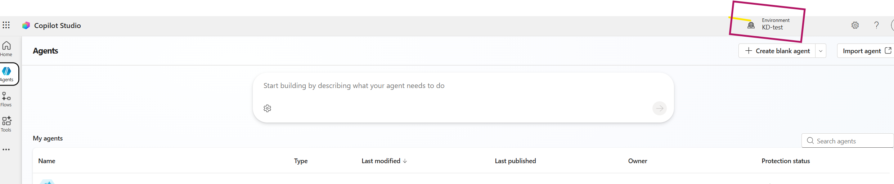

4. Click **+ Create blank agent**

   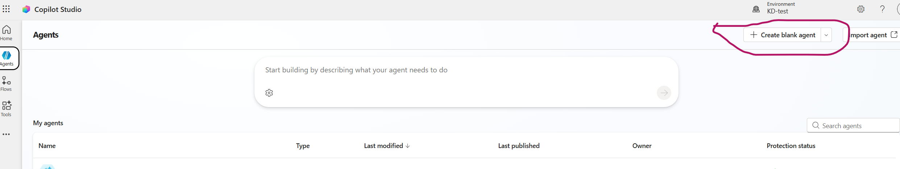

5. You'll see the new agent Overview page:

   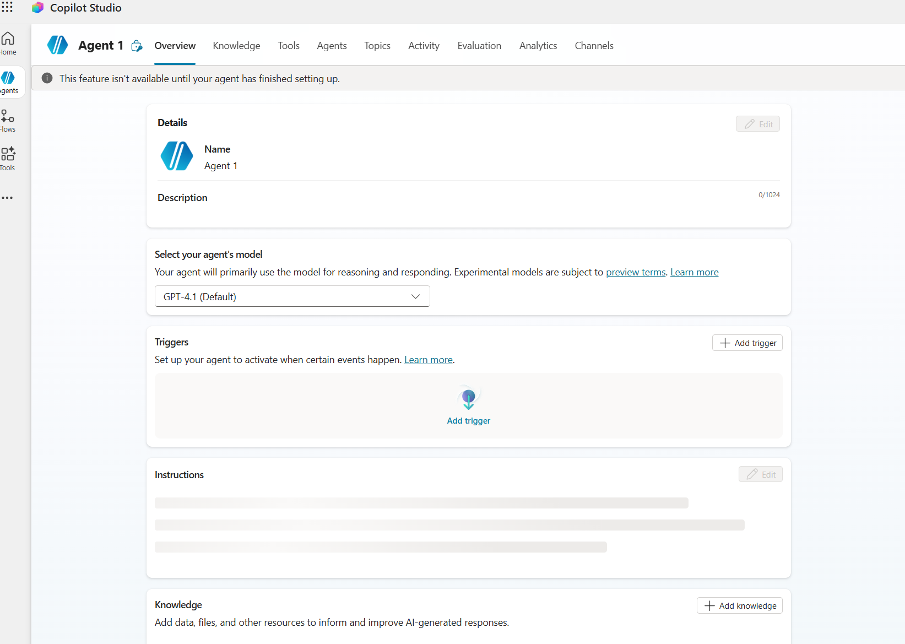

6. Configure the **Details** section:
   - **Name:** `Fraud Investigation Assistant`
   - **Description:** `AI-powered fraud investigation assistant with access to fraud patterns, regulatory guidance, and investigation procedures.`

   

7. Click **Save**

---

### Step B: Configure Agent Instructions

In the **Instructions** section, paste the following instructions and click **Save**:

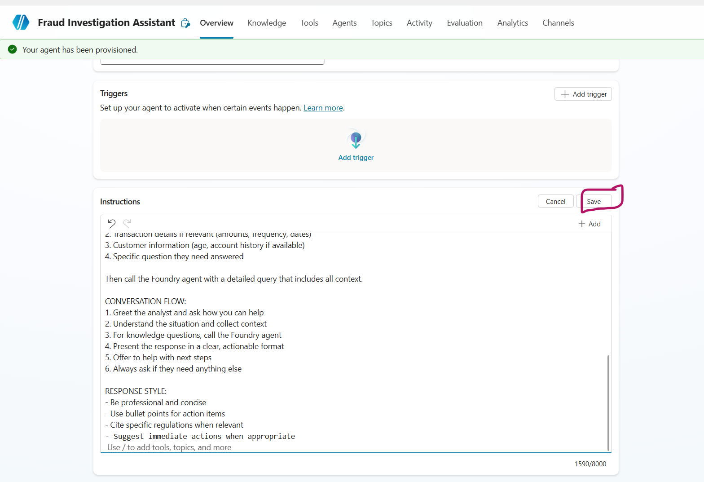

**Instructions to paste:**

```
You are a Fraud Investigation Assistant that helps fraud analysts investigate suspicious activities.

YOUR CAPABILITIES:
1. Quick reference lookups (thresholds, deadlines, codes) from uploaded knowledge
2. Access deep fraud pattern intelligence via Foundry Agent
3. Regulatory compliance guidance (BSA/AML, SAR filing, OFAC)
4. Investigation procedures and evidence collection guidance

CRITICAL RULE - GATHER CONTEXT FOR VAGUE REQUESTS:
When the user says something general like "I need help investigating" or "I have a suspicious account", 
DO NOT call the Foundry Agent. Instead, ASK FOLLOW-UP QUESTIONS:
- What type of suspicious activity are you seeing?
- What are the transaction patterns that concern you?
- Any specific amounts or timeframes involved?

WHEN TO HANDLE DIRECTLY (NO FOUNDRY CALL):
- Greetings: "Hi", "Hello", "I need help" → Ask follow-up questions
- Quick threshold questions: "What's the CTR threshold?" → Answer $10,000
- Deadline questions: "How long to file SAR?" → Answer 30 days
- Fraud code lookups: "What does ATO mean?" → Answer from knowledge

WHEN TO CALL FOUNDRY AGENT:
- User provides specific fraud scenario with details (amounts, patterns, timing)
- User asks about specific fraud red flags or patterns
- User needs investigation procedures for a specific case type
- User asks complex regulatory questions

QUICK REFERENCE INFO (use from uploaded knowledge):
- CTR threshold: $10,000 in cash
- SAR threshold: $5,000 for banks, $2,000 for MSBs  
- SAR deadline: 30 days (60 days if no suspect)
- CTR deadline: 15 days from transaction
- Wire recall window: 24-48 hours for best results
- Fraud codes: ATO, BEC, SIF, MM, STR, WF, EFE

RESPONSE STYLE:
- Be professional and concise
- Use bullet points for action items
- Ask clarifying questions for vague requests
```

---

### Step C: Upload Quick Reference Knowledge

Upload the quick reference guide so Copilot can handle common lookups directly without calling Foundry.

1. In the **Knowledge** section, click **+ Add knowledge**

   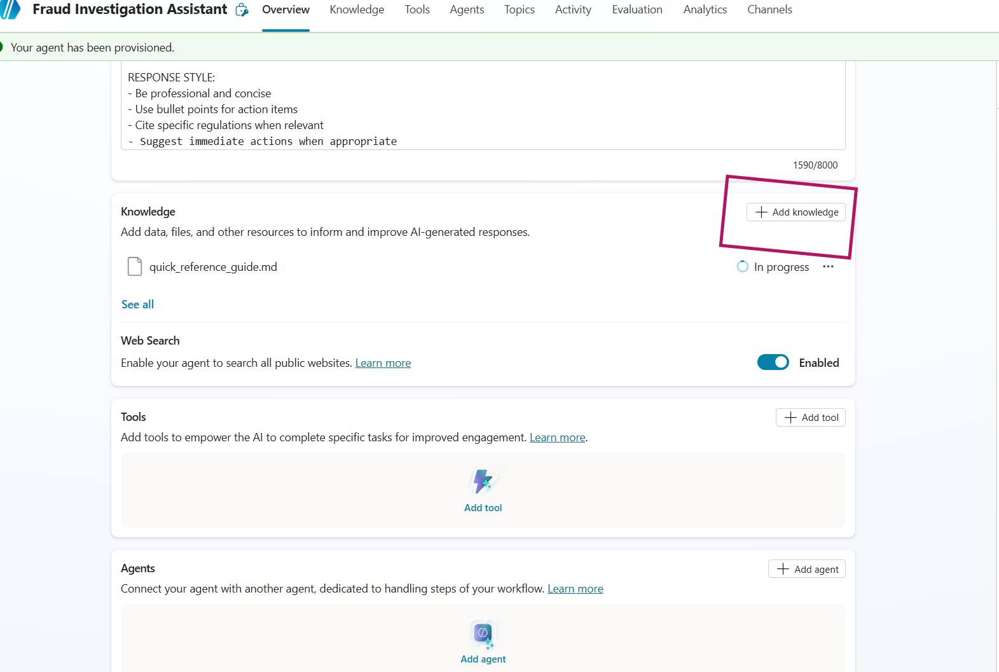

2. In the dialog, select **Upload file** and upload: `data/copilot_knowledge/quick_reference_guide.md`

   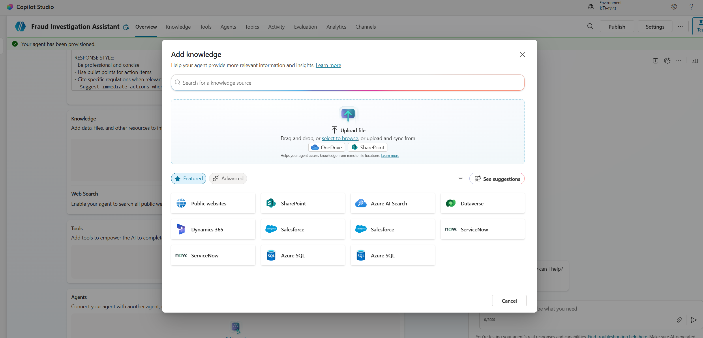

3. Click **Add**

**What this enables:**
- CTR/SAR thresholds and deadlines
- Account freeze types and approvals
- Fraud type codes
- Priority level definitions
- Internal contact information

---

### Step C.1: Disable Web Search

> **Important:** Disable web search to ensure the agent only uses your uploaded knowledge and Foundry Agent for answers.

1. In the Overview page, find the **Web Search** section
2. Toggle **OFF** the "Enabled" switch (it should say "Disabled" after)

   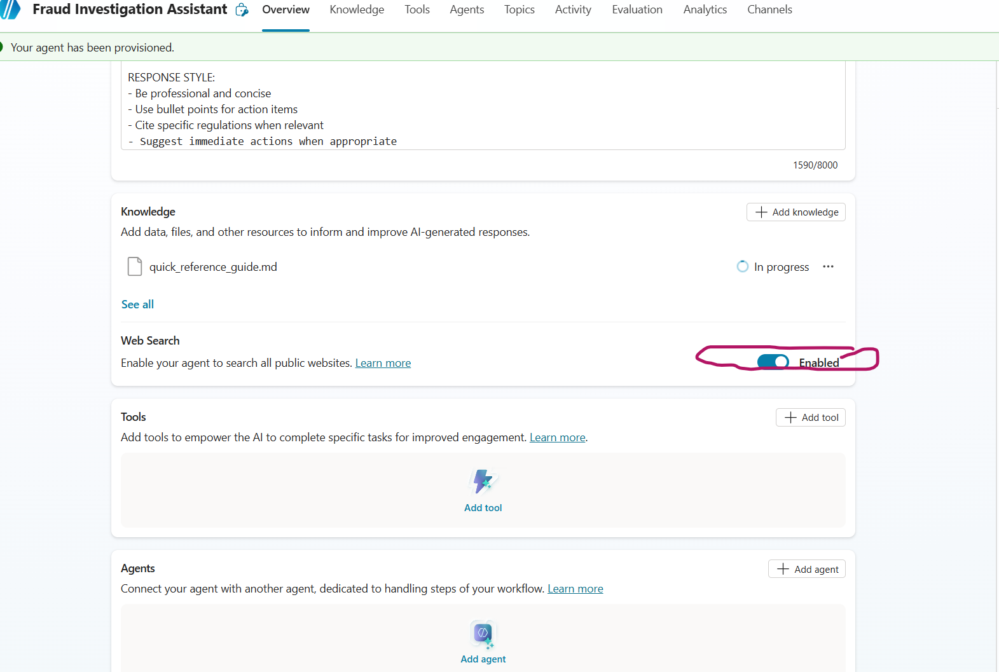

3. This ensures responses come only from:
   - Your uploaded quick reference guide
   - The connected Foundry Agent

---

### Step D: Add the Azure AI Agent Extension

This connects Copilot Studio to your Foundry Agent.

1. Go to the **Agents** tab in the top navigation bar
2. Click **+ Add** to add an agent

   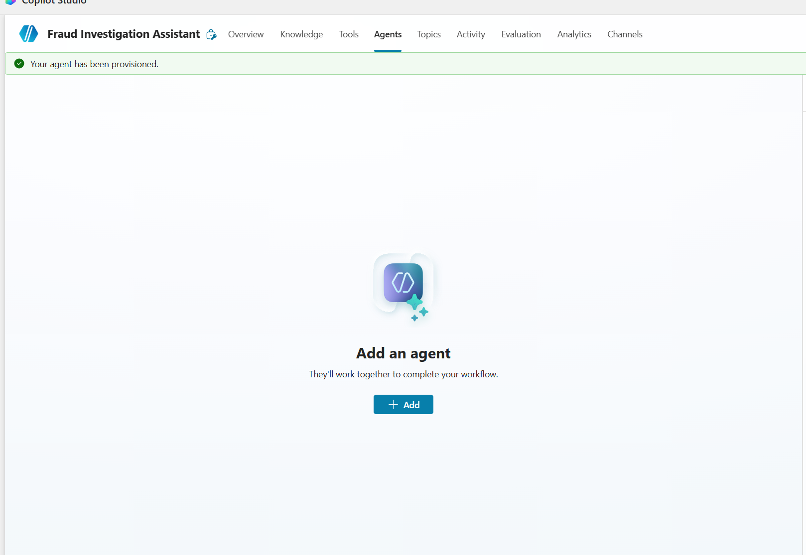

3. In the dialog, click **Connect to an external agent** dropdown

   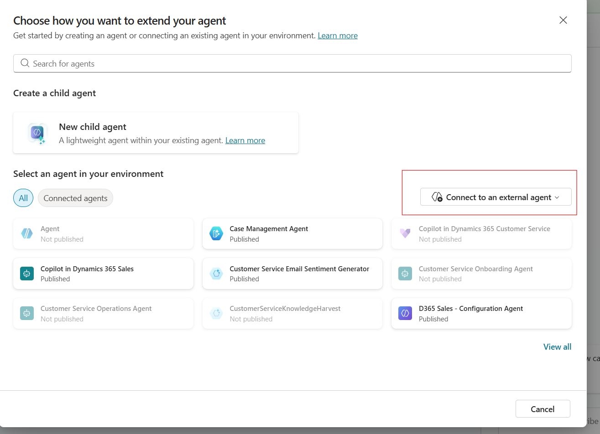

4. Select **Microsoft Foundry** from the dropdown

   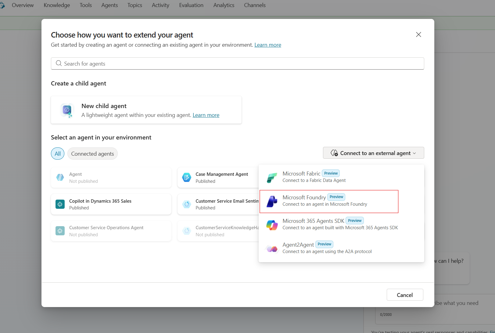

5. Configure the connection:
   - **Name:** `Fraud Knowledge Expert`
   - **Description:** `Expert on fraud patterns, regulatory compliance, and investigation procedures. Call this agent for any knowledge-intensive questions.`
   - **Agent Id:** Enter your agent **name** from the notebook (e.g., `FraudInvestigationAgent`)
     > **Note:** The "Agent Id" is the agent name string, not a UUID.

   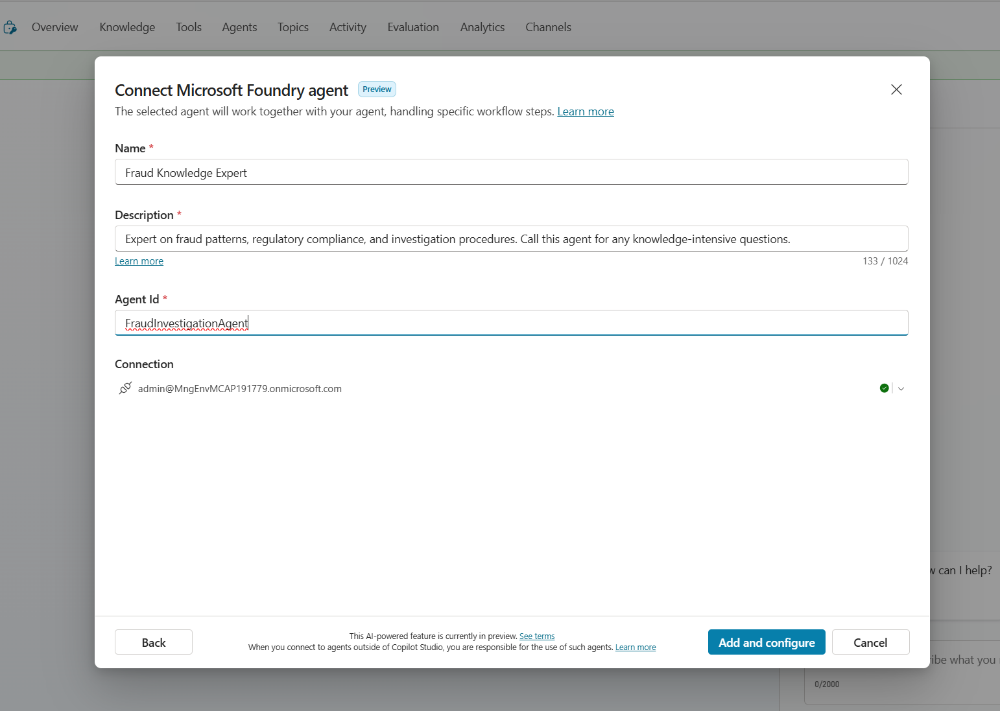

6. Click **Add and configure**

---

### Step E: Test Your Setup

Use these test scenarios to verify the integration:

#### Test 1: Copilot Handles Directly (Greeting)
```
User: "Hi, I need help with a fraud case"
Expected: Copilot greets and asks for details (no Foundry call)
```

#### Test 2: Quick Lookup (Uses Uploaded Knowledge)
```
User: "What's the CTR threshold?"
Expected: Copilot answers "$10,000 in cash" from uploaded knowledge (no Foundry call)
```

#### Test 3: Routes to Foundry
```
User: "What are the indicators of synthetic identity fraud?"
Expected: Copilot calls Foundry, returns detailed fraud patterns
```

#### Test 4: Hybrid Flow
```
User: "I have a customer with multiple $9,900 cash deposits over the past week. What should I look for?"
Expected: Copilot acknowledges, calls Foundry, returns:
- Money mule indicators
- Structuring patterns
- CTR reporting requirements
- Account freeze procedures
```

---

## 🧪 Complete Test Scenarios

### Scenario 1: Greeting (Copilot Only)

**Input:**
```
Hi, I need help investigating a suspicious account
```

**Expected Copilot Response:**
```
Hello! I'd be happy to help you investigate a suspicious account. 

To provide the best guidance, could you tell me:
1. What type of suspicious activity are you seeing?
2. What are the transaction patterns that concern you?
3. Any specific amounts or timeframes involved?

This will help me pull the most relevant information for your investigation.
```

---

### Scenario 2: Quick Lookup - CTR Threshold (Copilot Knowledge)

**Input:**
```
What's the CTR filing threshold?
```

**Expected Copilot Response (from uploaded knowledge, no Foundry call):**
```
The CTR (Currency Transaction Report) threshold is $10,000 in cash.

📋 Quick Reference:
• Single transaction: $10,000+ in cash requires CTR
• Aggregated: Multiple cash transactions totaling $10,000+ in one business day
• Filing deadline: 15 calendar days from transaction
• Form: FinCEN Form 112

Need more details on CTR exemptions or aggregation rules? I can look that up for you.
```

---

### Scenario 3: Quick Lookup - SAR Deadline (Copilot Knowledge)

**Input:**
```
How long do I have to file a SAR?
```

**Expected Copilot Response (from uploaded knowledge, no Foundry call):**
```
SAR filing deadlines:

⏰ Standard deadline: 30 calendar days from detection
⏰ Extended deadline: 60 days if no suspect identified

📋 Key points:
• "Detection" = when you have enough information to file
• Retention: Keep SAR and supporting docs for 5 years
• Confidentiality: Never disclose SAR existence to the subject
• Form: FinCEN Form 111

Need help with what to include in the SAR narrative? I can provide detailed guidance.
```

---

### Scenario 4: Quick Lookup - Fraud Codes (Copilot Knowledge)

**Input:**
```
What does ATO stand for?
```

**Expected Copilot Response (from uploaded knowledge, no Foundry call):**
```
ATO stands for Account Takeover.

📋 Common Fraud Type Codes:
• ATO - Account Takeover
• BEC - Business Email Compromise  
• SIF - Synthetic Identity Fraud
• MM - Money Mule
• STR - Structuring
• WF - Wire Fraud
• EFE - Elder Financial Exploitation

Would you like detailed information about ATO red flags and investigation procedures?
```

---

### Scenario 5: Fraud Pattern Query (Routes to Foundry)

**Input:**
```
What are the red flags for account takeover fraud?
```

**Expected Flow:**
1. Copilot recognizes this needs detailed fraud intelligence
2. Copilot calls Foundry Agent
3. Foundry queries **Fraud Patterns** knowledge source
4. Returns detailed ATO indicators

**Expected Response Includes:**
- Login attempts from new devices/locations
- Rapid changes to contact information
- Password reset from unfamiliar IPs
- Behavioral biometrics anomalies
- Session anomalies and navigation patterns

---

### Scenario 6: Regulatory Question (Routes to Foundry)

**Input:**
```
What are the SAR filing requirements and deadlines?
```

**Expected Flow:**
1. Copilot routes to Foundry
2. Foundry queries **Regulatory Compliance** knowledge source
3. Returns SAR filing details

**Expected Response Includes:**
- $5,000 threshold for banks, $2,000 for MSBs
- 30-day filing deadline (60 days if no suspect)
- Required narrative elements (who, what, when, where, why, how)
- 5-year retention requirement

---

### Scenario 7: Investigation Procedure (Routes to Foundry)

**Input:**
```
How do I properly freeze an account when fraud is suspected?
```

**Expected Flow:**
1. Copilot routes to Foundry
2. Foundry queries **Investigation Procedures** knowledge source
3. Returns freeze procedures

**Expected Response Includes:**
- Full freeze vs partial hold options
- Approval requirements for balances >$100K
- Documentation requirements
- 48-hour review requirement
- Customer notification guidelines

---

### Scenario 8: 🌟 Hybrid - Money Mule / Structuring Detection

**Input:**
```
I have a new account opened 3 weeks ago by a 19-year-old college student. The account has received multiple cash deposits of $9,500 each day for the past 5 days, followed immediately by wire transfers overseas. The customer says it's from their "online business." What should I do?
```

**Expected Response Includes:**
- CTR threshold: $10,000 (deposits are just under - structuring!)
- SAR deadline: 30 days from detection
- Fraud codes: MM (Money Mule) + STR (Structuring)
- Priority: 🔴 CRITICAL
- Money mule recruitment indicators targeting young people
- 31 USC 5324 structuring laws and aggregation rules
- Account freeze procedures and customer interview techniques
- Immediate actions: Place hold, don't alert customer, escalate to BSA/AML
- Investigation steps: Review account opening docs, pull surveillance, trace wire beneficiaries

---

### Scenario 9: 🌟 Hybrid - Account Takeover with Wire Fraud

**Input:**
```
A customer is calling in frantically saying there's been a $45,000 unauthorized wire transfer from their business account. I can see their email and phone number were changed 2 days ago, and there were login attempts from a new IP address. What's our procedure?
```

**Expected Response Includes:**
- ⏰ Wire recall window: 24-48 hours - TIME CRITICAL!
- SAR deadline: 30 days from detection
- Fraud codes: ATO (Account Takeover) + WF (Wire Fraud)
- Priority: 🔴 CRITICAL
- ATO attack pattern analysis - credential compromise indicators
- Regulation E considerations for business accounts
- Wire recall procedures and evidence preservation steps
- Immediate actions: Initiate wire recall NOW, freeze account, restore contact info
- Evidence checklist: Login records, contact change audit trail, wire authorization records

---

### Scenario 10: 🌟 Hybrid - Business Email Compromise

**Input:**
```
Our commercial client's controller just requested an urgent $125,000 wire to a new vendor in Hong Kong. The email appears to be from the CEO authorizing it, but when I called the CEO directly, he said he never sent that email. The email domain is slightly different - company.com vs companny.com.
```

**Expected Response Includes:**
- Fraud code: BEC (Business Email Compromise)
- SAR required: YES - even for prevented fraud attempts!
- SAR deadline: 30 days from detection
- Priority: 🟠 HIGH
- BEC attack pattern - domain spoofing (typosquatting), CEO impersonation
- FinCEN BEC advisories and SAR requirements for attempts
- Evidence preservation - full email headers, screenshots
- Immediate actions: Don't process wire, document verification call, notify client
- IC3 reporting recommendation (ic3.gov)
- Client recommendations: DMARC/DKIM/SPF, dual authorization for large wires

---

### Scenario 11: 🌟 Hybrid - SAR Filing with Multiple Fraud Types

**Input:**
```
I need to write a SAR narrative for a business email compromise case involving cryptocurrency. What should I include?
```

**Expected Response Includes:**
- SAR deadline: 30 days from detection
- Retention: 5 years for SAR + supporting docs
- SAR narrative structure: 5 W's + H (Who, What, When, Where, Why, How)
- Form: FinCEN Form 111
- BEC-specific narrative elements to include
- Cryptocurrency documentation requirements - wallet addresses, exchanges, blockchain hashes
- SAR writing standards and quality review checklist
- Who: Victim company, compromised emails, crypto exchanges, wallet addresses
- What: BEC with cryptocurrency conversion, amounts, transaction dates
- When: Timeline of suspicious email, detection, transactions, crypto conversion
- Where: IP addresses, exchange jurisdictions, wire destinations
- Why: Red flags - lookalike domain, urgency language, payment routing change
- How: Social engineering technique, email impersonation, crypto conversion path

---

## 📊 Question Routing Summary

| Question Type | Handler | Knowledge Source |
|---------------|---------|------------------|
| Greetings & intake | Copilot | None |
| CTR threshold ($10K) | Copilot | Uploaded Knowledge |
| SAR threshold ($5K/$2K) | Copilot | Uploaded Knowledge |
| SAR deadline (30/60 days) | Copilot | Uploaded Knowledge |
| Fraud type codes (ATO, BEC, etc.) | Copilot | Uploaded Knowledge |
| Wire recall window | Copilot | Uploaded Knowledge |
| Detailed fraud pattern analysis | Foundry | Fraud Patterns |
| Complex regulatory guidance | Foundry | Regulatory Compliance |
| Investigation procedures | Foundry | Investigation Procedures |
| **🌟 Hybrid scenarios** | **Both** | **Copilot Knowledge + Foundry** |

---

## 🎯 Quick Reference: Sample Questions by Category

### Quick Lookups (→ Copilot with Uploaded Knowledge)
- "What's the CTR threshold?"
- "How long do I have to file a SAR?"
- "What does ATO stand for?"
- "What's the wire recall window?"
- "What are the freeze approval thresholds?"

### Fraud Pattern Questions (→ Foundry Only)
- "What are the indicators of synthetic identity fraud?"
- "How do I identify detailed money mule patterns?"
- "What are the behavioral indicators of account takeover?"
- "What patterns indicate business email compromise?"

### 🌟 Hybrid Questions (Comprehensive Responses)
These questions get comprehensive responses combining thresholds, deadlines, fraud patterns, and procedures:

- "I have $9,500 cash deposits for 5 days straight. What should I do?"
  → CTR threshold, structuring analysis, money mule patterns, investigation procedures

- "Customer says there's a $45K unauthorized wire. Email was changed 2 days ago."
  → Wire recall window, ATO investigation steps, evidence preservation, Reg E

- "CEO impersonation email requesting $125K wire to Hong Kong."
  → BEC fraud code, SAR requirements, IC3 reporting, client recommendations

- "Need to write SAR for BEC with crypto."
  → SAR structure (5 W's + H), BEC-specific elements, crypto documentation requirements

---

## ✅ Setup Checklist

- [ ] Created Copilot Studio agent with correct name
- [ ] Added comprehensive instructions
- [ ] **Uploaded quick_reference_guide.md as Knowledge**
- [ ] Connected Azure AI Agent Extension
- [ ] Configured Foundry Agent connection
- [ ] Set up routing rules
- [ ] Tested quick lookup (Copilot handles from knowledge)
- [ ] Tested fraud pattern query (routes to Foundry)
- [ ] Tested regulatory query (routes to Foundry)
- [ ] Tested hybrid scenario (multiple sources)
- [ ] Verified response quality

---

## 🔧 Troubleshooting

### Copilot doesn't call Foundry Agent
- Verify the Azure AI Agent Extension is properly configured
- Check the **Agent ID** field contains your agent **name** (e.g., `FraudInvestigationAgent`)
- Ensure the routing instructions are clear

### Connection Error - "Let's get you connected first"

If you see a connection error when testing:

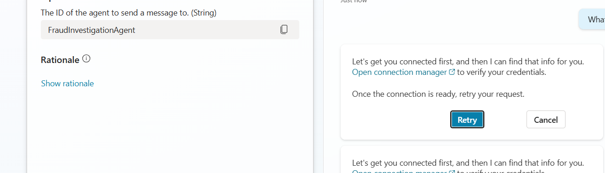

1. Click **Open connection manager** to verify your credentials
2. In the Manage connections page, find **Azure AI Foundry Agent Service**
3. If status shows "Not Connected", click **Connect** to authenticate

   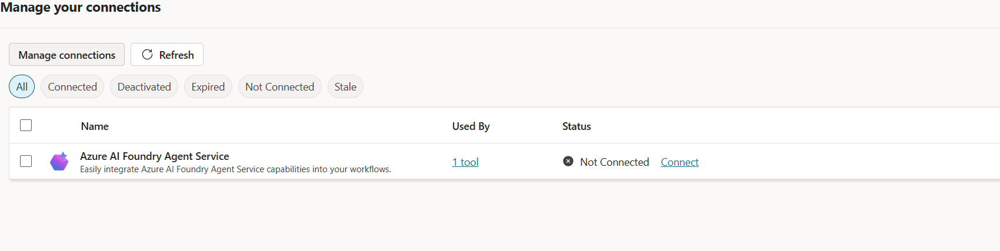

4. Once connected, click **Retry** in the chat

### Foundry Agent returns empty results
- Verify the knowledge base was created successfully
- Check that documents were indexed
- Test the Foundry agent directly in the notebook

### Slow responses
- This is normal for knowledge-intensive queries
- Foundry performs agentic retrieval across multiple sources
- Consider caching common queries

---

**You're all set! 🎉**

Your Fraud Investigation Assistant is now ready to help analysts with comprehensive fraud intelligence, regulatory guidance, and investigation procedures.
